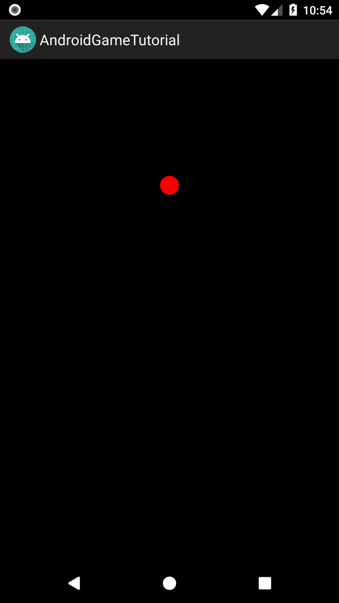
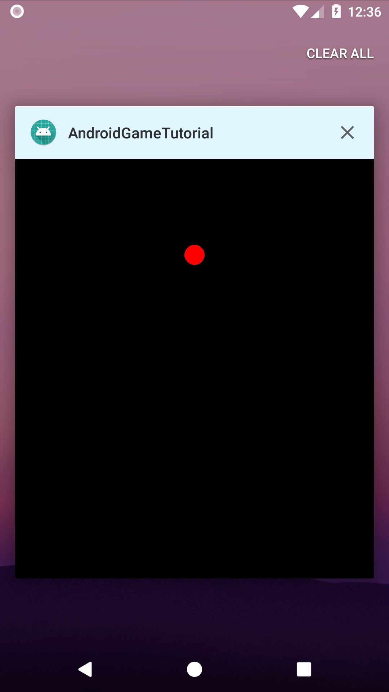

# Rozdział 1 - Nowy projekt, klasa `View` i spółka

Całe to "tworzenie" gier zacznę na spokojnie - od stworzenia prostej animacji. A tak dokładniej, to zacznę jeszcze prościej - od wyświetlenia bitmapy. Nim jednak do tego przejdę, potrzebuje projektu.

## Utworzenie projektu

W Android Studio wybieramy opcję utworzenia nowego projektu. Nadamy mu nazwę, wybierzemy nazwę pakietu i lokalizacje na dysku. Ja mój projekt nazwałem `AndroidGameTutorial` (przestrzeń nazw, to `com.github.daishe.androidgametutorial`).

Następnie wybierzmy wsparcie dla telefonów i tabletów z minimalnym API w wersji 19, a dalej opcję utworzenia pustej aktywności (`Empty Activity`). Pozostawmy jej domyślną nazwę (`MainActivity`) oraz zaznaczona opcję kompatybilności wstecznej. Odznaczmy jednak opcję generowania pliku z layoutem - tworzymy przecież grę, więc po co plik layoutu?

Po powtórzeniu tych kroków powinien ukazać się taki widok:

```java
package com.github.daishe.androidgametutorial;

import android.support.v7.app.AppCompatActivity;
import android.os.Bundle;

public class MainActivity extends AppCompatActivity {

    @Override
    protected void onCreate(Bundle savedInstanceState) {
        super.onCreate(savedInstanceState);
    }

}
```

## Rysowanie po ekranie

To, co musimy w tej chwili wiedzieć, to że w świecie Androida proste rysowanie odbywa się przy użyciu klasy `View` w metodzie `onDraw`.

Utwórzmy teraz nową klasę dziedziczącą po klasie `View` (pełna nazwa klasy to `android.view.View`) i nadajmy jej nazwę `GameView`.

Powinniśmy zobaczyć pusty szkielet klasy i informację o brakującym konstruktorze. Dodajmy go. Możemy to zrobić automatycznie - z listy wybierzmy ten, który przyjmuje jeden argument (kontekst).

```java
package com.github.daishe.androidgametutorial;

import android.content.Context;
import android.view.View;

public class GameView extends View {

    public GameView(Context context) {
        super(context);
    }

}
```

Następnie przeładujmy wspomnianą wcześniej metodę `onDraw`, wyrysowując na środku ekranu czerwone kółko. Po tych zmianach kod klasy powinien wyglądać następująco.

```java
package com.github.daishe.androidgametutorial;

import android.content.Context;
import android.graphics.Canvas;
import android.graphics.Color;
import android.graphics.Paint;
import android.view.View;

public class GameView extends View {

    private Paint paint = new Paint();

    public GameView(Context context) {
        super(context);
        this.paint.setColor(Color.RED);
    }

    @Override
    protected void onDraw(Canvas canvas) {
        canvas.drawColor(Color.BLACK);
        canvas.drawCircle(canvas.getWidth() / 2, canvas.getHeight() / 4, 30, paint);
    }

}
```

Jak widać, całość nie była zbyt skomplikowana. Znajdują się tu 3 nowe elementy:

- Klasa `Color` - posada statyczne atrybuty, pod którymi kryją się wartości odpowiadające odpowiednim kolorom. W świecie Androida kolor to po prostu liczba typu `int`.
- Klasa `Paint` i atrybut `paint` - to z kolei jest (swego rodzaju) "kontener" na różne opcje związane z rysowaniem. Przy użyciu niego możemy ustawić różne właściwości ryzowania. Tu dla przykładu jest to kolor. Do innych należą:
  - przezroczystość (tu uwaga na kolejność ustawiania, bo przezroczystość wchodzi w skład koloru),
  - ustawienie, czy rysować wypełniony obiekt, czy tylko obrys,
  - rozmiar czcionki (w przypadku rysowania tekstu),
  - a nawet ustawienie, że rysowanie ma się odbywać z antyaliasingiem.
- Klasa `Canvas` i zmienna `canvas` - to komponent "po którym rysujemy". Można o nim myśleć, jako o tablicy, na której można narysować, co tylko chcemy.

Skoro mamy już widok, czas go zarejestrować w naszej aktywności. Dodajmy następujący kod na końcu metody `onCreate`:

```java
this.setContentView(new GameView(this));
```

Czas przetestować to, co udało się do tej pory osiągnąć.



Cóż. Efekt nie jest powalający. I nie chodzi mi o to, co jest rysowane. Chodzi o samą aktywność - to nie wygląda jak gra. Co tu robi ta belka tytułowa? Dlaczego pasek statusu jest widoczny? Dlaczego ekran wciąż wygasa? A co się stanie z naszą aplikacją w momencie obrotu telefonu?

Tak gry nie wyglądają. Dlatego teraz zajmiemy się tym problemem.

## Pimp my activity

Na początek zajmiemy się ta wielką belką tytułową. Zmodyfikujmy atrybut `parent` elementu `style` w pliku `styles.xml` - nadajmy mu wartość `Theme.AppCompat.Light.NoActionBar`.

I już belki nie ma. Następnie zajmiemy się paskiem statusu i wygaszaniem ekranu. Do metody `onCreate` dodajmy następujący kod:

```java
this.getWindow().addFlags(WindowManager.LayoutParams.FLAG_FULLSCREEN);
this.getWindow().addFlags(WindowManager.LayoutParams.FLAG_KEEP_SCREEN_ON);
```

Od razu lepiej. Czas teraz zablokować obroty ekranu. W tym celu w pliku manifestu zmodyfikujmy element `activity`:

```xml
<activity android:name=".MainActivity"
    android:screenOrientation="sensorPortrait">
    <intent-filter>
        <action android:name="android.intent.action.MAIN" />
        <category android:name="android.intent.category.LAUNCHER" />
    </intent-filter>
</activity>
```

Teraz aplikacja prezentuje się o niebo lepiej. To jednak nie koniec. Trzeba jeszcze dostosować kolory:

- paska statusu (Dark Primary Color / Status Bar Color),
- belki tytułowej, która jest widoczna podczas zmieniania aplikacji (Primary Color),
- paska z nawigacją (Navigation Bar Color).

Do elementu `resources` w pliku `colors.xml` dodajmy następujący kod:

```xml
<color name="colorPrimary">#E1F5FE</color>
<color name="colorPrimaryDark">#4FC3F7</color>
<color name="colorAccent">#78909C</color>
<color name="statusBarColor">#1D1A38</color>
<color name="navigationBarColor">#1D1A38</color>
```

Następnie w katalogu `res` dodajmy katalog `values-v21`, a w nim plik `styles.xml` o następującej zawartości:

```xml
<resources>

    <style name="AppTheme" parent="Theme.AppCompat.Light.NoActionBar">
        <item name="colorPrimary">@color/colorPrimary</item>
        <item name="colorPrimaryDark">@color/colorPrimaryDark</item>
        <item name="colorAccent">@color/colorAccent</item>
        <item name="android:statusBarColor">@color/statusBarColor</item>
        <item name="android:navigationBarColor">@color/navigationBarColor</item>
    </style>

</resources>
```



Nie jest źle, ale jeszcze brakuje jednego, drobnego elementu - ikony aplikacji.

## Ikona - wisienka na torcie

Z katalogu zasobów niniejszego kursu (katalog `assets`) wybierzmy plik `ship.svg` i zaimportujmy go jako ikonę aplikacji - katalog `res`, "New", "Image Asset"):

- Icon Type: `Launcher Icons (Adaptive and Legacy)`
- Name: `ic_launcher`
- Foreground Layer:
  - Layer Name: `ic_launcher_foreground`
  - Source Asset:
    - Asset Type: `Image`
    - Path: *lokalizacja pliku `ship.svg`*
  - Scaling:
    - Trim: `Yes`
    - Resize: `66%`
- Background Layer:
  - Layer Name: `ic_launcher_background`
  - Source Asset:
    - Asset Type: `Color`
    - Color: `#2E2957`
- Legacy:
  - Legacy Icon (API <= 25)
    - Generate: `Yes`
    - Shape: `Square`
  - Round Icon (API = 25):
    - Generate `Yes`
  - Google Play Store Icon:
    - Generate: `Yes`
    - Shape: `Square`

## Podsumowanie

Na razie udało nam się ustawić styl aplikacji w systemie i wyświetlić kółko na ekranie. Teraz czas na coś ciekawszego - animacje przy użyciu obrazów.

## Zmodyfikowane pliki

Ponieważ w tym rozdziale utworzyłem nowy projekt, to tak naprawdę zmodyfikowany został każdy plik. Dlatego też pójdę na skróty i dołączę zawartość, ale tylko tych plików, które zostały zmodyfikowane od momentu utworzenia nowego pustego projektu.

### Plik `colors.xml`

```xml
<?xml version="1.0" encoding="utf-8"?>
<resources>
    <color name="colorPrimary">#E1F5FE</color>
    <color name="colorPrimaryDark">#4FC3F7</color>
    <color name="colorAccent">#78909C</color>
    <color name="statusBarColor">#1D1A38</color>
    <color name="navigationBarColor">#1D1A38</color>
</resources>
```

### Plik `GameView.java`

```java
package com.github.daishe.androidgametutorial;

import android.content.Context;
import android.graphics.Canvas;
import android.graphics.Color;
import android.graphics.Paint;
import android.view.View;

public class GameView extends View {

    private Paint paint = new Paint();

    public GameView(Context context) {
        super(context);
        this.paint.setColor(Color.RED);
    }

    @Override
    protected void onDraw(Canvas canvas) {
        canvas.drawColor(Color.BLACK);
        canvas.drawCircle(canvas.getWidth() / 2, canvas.getHeight() / 4, 30, paint);
    }

}
```

### Plik `MainActivity.java`

```java
package com.github.daishe.androidgametutorial;

import android.os.Bundle;
import android.support.v7.app.AppCompatActivity;
import android.view.WindowManager;

public class MainActivity extends AppCompatActivity {

    private GameView gameView;

    @Override
    protected void onCreate(Bundle savedInstanceState) {
        super.onCreate(savedInstanceState);

        this.getWindow().addFlags(WindowManager.LayoutParams.FLAG_FULLSCREEN);
        this.getWindow().addFlags(WindowManager.LayoutParams.FLAG_KEEP_SCREEN_ON);

        this.gameView = new GameView(this);

        this.setContentView(this.gameView);
    }

}
```

### Plik `styles.xml`

```xml
<resources>

    <style name="AppTheme" parent="Theme.AppCompat.Light.NoActionBar">
        <item name="colorPrimary">@color/colorPrimary</item>
        <item name="colorPrimaryDark">@color/colorPrimaryDark</item>
        <item name="colorAccent">@color/colorAccent</item>
    </style>

</resources>
```

### Plik `styles.xml` (v21)

```xml
<resources>

<style name="AppTheme" parent="Theme.AppCompat.Light.NoActionBar">
    <item name="colorPrimary">@color/colorPrimary</item>
    <item name="colorPrimaryDark">@color/colorPrimaryDark</item>
    <item name="colorAccent">@color/colorAccent</item>
    <item name="android:statusBarColor">@color/statusBarColor</item>
    <item name="android:navigationBarColor">@color/navigationBarColor</item>
</style>

</resources>
```
