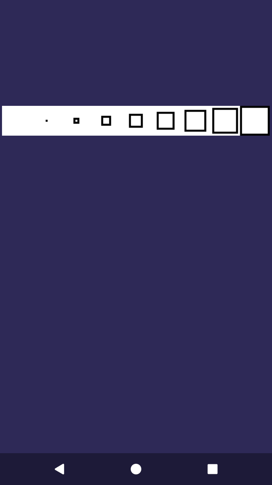
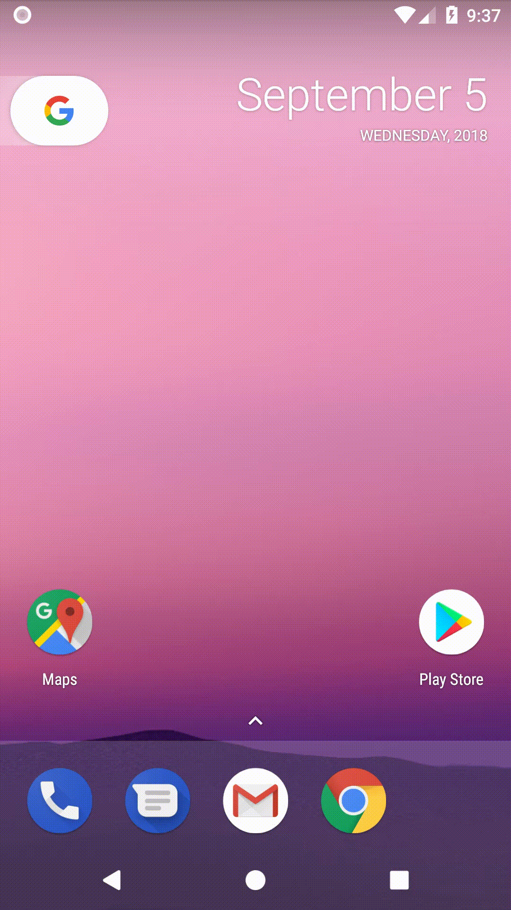

# Rozdział 2 - Animacje, obrazy i główna pętla gry

Czas pójść o krok dalej - stworzę animację skonstruowaną z serii obrazów. Nim jednak to zrobię, trzeba załadować owe obrazy.

## Bitmapa

Użycie wcześniej liczby mnogiej to lekka przesada. Nie będziemy ładować serii obrazów, a jedynie jeden obraz, który zawiera "sklejone" wszystkie klatki. Wyświetlać będziemy fragment obrazu - zależnie od tego, którą klatkę chcemy wyświetlić.

Tak więc skopiujmy plik `squares.bmp` z katalogu zasobów kursu i wklejmy go do katalogu `res/drawable`.

### Wyświetlenie bitmapy

W klasie `GameView` dodajmy prywatny atrybut `bitmap` klasy `Bitmap`. W konstruktorze dodajmy następującą linię:

```java
this.bitmap = BitmapFactory.decodeResource(getResources(), R.drawable.square);
```

a zawartość metody `onDraw` wymieńmy na następującą:

```java
canvas.drawColor(0xFF2E2957);
float x = (canvas.getWidth() - this.bitmap.getWidth()) / 2;
float y = (canvas.getHeight() - this.bitmap.getHeight()) / 4;
canvas.drawBitmap(this.bitmap, x, y, paint);
```



Cóż, animacja to jeszcze nie jest.

### Wyświetlenie wybranego fragmentu bitmapy

Doprowadźmy klasę `GameView` do następującej postaci:

```java
package com.github.daishe.androidgametutorial;

import android.content.Context;
import android.graphics.Bitmap;
import android.graphics.BitmapFactory;
import android.graphics.Canvas;
import android.graphics.Color;
import android.graphics.Paint;
import android.graphics.Rect;
import android.view.View;

public class GameView extends View {

    private Paint paint = new Paint();

    private Bitmap bitmap;
    private Rect src;
    private Rect dst;

    public GameView(Context context) {
        super(context);
        this.paint.setColor(Color.RED);

        this.bitmap = BitmapFactory.decodeResource(getResources(), R.drawable.square);
        this.src = new Rect(0, 0, 0, this.bitmap.getHeight());
        this.dst = new Rect();
    }

    @Override
    protected void onDraw(Canvas canvas) {
        canvas.drawColor(0xFF2E2957);

        this.frame(4, canvas.getWidth() / 2, canvas.getHeight() / 4);
        canvas.drawBitmap(this.bitmap, src, dst, paint);
    }

    private void frame(int n, int x, int y) {
        int width = this.bitmap.getWidth() / 9;
        int height = this.bitmap.getHeight();
        this.src.left = width * n;
        this.src.right = width * (n + 1);

        width /= 2;
        height /= 2;
        this.dst.left = x - width;
        this.dst.top = y - height;
        this.dst.right = x + width;
        this.dst.bottom = y + height;
    }

}
```


## Animacja

No właśnie - miała przecież być animacja. Dodajmy pomocniczą klasę `Time`:

```java
package com.github.daishe.androidgametutorial;

public final class Time {

    public static long resolution() {
        return 1000000000;
    }

    public static long now() {
        return System.nanoTime();
    }

}
```

a w klasie `GameView` utwórzmy prywatną metodę `selectFrame`:

```java
private int selectFrame() {
    return (int)(Time.now() / (Time.resolution() / 10)) % 9;
}
```

i zmodyfikujmy metodę `onDraw`:

```java
@Override
protected void onDraw(Canvas canvas) {
    canvas.drawColor(0xFF2E2957);

    this.frame(this.selectFrame(), canvas.getWidth() / 2, canvas.getHeight() / 4);
    canvas.drawBitmap(this.bitmap, src, dst, paint);
}
```

I co? No i nic. Metoda `onDraw` klasy `View` jest wywoływana przez komponent trzymający widok, którego nie możemy "zobaczyć", gdy widok jest tworzony. Zmieńmy klasę `GameView` tak, by dziedziczyła po klasie `SurfaceView`, zamiast `View`.


Tylko teraz jest jeszcze gorzej. Metoda `onDraw` nie jest w ogóle wywoływana. Dzieje się tak, ponieważ w przypadku `SurfaceView` programista jest zobowiązany do skonstruowania całej logiki, która mówi dokładnie kiedy uruchamiać metodę `onDraw`. To, co trzeba teraz zrobić, to stworzyć tzw. główną pętlę gry.

Dodajmy klasę `GameThread`:

``` java
package com.github.daishe.androidgametutorial;

import android.graphics.Canvas;
import android.support.annotation.NonNull;
import android.view.SurfaceHolder;

import java.util.concurrent.atomic.AtomicBoolean;

public class GameThread extends Thread {

    private static final int framesPerSecond = 30;

    private GameView view;

    private AtomicBoolean isDrawing = new AtomicBoolean(false);

    public GameThread(@NonNull GameView view) {
        this.view = view;
    }

    public boolean drawing() {
        return this.isDrawing.get();
    }

    public boolean drawing(boolean isDrawing) {
        this.isDrawing.set(isDrawing);
        return isDrawing;
    }

    @Override
    public void run() {
        while (!Thread.interrupted()) {
            try {
                long frameLogicStartTimePoint = Time.now();

                if (this.drawing())
                    this.executeDraw();

                long frameLogicStopTimePoint = Time.now();

                long frameLogicTimeDelta = frameLogicStopTimePoint - frameLogicStartTimePoint;
                frameLogicTimeDelta = frameLogicTimeDelta > 0 ? frameLogicTimeDelta : 0;
                long sleepTime = (this.ticksPerFrame() - frameLogicTimeDelta) / (Time.resolution() / 1000);
                Thread.sleep(sleepTime > 0 ? sleepTime : 0);
            }
            catch (InterruptedException e) {
                break;
            }
            catch (Exception e) {
            }
        }
    }

    private long ticksPerFrame() {
        double resolution = (double)Time.resolution();
        return Math.round(resolution / GameThread.framesPerSecond);
    }

    private void executeDraw() {
        // TODO: I feel empty inside...
    }

}
```

Nic szczególnego - wątek, który co określony czas uruchamia metodę `executeDraw` (jeśli `isDrawing` zostało ustawione na `true`). Teraz ową metodę trzeba uzupełnić:

```java
private void executeDraw() {
    SurfaceHolder surfaceHolder = this.view.getHolder();
    Canvas canvas = null;
    try {
        canvas = surfaceHolder.lockCanvas();
        if (canvas != null)
            this.view.onDraw(canvas);
    }
    finally {
        if (canvas != null)
            surfaceHolder.unlockCanvasAndPost(canvas);
    }
}
```

Ok, co tu się dzieje? Po pierwsze z widoku dobieramy się do jego właściciela, a właściwie do właściciela powierzchni (surface). Następnie próbujemy zablokować obszar rysowania (obiekt `canvas`). To jest konieczne, ponieważ jesteśmy w oddzielnym wątku i ktoś inny mógłby np. próbować zniszczyć płaszczyznę podczas rysowania. Następnie sprawdzamy, czy udało się zablokować i otrzymać obiekt `canvas`. Jeśli tak, to wywołujemy metodę `onDraw`. Na koniec uruchamiamy metodę `unlockCanvasAndPost`, która zwalnia obszar rysowania.

Kluczowe jest, by pamiętać, że blokowanie obszaru rysowania na długi czas wiąże się ze spadkiem wydajności.

Tylko teraz rodzą się pytania. Kiedy wątek ma rysować, tj. kiedy ustawić `isDrawing` na `true`? A kiedy ustawić na `false`? Rysowanie rozpoczniemy, gdy tylko płaszczyzna jest gotowa i zakończymy, gdy płaszczyzna zostanie zniszczona. A kiedy to się dzieje? Otóż te zdarzenia możemy wychwycić. Dodajmy klasę `GameSurfaceHolderCallback`:

```java
package com.github.daishe.androidgametutorial;

import android.view.SurfaceHolder;

public class GameSurfaceHolderCallback implements SurfaceHolder.Callback {

    private GameThread gameThread;

    public GameSurfaceHolderCallback(GameThread gameThread) {
        this.gameThread = gameThread;
    }

    @Override
    public void surfaceDestroyed(SurfaceHolder holder) {
        this.gameThread.drawing(false);
    }

    @Override
    public void surfaceCreated(SurfaceHolder holder) {
        this.gameThread.drawing(true);
    }

    @Override
    public void surfaceChanged(SurfaceHolder holder, int format, int width, int height) {
    }

}
```

Na koniec zmodyfikujmy główna aktywność, doprowadzając ją do następującej postaci:

```java
package com.github.daishe.androidgametutorial;

import android.os.Bundle;
import android.support.v7.app.AppCompatActivity;
import android.view.WindowManager;

public class MainActivity extends AppCompatActivity {

    private GameView gameView;
    private GameThread gameThread;

    @Override
    protected void onCreate(Bundle savedInstanceState) {
        super.onCreate(savedInstanceState);

        this.getWindow().addFlags(WindowManager.LayoutParams.FLAG_FULLSCREEN);
        this.getWindow().addFlags(WindowManager.LayoutParams.FLAG_KEEP_SCREEN_ON);

        this.gameView = new GameView(this);
        this.gameThread = new GameThread(this.gameView);

        this.gameView.getHolder().addCallback(new GameSurfaceHolderCallback(this.gameThread));
        this.setContentView(this.gameView);

        this.gameThread.start();
    }

}
```



I o to chodziło. Choć przydałoby się jeszcze kilka ostatnich szlifów.

## Separacja logiki i renderowania

Jak było wspomniane wcześniej, obszar rysowania powinniśmy blokować na możliwie najkrótszy czas. Tak więc przydałoby się przenieść logikę odpowiedzialną za wybór klatki. W tym celu dodajmy metodę `update` i zmodyfikujmy metodę `onDraw` w klasie `GameView`:

```java
protected void update() {
    this.frame(this.selectFrame(), this.getWidth() / 2, this.getHeight() / 4);
}

@Override
protected void onDraw(Canvas canvas) {
    canvas.drawColor(0xFF2E2957);
    canvas.drawBitmap(this.bitmap, src, dst, paint);
}
```

a następnie zmodyfikujmy klasę `GameThread`:

```java
package com.github.daishe.androidgametutorial;

import android.graphics.Canvas;
import android.support.annotation.NonNull;
import android.view.SurfaceHolder;

import java.util.concurrent.atomic.AtomicBoolean;

public class GameThread extends Thread {

    private static final int framesPerSecond = 30;

    private GameView view;

    private AtomicBoolean isDrawing = new AtomicBoolean(false);

    public GameThread(@NonNull GameView view) {
        this.view = view;
    }

    public boolean drawing() {
        return this.isDrawing.get();
    }

    public boolean drawing(boolean isDrawing) {
        this.isDrawing.set(isDrawing);
        return isDrawing;
    }

    @Override
    public void run() {
        while (!Thread.interrupted()) {
            try {
                long frameLogicStartTimePoint = Time.now();

                if (this.drawing()) {
                    this.executeUpdate();
                    this.executeDraw();
                }

                long frameLogicStopTimePoint = Time.now();

                long frameLogicTimeDelta = frameLogicStopTimePoint - frameLogicStartTimePoint;
                frameLogicTimeDelta = frameLogicTimeDelta > 0 ? frameLogicTimeDelta : 0;
                long sleepTime = (this.ticksPerFrame() - frameLogicTimeDelta) / (Time.resolution() / 1000);
                Thread.sleep(sleepTime > 0 ? sleepTime : 0);
            }
            catch (InterruptedException  e) {
                break;
            }
            catch (Exception e) {
            }
        }
    }

    private long ticksPerFrame() {
        double resolution = (double)Time.resolution();
        return Math.round(resolution / GameThread.framesPerSecond);
    }

    private void executeUpdate() {
        this.view.update();
    }

    private void executeDraw() {
        SurfaceHolder surfaceHolder = this.view.getHolder();
        Canvas canvas = null;
        try {
            canvas = surfaceHolder.lockCanvas();
            if (canvas != null)
                this.view.onDraw(canvas);
        }
        finally {
            if (canvas != null)
                surfaceHolder.unlockCanvasAndPost(canvas);
        }
    }

}
```

## Podsumowanie

Jak na razie udało nam się skonstruować prostą animację z sekwencji obrazów. Gra to zdecydowanie coś więcej, dlatego teraz przejdziemy do animacji, w których będziemy programowo poruszać obiektami.

## Zmodyfikowane pliki

Jak w poprzednim rozdziale i w tym na końcu zamieszczam listę wszystkich zmodyfikowanych plików.

### Plik `GameSurfaceHolderCallback.java`

```java
package com.github.daishe.androidgametutorial;

import android.view.SurfaceHolder;

public class GameSurfaceHolderCallback implements SurfaceHolder.Callback {

    private GameThread gameThread;

    public GameSurfaceHolderCallback(GameThread gameThread) {
        this.gameThread = gameThread;
    }

    @Override
    public void surfaceDestroyed(SurfaceHolder holder) {
        this.gameThread.drawing(false);
    }

    @Override
    public void surfaceCreated(SurfaceHolder holder) {
        this.gameThread.drawing(true);
    }

    @Override
    public void surfaceChanged(SurfaceHolder holder, int format, int width, int height) {
    }

}
```

### Plik `GameThread.java`

```java
package com.github.daishe.androidgametutorial;

import android.graphics.Canvas;
import android.support.annotation.NonNull;
import android.view.SurfaceHolder;

import java.util.concurrent.atomic.AtomicBoolean;

public class GameThread extends Thread {

    private static final int framesPerSecond = 30;

    private GameView view;

    private AtomicBoolean isDrawing = new AtomicBoolean(false);

    public GameThread(@NonNull GameView view) {
        this.view = view;
    }

    public boolean drawing() {
        return this.isDrawing.get();
    }

    public boolean drawing(boolean isDrawing) {
        this.isDrawing.set(isDrawing);
        return isDrawing;
    }

    @Override
    public void run() {
        while (!Thread.interrupted()) {
            try {
                long frameLogicStartTimePoint = Time.now();

                if (this.drawing()) {
                    this.executeUpdate();
                    this.executeDraw();
                }

                long frameLogicStopTimePoint = Time.now();

                long frameLogicTimeDelta = frameLogicStopTimePoint - frameLogicStartTimePoint;
                frameLogicTimeDelta = frameLogicTimeDelta > 0 ? frameLogicTimeDelta : 0;
                long sleepTime = (this.ticksPerFrame() - frameLogicTimeDelta) / (Time.resolution() / 1000);
                Thread.sleep(sleepTime > 0 ? sleepTime : 0);
            }
            catch (InterruptedException  e) {
                break;
            }
            catch (Exception e) {
            }
        }
    }

    private long ticksPerFrame() {
        double resolution = (double)Time.resolution();
        return Math.round(resolution / GameThread.framesPerSecond);
    }

    private void executeUpdate() {
        this.view.update();
    }

    private void executeDraw() {
        SurfaceHolder surfaceHolder = this.view.getHolder();
        Canvas canvas = null;
        try {
            canvas = surfaceHolder.lockCanvas();
            if (canvas != null)
                this.view.onDraw(canvas);
        }
        finally {
            if (canvas != null)
                surfaceHolder.unlockCanvasAndPost(canvas);
        }
    }

}
```

### Plik `GameView.java`

```java
package com.github.daishe.androidgametutorial;

import android.content.Context;
import android.graphics.Bitmap;
import android.graphics.BitmapFactory;
import android.graphics.Canvas;
import android.graphics.Color;
import android.graphics.Paint;
import android.graphics.Rect;
import android.view.SurfaceView;

public class GameView extends SurfaceView {

    private static final int frames = 9;

    private Paint paint = new Paint();

    private Bitmap bitmap;
    private Rect src;
    private Rect dst;

    public GameView(Context context) {
        super(context);
        this.paint.setColor(Color.RED);

        this.bitmap = BitmapFactory.decodeResource(getResources(), R.drawable.square);
        this.src = new Rect(0, 0, 0, this.bitmap.getHeight());
        this.dst = new Rect();
    }

    protected void update() {
        this.frame(this.selectFrame(), this.getWidth() / 2, this.getHeight() / 4);
    }

    @Override
    protected void onDraw(Canvas canvas) {
        canvas.drawColor(0xFF2E2957);
        canvas.drawBitmap(this.bitmap, src, dst, paint);
    }

    private void frame(int n, int x, int y) {
        int width = this.bitmap.getWidth() / 9;
        int height = this.bitmap.getHeight();
        this.src.left = width * n;
        this.src.right = width * (n + 1);

        width /= 2;
        height /= 2;
        this.dst.left = x - width;
        this.dst.top = y - height;
        this.dst.right = x + width;
        this.dst.bottom = y + height;
    }

    private int selectFrame() {
        return (int)(Time.now() / (Time.resolution() / 18)) % 9;
    }

}
```

### Plik `MainActivity.java`

```java
package com.github.daishe.androidgametutorial;

import android.os.Bundle;
import android.support.v7.app.AppCompatActivity;
import android.view.WindowManager;

public class MainActivity extends AppCompatActivity {

    private GameView gameView;
    private GameThread gameThread;

    @Override
    protected void onCreate(Bundle savedInstanceState) {
        super.onCreate(savedInstanceState);

        this.getWindow().addFlags(WindowManager.LayoutParams.FLAG_FULLSCREEN);
        this.getWindow().addFlags(WindowManager.LayoutParams.FLAG_KEEP_SCREEN_ON);

        this.gameView = new GameView(this);
        this.gameThread = new GameThread(this.gameView);

        this.gameView.getHolder().addCallback(new GameSurfaceHolderCallback(this.gameThread));
        this.setContentView(this.gameView);

        this.gameThread.start();
    }

}
```

### Plik `Time.java`

```java
package com.github.daishe.androidgametutorial;

public final class Time {

    public static long resolution() {
        return 1000000000;
    }

    public static long now() {
        return System.nanoTime();
    }

}
```
