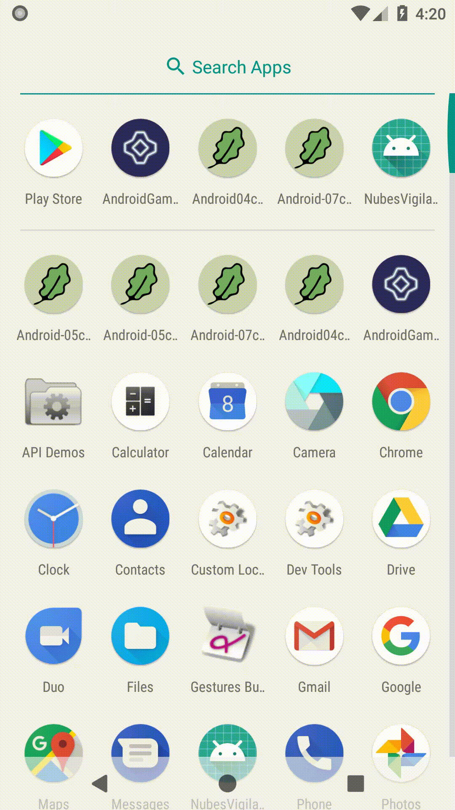

# Rozdział 3 - Wektory i SVG

W tym rozdziale stworzę prostą animację programową, która da początek całej grze.

## Grafiki wektorowe

Na początek wymienimy grafiki. Nasza gra będzie używać grafik wektorowych (SVG). Tak więc możemy skasować plik `square.bmp` z katalogu `res/drawable`.

Z katalogu zasobów (katalog `assets`) wybierzmy plik `asteroid-m0.svg` i zaimportujmy go jako zasób wektorowy (katalog `res`, "New", "Vector Asset"):

- Asset Type: `Local file (SVG, PSD)`
- Name: `ic_asteroid_medium_0`
- Path: *lokalizacja pliku `asteroid-m0.svg`*
- Size: *oryginalna wartość*
- Override: *zaznaczone*
- Opacity: `100%`
- Enable auto mirroring for RTL layout: *nie zaznaczone*

Tylko teraz będzie pewien problem. Otóż możemy wyświetlać bitmapy, a mamy grafikę wektorową. Co musimy zrobić, to zmienić programowo grafikę wektorową w bitmapę. To podejście ma tę zaletę, że możemy wybrać jakość obrazów całkowicie dynamiczne. Ten temat przekracza jednak granice tego kursu (a przynajmniej tego rozdziału). Dlatego grafiki będziemy ładować "na sztywno" - zawsze w tym samym rozmiarze, niezależnie od wszystkiego.

Architekturę ładownia bitmap można zrealizować na mnóstwo sposobów. Poniżej znajduje się arbitralnie wybrane jeno z nich. Dodajmy pomocniczą klasę `ImageLoader`:

```java
package com.github.daishe.androidgametutorial;

import android.content.Context;
import android.graphics.Bitmap;
import android.graphics.Canvas;
import android.graphics.drawable.Drawable;
import android.os.Build;
import android.support.annotation.NonNull;
import android.support.v4.content.ContextCompat;
import android.support.v4.graphics.drawable.DrawableCompat;

public final class ImageLoader {

    private Context context = null;
    private int resource = 0;
    private float alpha = 1.f;
    private float scale = 1.f;

    public ImageLoader() {
    }

    @NonNull
    public static ImageLoader with() {
        return new ImageLoader();
    }

    @NonNull
    public ImageLoader context(Context context) {
        this.context = context;
        return this;
    }

    @NonNull
    public ImageLoader resource(int resource) {
        this.resource = resource;
        return this;
    }

    @NonNull
    public ImageLoader alpha(float alpha) {
        this.alpha = alpha;
        return this;
    }

    @NonNull
    public ImageLoader scale(float scale) {
        this.scale = scale;
        return this;
    }

    @NonNull
    public Bitmap fromSvg() {
        Drawable drawable = ContextCompat.getDrawable(this.context, this.resource);
        Bitmap bitmap = Bitmap.createBitmap(
                Math.round(drawable.getIntrinsicWidth() * this.scale),
                Math.round(drawable.getIntrinsicHeight() * this.scale),
                Bitmap.Config.ARGB_8888
        );

        if (Build.VERSION.SDK_INT < Build.VERSION_CODES.LOLLIPOP) {
            drawable = (DrawableCompat.wrap(drawable)).mutate();
        }

        Canvas canvas = new Canvas(bitmap);
        drawable.setBounds(
                0,
                0,
                canvas.getWidth(),
                canvas.getHeight()
        );
        drawable.setAlpha(Math.round(this.alpha * 255));
        drawable.draw(canvas);

        return bitmap;
    }

    @NonNull
    public Bitmap fromSvg(int resource) {
        return this.resource(resource).fromSvg();
    }

}
```

Pozwoli nam ona, w stosunkowo bezproblemowy sposób, konwertować zasoby wektorowe na gotowe do użycia bitmapy. Przykładowo linia:

```java
ImageLoader.with().context(someContext).alpha(0.5f).scale(2f).fromSvg(R.drawable.ic_asteroid_medium_0);
```

zwróci bitmapę stworzoną przy użyciu kontekstu `someContext` z zasobu wektorowego `R.drawable.ic_asteroid_medium_0` z 50% przezroczystością i dwukrotnie powiększoną (względem rozmiaru oryginalnego).

To jednak jeszcze nie koniec wprowadzania klas pomocniczych.

## Wół roboczy

Teraz zajmiemy się dodaniem 2 klas - `Vector2D` i `MutableVector2D`. Uchylę rąbka tajemnicy i zdradzę, że są one bardzo istotne - będą wołem roboczy dla wszystkiego. Przy ich użyciu będziemy reprezentować, m.in. położenie obiektu, prędkość obiektu, czy orientacje telefonu. Są one - odpowiednio - niemodyfikowalny i modyfikowalny wektorem dwuwymiarowym. Taki podział i niemodyfikowalne struktury danych są ukłonem w stronę programowania funkcyjnego.

Klasa `Vector2D`:

```java
package com.github.daishe.androidgametutorial;

import android.support.annotation.NonNull;

public class Vector2D {

    private float x;
    private float y;

    public Vector2D() {
        this.x = 0;
        this.y = 0;
    }

    public Vector2D(@NonNull Vector2D other) {
        this.x = other.x();
        this.y = other.y();
    }

    public final float x() { return this.x; }
    public final float y() { return this.y; }

    public final float radius() { return cartesianToPolarRadius(this.x(), this.y()); }
    public final float radiusSquare() { return cartesianToPolarRadiusSquare(this.x(), this.y()); }
    public final float theta() { return cartesianToPolarTheta(this.x(), this.y()); }

    public final float abs() { return cartesianToPolarRadius(this.x(), this.y()); }
    public final float absSquare() { return cartesianToPolarRadiusSquare(this.x(), this.y()); }

    @NonNull public static MutableVector2D fromNothing() { return MutableVector2D.fromNothing(); }
    @NonNull public static MutableVector2D from(@NonNull Vector2D other) { return MutableVector2D.from(other); }
    @NonNull public static MutableVector2D fromVector(@NonNull Vector2D other) { return MutableVector2D.fromVector(other); }
    @NonNull public static MutableVector2D fromCartesian(float x, float y) { return MutableVector2D.fromCartesian(x, y); }
    @NonNull public static MutableVector2D fromPolar(float radius, float theta) { return MutableVector2D.fromPolar(radius, theta); }

    @NonNull public final MutableVector2D withCartesian(float x, float y) { return fromCartesian(x, y); }
    @NonNull public final MutableVector2D withCartesianX(float x) { return fromCartesian(x, this.y()); }
    @NonNull public final MutableVector2D withCartesianY(float y) { return fromCartesian(this.x(), y); }
    @NonNull public final MutableVector2D withPolar(float radius, float theta) { return fromPolar(radius, theta); }
    @NonNull public final MutableVector2D withPolarRadius(float radius) { return fromPolar(radius, this.theta()); }
    @NonNull public final MutableVector2D withPolarTheta(float theta) { return fromPolar(this.radius(), theta); }

    @NonNull public final MutableVector2D copy() { return fromCartesian(this.x(), this.y()); }

    @NonNull public final Vector2D asImmutable() { return this; }

    @NonNull public final MutableVector2D add(@NonNull Vector2D other) { return fromCartesian(this.x() + other.x(), this.y() + other.y()); }
    @NonNull public final MutableVector2D sub(@NonNull Vector2D other) { return fromCartesian(this.x() - other.x(), this.y() - other.y()); }
    @NonNull public final MutableVector2D mul(float by) { return fromCartesian(this.x() * by, this.y() * by); }
    @NonNull public final MutableVector2D div(float by) { return fromCartesian(this.x() / by, this.y() / by); }

    @NonNull public final MutableVector2D normalize() { return fromPolar(1.f, this.theta()); }

    @NonNull
    public final MutableVector2D limit(float to) {
        float radiusSquare = this.radiusSquare();
        if (radiusSquare > to * to) {
            float ratio = to / (float)Math.sqrt(radiusSquare);
            return fromCartesian(this.x() * ratio, this.y() * ratio);
        }
        return this.copy();
    }

    public boolean equals(float radius) { return this.abs() == radius; }

    public boolean equals(Object object) {
        if (object == this)
            return true;
        if (object instanceof Float)
            return this.abs() == (Float)object;
        if (object instanceof Vector2D) {
            Vector2D other = (Vector2D)object;
            return this.x() == other.x() && this.y() == other.y();
        }
        return super.equals(object);
    }

    @NonNull
    public final String stringify() {
        return "[" + String.valueOf(this.x()) + "," + String.valueOf(this.y()) + "]";
    }

    @NonNull
    public final String stringifyExtended() {
        return "[x:" + String.valueOf(this.x()) + ", y:" + String.valueOf(this.y()) + ", radius:" + String.valueOf(this.radius()) + ", theta:" + String.valueOf(this.theta()) + "]";
    }

    static float cartesianToPolarRadius(float x, float y) {return (float)Math.sqrt(x*x + y*y); }
    static float cartesianToPolarRadiusSquare(float x, float y) { return x*x + y*y; }
    static float cartesianToPolarTheta(float x, float y) { return (float)Math.atan2(y, x); }
    static float polarToCartesianX(float radius, float theta) { return radius * (float)Math.cos(theta); }
    static float polarToCartesianY(float radius, float theta) { return radius * (float)Math.sin(theta); }

    @NonNull
    static Vector2D setVector2DUsingCartesian(float x, float y, @NonNull Vector2D vector) {
        vector.x = x;
        vector.y = y;
        return vector;
    }

    @NonNull
    static Vector2D setVector2DUsingPolar(float radius, float theta, @NonNull Vector2D vector) {
        vector.x = polarToCartesianX(radius, theta);
        vector.y = polarToCartesianY(radius, theta);
        return vector;
    }

}
```

i klasa `MutableVector2D`:

```java
package com.github.daishe.androidgametutorial;

import android.support.annotation.NonNull;

public class MutableVector2D extends Vector2D {

    public MutableVector2D() { super(); }
    public MutableVector2D(@NonNull Vector2D other) { super(other); }

    public final float x(float x) { return setMutableVector2DUsingCartesian(x, this.y(), this).x(); }
    public final float y(float y) { return setMutableVector2DUsingCartesian(this.x(), y, this).y(); }

    public final float radius(float radius) { return setMutableVector2DUsingPolar(radius, this.theta(), this).radius(); }
    public final float radiusSquare(float radiusSquare) { return setMutableVector2DUsingPolar((float)Math.sqrt(radiusSquare), this.theta(), this).radiusSquare(); }
    public final float theta(float theta) { return setMutableVector2DUsingPolar(this.radius(), theta, this).theta(); }

    public final float abs(float abs) { return setMutableVector2DUsingPolar(abs, this.theta(), this).abs(); }
    public final float absSquare(float absSquare) { return setMutableVector2DUsingPolar((float)Math.sqrt(absSquare), this.theta(), this).absSquare(); }

    @NonNull public static MutableVector2D fromNothing() { return new MutableVector2D(); }
    @NonNull public static MutableVector2D from(@NonNull Vector2D other) { return new MutableVector2D(other); }
    @NonNull public static MutableVector2D fromVector(@NonNull Vector2D other) { return new MutableVector2D(other); }
    @NonNull public static MutableVector2D fromCartesian(float x, float y) { return setMutableVector2DUsingCartesian(x, y, new MutableVector2D()); }
    @NonNull public static MutableVector2D fromPolar(float radius, float theta) { return setMutableVector2DUsingPolar(radius, theta, new MutableVector2D()); }

    @NonNull public MutableVector2D setTo(@NonNull Vector2D other) { return setMutableVector2DUsingCartesian(other.x(), other.y(), this); }
    @NonNull public MutableVector2D setToCartesian(float x, float y) { return setMutableVector2DUsingCartesian(x, y, this); }
    @NonNull public MutableVector2D setToPolar(float radius, float theta) { return setMutableVector2DUsingPolar(radius, theta, this); }

    @NonNull public final MutableVector2D addInPlace(@NonNull Vector2D other) { return setMutableVector2DUsingCartesian(this.x() + other.x(), this.y() + other.y(), this); }
    @NonNull public final MutableVector2D subInPlace(@NonNull Vector2D other) { return setMutableVector2DUsingCartesian(this.x() - other.x(), this.y() - other.y(), this); }
    @NonNull public final MutableVector2D mulInPlace(float by) { return setMutableVector2DUsingCartesian(this.x() * by, this.y() * by, this); }
    @NonNull public final MutableVector2D divInPlace(float by) { return setMutableVector2DUsingCartesian(this.x() / by, this.y() / by, this); }

    @NonNull public final MutableVector2D normalizeInPlace() { return setMutableVector2DUsingPolar(1.f, this.theta(), this); }

    @NonNull
    public final MutableVector2D limitInPlace(float to) {
        float radiusSquare = this.radiusSquare();
        if (radiusSquare > to * to) {
            float ratio = to / (float)Math.sqrt(radiusSquare);
            return setMutableVector2DUsingCartesian(this.x() * ratio, this.y() * ratio, this);
        }
        return this;
    }

    public boolean equals(Object object) {
        if (object instanceof MutableVector2D) {
            Vector2D other = (Vector2D)object;
            return this.x() == other.x() && this.y() == other.y();
        }
        return super.equals(object);
    }

    @NonNull
    static MutableVector2D setMutableVector2DUsingCartesian(float x, float y, @NonNull MutableVector2D vector) {
        setVector2DUsingCartesian(x, y, vector);
        return vector;
    }

    @NonNull
    static MutableVector2D setMutableVector2DUsingPolar(float radius, float theta, @NonNull MutableVector2D vector) {
        setVector2DUsingPolar(radius, theta, vector);
        return vector;
    }

}
```

## Animacja

Teraz zajmiemy się samą animacją. Tylko taka drobna uwaga: trzymanie wszystkiego w klasie `GameView` bardzo brzydko pachnie. Dlatego wyekstrahujemy animowany obiekt (asteroidę) do osobnej klasy, którą nazwiemy `Asteroid`:

```java
package com.github.daishe.androidgametutorial;

import android.graphics.Bitmap;
import android.graphics.Canvas;
import android.graphics.Paint;

public class Asteroid {

    private Paint paint = new Paint();

    private Vector2D centerPosition;
    private MutableVector2D position = Vector2D.fromNothing();
    private MutableVector2D velocity = Vector2D.fromNothing();

    private Bitmap asteroidImage;

    public Asteroid(Bitmap asteroidImage, Vector2D centerPosition, Vector2D initialPosition, Vector2D initialVelocity) {
        this.paint.setAntiAlias(true);

        this.centerPosition = Vector2D.from(centerPosition);
        this.position.setTo(initialPosition);
        this.velocity.setTo(initialVelocity);

        this.asteroidImage = asteroidImage;
    }

    public Vector2D position() {
        return this.position;
    }

    public Vector2D position(Vector2D position) {
        return this.position.setTo(position);
    }

    public void update(float timeShift) {
        Vector2D acceleration = Vector2D.from(this.centerPosition)
            .subInPlace(this.position);
        this.velocity.addInPlace(acceleration.mul(timeShift));
        this.position.addInPlace(this.velocity.mul(timeShift));
    }

    public void draw(Canvas canvas) {
        canvas.drawBitmap(this.asteroidImage, this.position.x(), this.position.y(), this.paint);
    }

}
```

Pozostaje jeszcze zaktualizować klasę `GameView`. Doprowadźmy ją do następującej postaci:

```java
package com.github.daishe.androidgametutorial;

import android.content.Context;
import android.graphics.Canvas;
import android.view.SurfaceView;

public class GameView extends SurfaceView {

    private Asteroid asteroid = null;

    private long lastUpdateTime;

    public GameView(Context context) {
        super(context);
        this.lastUpdateTime = Time.now();
    }

    protected void update() {
        if (this.asteroid == null)
            this.createAsteroid();

        long updateTime = Time.now();
        long timeDelta = updateTime - this.lastUpdateTime;
        timeDelta = timeDelta > 0 ? timeDelta : 0;
        this.lastUpdateTime = updateTime;

        float timeShift = (float)(timeDelta / (double)Time.resolution());
        this.asteroid.update(timeShift);
    }

    private void createAsteroid() {
        this.asteroid = new Asteroid(
                ImageLoader.with().context(this.getContext()).scale(0.04f).fromSvg(R.drawable.ic_asteroid_medium_0),
                Vector2D.fromCartesian(this.getWidth() / 2, this.getHeight() / 2),
                Vector2D.fromCartesian(this.getWidth() / 2, this.getHeight() / 4),
                Vector2D.fromCartesian(-150, 0)
        );
    }

    @Override
    protected void onDraw(Canvas canvas) {
        canvas.drawColor(0xFF2E2957);
        this.asteroid.draw(canvas);
    }

}
```



Tak na marginesie: zwróćmy uwagę, że to nie jest prawdziwe orbitowanie - przyspieszenie jest tym mniejsze im bliżej środka. Zachowanie to przypomina bardziej wahadło.

## Podsumowanie

W tym rozdziale stworzyliśmy prostą programową animację orbitującej asteroidy. Jeśli pobawimy się trochę stworzoną do tej pory aplikacją, to odkryjemy pewien problem (by go odkryć przenieśmy aktywność z grą do tła, a następnie wróćmy do niej). Poza tym rozbudowa (tj. dodawanie kolejnych elementów) byłaby (z obecną architekturą) skomplikowana. Wszystkie te problemy rozwiążemy w następnym rozdziale.

## Zmodyfikowane pliki

Poniżej znajduje się lista wszystkich zmodyfikowanych plików w tym rozdziale.

### Plik `Asteroid.java`

```java
package com.github.daishe.androidgametutorial;

import android.graphics.Bitmap;
import android.graphics.Canvas;
import android.graphics.Paint;

public class Asteroid {

    private Paint paint = new Paint();

    private Vector2D centerPosition;
    private MutableVector2D position = Vector2D.fromNothing();
    private MutableVector2D velocity = Vector2D.fromNothing();

    private Bitmap asteroidImage;

    public Asteroid(Bitmap asteroidImage, Vector2D centerPosition, Vector2D initialPosition, Vector2D initialVelocity) {
        this.paint.setAntiAlias(true);

        this.centerPosition = Vector2D.from(centerPosition);
        this.position.setTo(initialPosition);
        this.velocity.setTo(initialVelocity);

        this.asteroidImage = asteroidImage;
    }

    public Vector2D position() {
        return this.position;
    }

    public Vector2D position(Vector2D position) {
        return this.position.setTo(position);
    }

    public void update(float timeShift) {
        Vector2D acceleration = Vector2D.from(this.centerPosition)
            .subInPlace(this.position);
        this.velocity.addInPlace(acceleration.mul(timeShift));
        this.position.addInPlace(this.velocity.mul(timeShift));
    }

    public void draw(Canvas canvas) {
        canvas.drawBitmap(this.asteroidImage, this.position.x(), this.position.y(), this.paint);
    }

}
```

### Plik `GameView.java`

```java
package com.github.daishe.androidgametutorial;

import android.content.Context;
import android.graphics.Canvas;
import android.view.SurfaceView;

public class GameView extends SurfaceView {

    private Asteroid asteroid = null;

    private long lastUpdateTime;

    public GameView(Context context) {
        super(context);
        this.lastUpdateTime = Time.now();
    }

    protected void update() {
        if (this.asteroid == null)
            this.createAsteroid();

        long updateTime = Time.now();
        long timeDelta = updateTime - this.lastUpdateTime;
        timeDelta = timeDelta > 0 ? timeDelta : 0;
        this.lastUpdateTime = updateTime;

        float timeShift = (float)(timeDelta / (double)Time.resolution());
        this.asteroid.update(timeShift);
    }

    private void createAsteroid() {
        this.asteroid = new Asteroid(
                ImageLoader.with().context(this.getContext()).scale(0.04f).fromSvg(R.drawable.ic_asteroid_medium_0),
                Vector2D.fromCartesian(this.getWidth() / 2, this.getHeight() / 2),
                Vector2D.fromCartesian(this.getWidth() / 2, this.getHeight() / 4),
                Vector2D.fromCartesian(-150, 0)
        );
    }

    @Override
    protected void onDraw(Canvas canvas) {
        canvas.drawColor(0xFF2E2957);
        this.asteroid.draw(canvas);
    }

}
```

### Plik `ImageLoader.java`

```java
package com.github.daishe.androidgametutorial;

import android.content.Context;
import android.graphics.Bitmap;
import android.graphics.Canvas;
import android.graphics.drawable.Drawable;
import android.os.Build;
import android.support.annotation.NonNull;
import android.support.v4.content.ContextCompat;
import android.support.v4.graphics.drawable.DrawableCompat;

public final class ImageLoader {

    private Context context = null;
    private int resource = 0;
    private float alpha = 1.f;
    private float scale = 1.f;

    public ImageLoader() {
    }

    @NonNull
    public static ImageLoader with() {
        return new ImageLoader();
    }

    @NonNull
    public ImageLoader context(Context context) {
        this.context = context;
        return this;
    }

    @NonNull
    public ImageLoader resource(int resource) {
        this.resource = resource;
        return this;
    }

    @NonNull
    public ImageLoader alpha(float alpha) {
        this.alpha = alpha;
        return this;
    }

    @NonNull
    public ImageLoader scale(float scale) {
        this.scale = scale;
        return this;
    }

    @NonNull
    public Bitmap fromSvg() {
        Drawable drawable = ContextCompat.getDrawable(this.context, this.resource);
        Bitmap bitmap = Bitmap.createBitmap(
                Math.round(drawable.getIntrinsicWidth() * this.scale),
                Math.round(drawable.getIntrinsicHeight() * this.scale),
                Bitmap.Config.ARGB_8888
        );

        if (Build.VERSION.SDK_INT < Build.VERSION_CODES.LOLLIPOP) {
            drawable = (DrawableCompat.wrap(drawable)).mutate();
        }

        Canvas canvas = new Canvas(bitmap);
        drawable.setBounds(
                0,
                0,
                canvas.getWidth(),
                canvas.getHeight()
        );
        drawable.setAlpha(Math.round(this.alpha * 255));
        drawable.draw(canvas);

        return bitmap;
    }

    @NonNull
    public Bitmap fromSvg(int resource) {
        return this.resource(resource).fromSvg();
    }

}
```

### Plik `MutableVector2D.java`

```java
package com.github.daishe.androidgametutorial;

import android.support.annotation.NonNull;

public class MutableVector2D extends Vector2D {

    public MutableVector2D() { super(); }
    public MutableVector2D(@NonNull Vector2D other) { super(other); }

    public final float x(float x) { return setMutableVector2DUsingCartesian(x, this.y(), this).x(); }
    public final float y(float y) { return setMutableVector2DUsingCartesian(this.x(), y, this).y(); }

    public final float radius(float radius) { return setMutableVector2DUsingPolar(radius, this.theta(), this).radius(); }
    public final float radiusSquare(float radiusSquare) { return setMutableVector2DUsingPolar((float)Math.sqrt(radiusSquare), this.theta(), this).radiusSquare(); }
    public final float theta(float theta) { return setMutableVector2DUsingPolar(this.radius(), theta, this).theta(); }

    public final float abs(float abs) { return setMutableVector2DUsingPolar(abs, this.theta(), this).abs(); }
    public final float absSquare(float absSquare) { return setMutableVector2DUsingPolar((float)Math.sqrt(absSquare), this.theta(), this).absSquare(); }

    @NonNull public static MutableVector2D fromNothing() { return new MutableVector2D(); }
    @NonNull public static MutableVector2D from(@NonNull Vector2D other) { return new MutableVector2D(other); }
    @NonNull public static MutableVector2D fromVector(@NonNull Vector2D other) { return new MutableVector2D(other); }
    @NonNull public static MutableVector2D fromCartesian(float x, float y) { return setMutableVector2DUsingCartesian(x, y, new MutableVector2D()); }
    @NonNull public static MutableVector2D fromPolar(float radius, float theta) { return setMutableVector2DUsingPolar(radius, theta, new MutableVector2D()); }

    @NonNull public MutableVector2D setTo(@NonNull Vector2D other) { return setMutableVector2DUsingCartesian(other.x(), other.y(), this); }
    @NonNull public MutableVector2D setToCartesian(float x, float y) { return setMutableVector2DUsingCartesian(x, y, this); }
    @NonNull public MutableVector2D setToPolar(float radius, float theta) { return setMutableVector2DUsingPolar(radius, theta, this); }

    @NonNull public final MutableVector2D addInPlace(@NonNull Vector2D other) { return setMutableVector2DUsingCartesian(this.x() + other.x(), this.y() + other.y(), this); }
    @NonNull public final MutableVector2D subInPlace(@NonNull Vector2D other) { return setMutableVector2DUsingCartesian(this.x() - other.x(), this.y() - other.y(), this); }
    @NonNull public final MutableVector2D mulInPlace(float by) { return setMutableVector2DUsingCartesian(this.x() * by, this.y() * by, this); }
    @NonNull public final MutableVector2D divInPlace(float by) { return setMutableVector2DUsingCartesian(this.x() / by, this.y() / by, this); }

    @NonNull public final MutableVector2D normalizeInPlace() { return setMutableVector2DUsingPolar(1.f, this.theta(), this); }

    @NonNull
    public final MutableVector2D limitInPlace(float to) {
        float radiusSquare = this.radiusSquare();
        if (radiusSquare > to * to) {
            float ratio = to / (float)Math.sqrt(radiusSquare);
            return setMutableVector2DUsingCartesian(this.x() * ratio, this.y() * ratio, this);
        }
        return this;
    }

    public boolean equals(Object object) {
        if (object instanceof MutableVector2D) {
            Vector2D other = (Vector2D)object;
            return this.x() == other.x() && this.y() == other.y();
        }
        return super.equals(object);
    }

    @NonNull
    static MutableVector2D setMutableVector2DUsingCartesian(float x, float y, @NonNull MutableVector2D vector) {
        setVector2DUsingCartesian(x, y, vector);
        return vector;
    }

    @NonNull
    static MutableVector2D setMutableVector2DUsingPolar(float radius, float theta, @NonNull MutableVector2D vector) {
        setVector2DUsingPolar(radius, theta, vector);
        return vector;
    }

}
```

### Plik `Vector2D.java`

```java
package com.github.daishe.androidgametutorial;

import android.support.annotation.NonNull;

public class Vector2D {

    private float x;
    private float y;

    public Vector2D() {
        this.x = 0;
        this.y = 0;
    }

    public Vector2D(@NonNull Vector2D other) {
        this.x = other.x();
        this.y = other.y();
    }

    public final float x() { return this.x; }
    public final float y() { return this.y; }

    public final float radius() { return cartesianToPolarRadius(this.x(), this.y()); }
    public final float radiusSquare() { return cartesianToPolarRadiusSquare(this.x(), this.y()); }
    public final float theta() { return cartesianToPolarTheta(this.x(), this.y()); }

    public final float abs() { return cartesianToPolarRadius(this.x(), this.y()); }
    public final float absSquare() { return cartesianToPolarRadiusSquare(this.x(), this.y()); }

    @NonNull public static MutableVector2D fromNothing() { return MutableVector2D.fromNothing(); }
    @NonNull public static MutableVector2D from(@NonNull Vector2D other) { return MutableVector2D.from(other); }
    @NonNull public static MutableVector2D fromVector(@NonNull Vector2D other) { return MutableVector2D.fromVector(other); }
    @NonNull public static MutableVector2D fromCartesian(float x, float y) { return MutableVector2D.fromCartesian(x, y); }
    @NonNull public static MutableVector2D fromPolar(float radius, float theta) { return MutableVector2D.fromPolar(radius, theta); }

    @NonNull public final MutableVector2D withCartesian(float x, float y) { return fromCartesian(x, y); }
    @NonNull public final MutableVector2D withCartesianX(float x) { return fromCartesian(x, this.y()); }
    @NonNull public final MutableVector2D withCartesianY(float y) { return fromCartesian(this.x(), y); }
    @NonNull public final MutableVector2D withPolar(float radius, float theta) { return fromPolar(radius, theta); }
    @NonNull public final MutableVector2D withPolarRadius(float radius) { return fromPolar(radius, this.theta()); }
    @NonNull public final MutableVector2D withPolarTheta(float theta) { return fromPolar(this.radius(), theta); }

    @NonNull public final MutableVector2D copy() { return fromCartesian(this.x(), this.y()); }

    @NonNull public final Vector2D asImmutable() { return this; }

    @NonNull public final MutableVector2D add(@NonNull Vector2D other) { return fromCartesian(this.x() + other.x(), this.y() + other.y()); }
    @NonNull public final MutableVector2D sub(@NonNull Vector2D other) { return fromCartesian(this.x() - other.x(), this.y() - other.y()); }
    @NonNull public final MutableVector2D mul(float by) { return fromCartesian(this.x() * by, this.y() * by); }
    @NonNull public final MutableVector2D div(float by) { return fromCartesian(this.x() / by, this.y() / by); }

    @NonNull public final MutableVector2D normalize() { return fromPolar(1.f, this.theta()); }

    @NonNull
    public final MutableVector2D limit(float to) {
        float radiusSquare = this.radiusSquare();
        if (radiusSquare > to * to) {
            float ratio = to / (float)Math.sqrt(radiusSquare);
            return fromCartesian(this.x() * ratio, this.y() * ratio);
        }
        return this.copy();
    }

    public boolean equals(float radius) { return this.abs() == radius; }

    public boolean equals(Object object) {
        if (object == this)
            return true;
        if (object instanceof Float)
            return this.abs() == (Float)object;
        if (object instanceof Vector2D) {
            Vector2D other = (Vector2D)object;
            return this.x() == other.x() && this.y() == other.y();
        }
        return super.equals(object);
    }

    @NonNull
    public final String stringify() {
        return "[" + String.valueOf(this.x()) + "," + String.valueOf(this.y()) + "]";
    }

    @NonNull
    public final String stringifyExtended() {
        return "[x:" + String.valueOf(this.x()) + ", y:" + String.valueOf(this.y()) + ", radius:" + String.valueOf(this.radius()) + ", theta:" + String.valueOf(this.theta()) + "]";
    }

    static float cartesianToPolarRadius(float x, float y) {return (float)Math.sqrt(x*x + y*y); }
    static float cartesianToPolarRadiusSquare(float x, float y) { return x*x + y*y; }
    static float cartesianToPolarTheta(float x, float y) { return (float)Math.atan2(y, x); }
    static float polarToCartesianX(float radius, float theta) { return radius * (float)Math.cos(theta); }
    static float polarToCartesianY(float radius, float theta) { return radius * (float)Math.sin(theta); }

    @NonNull
    static Vector2D setVector2DUsingCartesian(float x, float y, @NonNull Vector2D vector) {
        vector.x = x;
        vector.y = y;
        return vector;
    }

    @NonNull
    static Vector2D setVector2DUsingPolar(float radius, float theta, @NonNull Vector2D vector) {
        vector.x = polarToCartesianX(radius, theta);
        vector.y = polarToCartesianY(radius, theta);
        return vector;
    }

}
```
