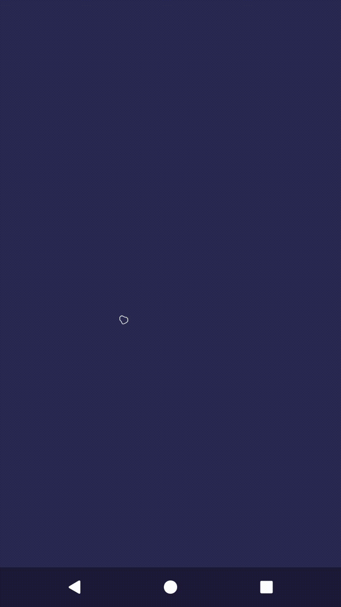
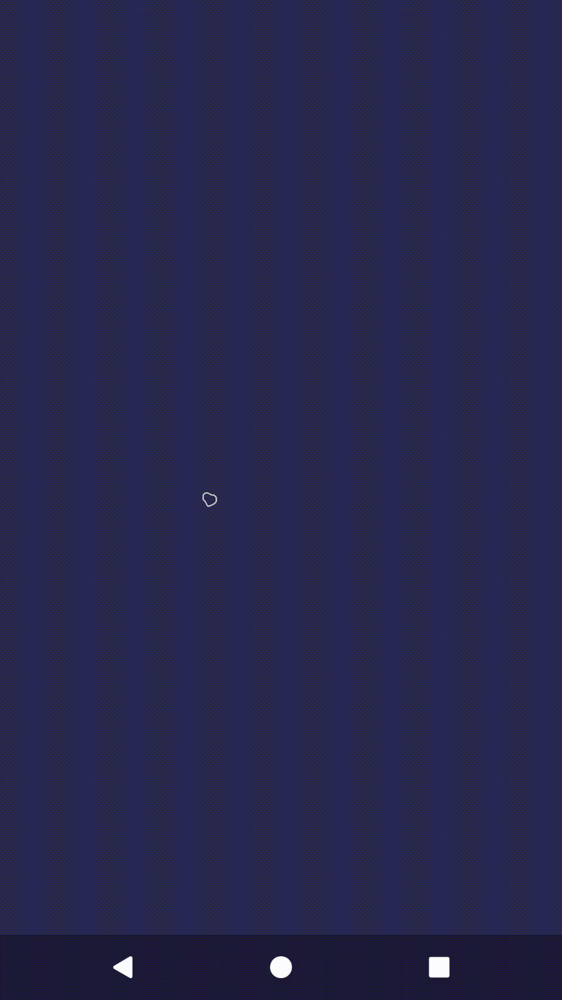
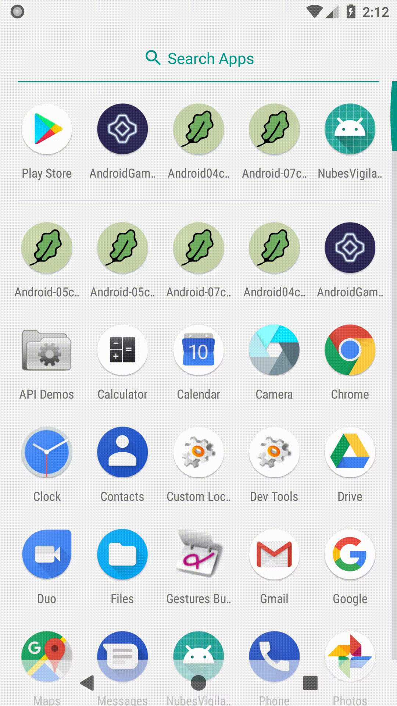

# Rozdział 4 - Fasada i czas

Ostatnio było sporo nowych klas? Sporo będzie dopiero teraz. W tym rozdziale zrobię w projekcie małą rewolucję. Więc trzymać się i do roboty.

## Panowanie nad czasem

Poprzedni rozdział zakończyliśmy wzmianką, o tym, że gra nie działa do końca poprawnie.



Problem polega na tym, że po przywróceniu uprzednio zatrzymanej (paused) aktywności, różnica czasu jest źle wyliczana - czas, na jaki aktywność została zatrzymana, jest doliczany do różnicy czasu. Ujmując inaczej - problem polega na tym, że czas płynie dalej, choć z perspektywy gry powinien się zatrzymać.

Możemy dodać logikę obchodzącą ten problem bezpośrednio do klasy `GameView`, ale to niepotrzebnie ją skomplikuje. Dlatego zastosujemy inne podejście - stworzymy nową, dedykowaną klasę `Timer`, która pozwoli na zatrzymywanie i wznawianie czasu.

Nim jednak do tego przejdziemy, mała refleksja na temat architektury. Klasa `Timer` będzie kolejnym elementem, na który nie ma do końca dobrego miejsca. Jednym z rozwiązań mogłoby być dodanie instancji klasy `Timer` do klasy `GameView`. Problemy z tym są dwa. Po pierwsze zmieni to sposób użycia klasy `GameView` (trzeba będzie jakoś informować obiekt o tym, że ma nastąpić pauza i wznowienie). Po drugie zwiększy się zatłoczenie samej klasy `GameView`. Stosując takie podejście, w miarę rozwoju, klasa stanie się odpowiedzialna za (prawie) wszystko. A takich elementów, jak klasa `Timer` będzie więcej. Inny z nich to np. gdzie umieścić załadowane bitmapy? Tego problemu w tej chwili nie widać, ponieważ obecnie jest jedna grafika, ale co zrobimy, gdy będzie ich 20? A co, gdy będzie np. 100 asteroid? Tak samo wyglądające asteroidy powinny współdzielić bitmapę, tj. nie powinniśmy ponownie ładować tej samej grafiki.

Dlatego teraz postaramy się temu zaradzić. Zrobimy to jednym z najprostszych podejść - wprowadzimy fasadę, która będzie łączyć w sobie wszystkie komponenty, takie jak klasa `Timer`.

## Fasada

Budowę fasady zacznijmy od wprowadzenia interfejsu dla wszystkich komponentów. Nie jest on niezbędny, ale wprowadzi porządek. Utwórzmy nowy interfejs `GameFacadeComponent`:

```java
package com.github.daishe.androidgametutorial;

import android.content.Context;
import android.support.annotation.NonNull;

public interface GameFacadeComponent {

    void create(@NonNull Context context);

    void pause();

    void resume();

    void destroy();

}
```

Jak można się domyślać, komponenty będą przechodziły między podobnymi stanami, jak aktywności w świecie androida - pozwoliłem sobie na zastosowanie antologicznej struktury.

Teraz czas na klasę `Timer`:

```java
package com.github.daishe.androidgametutorial;

import android.content.Context;
import android.support.annotation.NonNull;

public final class Timer implements GameFacadeComponent {

    private long startTime;
    private long subTime;

    private boolean paused;
    private long pauseTime;

    public Timer() {
    }

    public synchronized long timeAsLong() {
        if (this.paused)
            return this.pauseTime;
        long delta = Time.now() - this.startTime - this.subTime;
        return (delta > 0) ? delta : 0;
    }

    public synchronized float timeAsFloat() {
        return Timer.convertToFloatTime(this.timeAsLong());
    }

    @Override
    public void create(@NonNull Context context) {
        this.startTime = Time.now();
        this.subTime = 0;
        this.paused = false;
        this.pauseTime = 0;

        this.pause();
    }

    @Override
    public synchronized void pause() {
        this.pauseTime = this.timeAsLong();
        this.paused = true;
    }

    @Override
    public synchronized void resume() {
        this.paused = false;
        this.subTime += this.timeAsLong() - this.pauseTime;
    }

    @Override
    public void destroy() {
    }

    public static long convertToLongTime(float time) {
        double doubleResolution = (double)Time.resolution();
        double doubleTime = (double)time;
        return (long)(doubleTime * doubleResolution);
    }

    public static float convertToFloatTime(long time) {
        double doubleResolution = (double)Time.resolution();
        double doubleTime = (double)time;
        return (float)(doubleTime / doubleResolution);
    }

}
```

a zaraz po niej sama fasada - `GameFacade`:

```java
package com.github.daishe.androidgametutorial;

import android.content.Context;
import android.support.annotation.NonNull;

public final class GameFacade implements GameFacadeComponent {

    private Context context = null;
    private Timer timer = new Timer();

    public GameFacade() {
    }

    public Context context() {
        return this.context;
    }

    @NonNull
    public Timer timer() {
        return this.timer;
    }

    @Override
    public void create(@NonNull Context context) {
        this.context = context;

        this.timer.create(context);
    }

    @Override
    public void resume() {
        this.timer.resume();
    }

    @Override
    public void pause() {
        this.timer.pause();
    }

    @Override
    public void destroy() {
        this.timer.destroy();

        this.context = null;
    }

}
```

## Naprawa animacji

Czas wziąć się za naprawę animacji. Zmodyfikujmy klasę `GameView` tak, by używała stworzonej właśnie fasady:

```java
package com.github.daishe.androidgametutorial;

import android.content.Context;
import android.graphics.Canvas;
import android.support.annotation.NonNull;
import android.view.SurfaceView;

public class GameView extends SurfaceView {

    private GameFacade gameFacade;

    private Asteroid asteroid = null;

    private float lastUpdateTime;

    public GameView(Context context, @NonNull GameFacade gameFacade) {
        super(context);

        this.gameFacade = gameFacade;

        this.lastUpdateTime = this.gameFacade.timer().timeAsFloat();
    }

    protected void update() {
        if (this.asteroid == null)
            this.createAsteroid();

        float updateTime = this.gameFacade.timer().timeAsFloat();
        float timeShift = updateTime - this.lastUpdateTime;
        timeShift = timeShift > 0 ? timeShift : 0;
        this.lastUpdateTime = updateTime;

        this.asteroid.update(timeShift);
    }

    private void createAsteroid() {
        this.asteroid = new Asteroid(
                ImageLoader.with().context(this.getContext()).scale(0.04f).fromSvg(R.drawable.ic_asteroid_medium_0),
                Vector2D.fromCartesian(this.getWidth() / 2, this.getHeight() / 2),
                Vector2D.fromCartesian(this.getWidth() / 2, this.getHeight() / 4),
                Vector2D.fromCartesian(-150, 0)
        );
    }

    @Override
    protected void onDraw(Canvas canvas) {
        canvas.drawColor(0xFF2E2957);
        this.asteroid.draw(canvas);
    }

}
```

Teraz czas na główną aktywność - doprowadźmy klasę `MainActivity` do następującej postaci:

```java
package com.github.daishe.androidgametutorial;

import android.os.Bundle;
import android.support.annotation.NonNull;
import android.support.v7.app.AppCompatActivity;
import android.view.WindowManager;

public class MainActivity extends AppCompatActivity {

    private GameFacade gameFacade;
    private GameView gameView;
    private GameThread gameThread;

    @Override
    protected void onCreate(Bundle savedInstanceState) {
        super.onCreate(savedInstanceState);

        this.getWindow().addFlags(WindowManager.LayoutParams.FLAG_FULLSCREEN);
        this.getWindow().addFlags(WindowManager.LayoutParams.FLAG_KEEP_SCREEN_ON);

        this.gameFacade = this.makeGameFacade();
        this.gameView = new GameView(this, this.gameFacade);
        this.gameThread = new GameThread(this.gameView);

        this.gameView.getHolder().addCallback(new GameSurfaceHolderCallback(this.gameThread));
        this.setContentView(this.gameView);

        this.gameThread.start();
    }

    @Override
    protected void onResume() {
        super.onResume();
        this.gameFacade.resume();
    }

    @Override
    protected void onPause() {
        super.onPause();
        this.gameFacade.pause();
    }

    @NonNull
    private GameFacade makeGameFacade() {
        GameFacade gameFacade = new GameFacade();
        gameFacade.create(this);
        return gameFacade;
    }

}
```

Wreszcie aplikacja działa tak, jak należy.



Skoro jesteśmy przy poprawianiu błędów, to dodam jeszcze jedna rzecz - kiedy główna pętla gry powinna się zakończyć? Kiedy główna aktywność się zakończy.

## Poprawne zakończenie pętli

Zmodyfikujmy kod klasy `GameThread`:

```java
package com.github.daishe.androidgametutorial;

import android.app.Activity;
import android.graphics.Canvas;
import android.view.SurfaceHolder;

import java.lang.ref.WeakReference;
import java.util.concurrent.atomic.AtomicBoolean;

public class GameThread extends Thread {

    private static final int framesPerSecond = 30;

    private WeakReference<Activity> activityWeakReference;
    private GameView view;

    private AtomicBoolean isDrawing = new AtomicBoolean(false);

    public GameThread(Activity activity, GameView view) {
        this.activityWeakReference = new WeakReference<Activity>(activity);
        this.view = view;
    }

    public boolean drawing() {
        return this.isDrawing.get();
    }

    public boolean drawing(boolean isDrawing) {
        this.isDrawing.set(isDrawing);
        return isDrawing;
    }

    @Override
    public void run() {
        while (!Thread.interrupted() && this.isMainActivityRunning()) {
            try {
                long frameLogicStartTimePoint = Time.now();

                if (this.drawing()) {
                    this.executeUpdate();
                    this.executeDraw();
                }

                long frameLogicStopTimePoint = Time.now();

                long frameLogicTimeDelta = frameLogicStopTimePoint - frameLogicStartTimePoint;
                frameLogicTimeDelta = frameLogicTimeDelta > 0 ? frameLogicTimeDelta : 0;
                long sleepTime = (this.ticksPerFrame() - frameLogicTimeDelta) / (Time.resolution() / 1000);
                Thread.sleep(sleepTime > 0 ? sleepTime : 0);
            }
            catch (InterruptedException e) {
                break;
            }
            catch (Exception e) {
            }
        }
    }

    private boolean isMainActivityRunning() {
        Activity activity = this.activityWeakReference.get();
        return activity != null && !activity.isFinishing();
    }

    private long ticksPerFrame() {
        double resolution = (double)Time.resolution();
        return Math.round(resolution / GameThread.framesPerSecond);
    }

    private void executeUpdate() {
        this.view.update();
    }

    private void executeDraw() {
        SurfaceHolder surfaceHolder = this.view.getHolder();
        Canvas canvas = null;
        try {
            canvas = surfaceHolder.lockCanvas();
            if (canvas != null)
                this.view.onDraw(canvas);
        }
        finally {
            if (canvas != null)
                surfaceHolder.unlockCanvasAndPost(canvas);
        }
    }

}
```

a następnie kod tworzenia wątku w głównej aktywności (`MainActivity`):

```java
this.gameThread = new GameThread(this, this.gameView);
```

## Asteroidy

Tyle zmian w kodzie, a aplikacja się praktycznie nie zmieniła. Czas coś dodać. Zacznijmy od załadowania dodatkowych grafik. Znajdźmy odpowiednie pliki w katalogu zasobów (katalog `assets`) i załadujmy je analogicznie do pliku `asteroid-m0.svg` w rozdziale 3:

- Plik `asteroid-l0.svg`, nazwa zasobu: `ic_asteroid_large_0`.
- Plik `asteroid-l1.svg`, nazwa zasobu: `ic_asteroid_large_1`.
- Plik `asteroid-m1.svg`, nazwa zasobu: `ic_asteroid_medium_1`.
- Plik `asteroid-s0.svg`, nazwa zasobu: `ic_asteroid_small_0`.
- Plik `asteroid-s1.svg`, nazwa zasobu: `ic_asteroid_small_1`.
- Plik `asteroid-s2.svg`, nazwa zasobu: `ic_asteroid_small_2`.
- Plik `asteroid-t0.svg`, nazwa zasobu: `ic_asteroid_tiny_0`.
- Plik `asteroid-t1.svg`, nazwa zasobu: `ic_asteroid_tiny_1`.
- Plik `asteroid-t2.svg`, nazwa zasobu: `ic_asteroid_tiny_2`.
- Plik `asteroid-t3.svg`, nazwa zasobu: `ic_asteroid_tiny_3`.

Teraz przydałoby się coś, co zarządzałoby tymi wszystkimi grafikami. Dodajmy nowy komponent do fasady - `ImageManager`:

```java
package com.github.daishe.androidgametutorial;

import android.content.Context;
import android.graphics.Bitmap;
import android.support.annotation.NonNull;

public final class ImageManager implements GameFacadeComponent {

    private Bitmap asteroidTiny0 = null;
    private Bitmap asteroidTiny1 = null;
    private Bitmap asteroidTiny2 = null;
    private Bitmap asteroidTiny3 = null;
    private Bitmap asteroidSmall0 = null;
    private Bitmap asteroidSmall1 = null;
    private Bitmap asteroidSmall2 = null;
    private Bitmap asteroidMedium0 = null;
    private Bitmap asteroidMedium1 = null;
    private Bitmap asteroidLarge0 = null;
    private Bitmap asteroidLarge1 = null;

    public ImageManager() {
    }

    public Bitmap randomAsteroid() {
        // TODO: Fill me up
        return null;
    }

    @Override
    public void create(@NonNull Context context) {
        float scale = 0.04f;

        this.asteroidTiny0 = ImageLoader.with().context(context).scale(scale).fromSvg(R.drawable.ic_asteroid_tiny_0);
        this.asteroidTiny1 = ImageLoader.with().context(context).scale(scale).fromSvg(R.drawable.ic_asteroid_tiny_1);
        this.asteroidTiny2 = ImageLoader.with().context(context).scale(scale).fromSvg(R.drawable.ic_asteroid_tiny_2);
        this.asteroidTiny3 = ImageLoader.with().context(context).scale(scale).fromSvg(R.drawable.ic_asteroid_tiny_3);
        this.asteroidSmall0 = ImageLoader.with().context(context).scale(scale).fromSvg(R.drawable.ic_asteroid_small_0);
        this.asteroidSmall1 = ImageLoader.with().context(context).scale(scale).fromSvg(R.drawable.ic_asteroid_small_1);
        this.asteroidSmall2 = ImageLoader.with().context(context).scale(scale).fromSvg(R.drawable.ic_asteroid_small_2);
        this.asteroidMedium0 = ImageLoader.with().context(context).scale(scale).fromSvg(R.drawable.ic_asteroid_medium_0);
        this.asteroidMedium1 = ImageLoader.with().context(context).scale(scale).fromSvg(R.drawable.ic_asteroid_medium_1);
        this.asteroidLarge0 = ImageLoader.with().context(context).scale(scale).fromSvg(R.drawable.ic_asteroid_large_0);
        this.asteroidLarge1 = ImageLoader.with().context(context).scale(scale).fromSvg(R.drawable.ic_asteroid_large_1);
    }

    @Override
    public void pause() {
    }

    @Override
    public void resume() {
    }

    @Override
    public void destroy() {
        this.asteroidTiny0 = null;
        this.asteroidTiny1 = null;
        this.asteroidTiny2 = null;
        this.asteroidTiny3 = null;
        this.asteroidSmall0 = null;
        this.asteroidSmall1 = null;
        this.asteroidSmall2 = null;
        this.asteroidMedium0 = null;
        this.asteroidMedium1 = null;
        this.asteroidLarge0 = null;
        this.asteroidLarge1 = null;
    }

}
```

Pozostaje uzupełnić metodę `randomAsteroid` i dodać komponent do fasady. Dobrze byłoby wprowadzić bardziej "finezyjne" losowanie asteroid. Dlatego nim uzupełnimy kod, dodajmy pomocniczy komponent fasady - klasę `Random`:

```java
package com.github.daishe.androidgametutorial;

import android.content.Context;
import android.support.annotation.NonNull;

public final class Random implements GameFacadeComponent {

    private java.util.Random randomImpl = null;

    public Random() {
    }

    public int integer() {
        return this.randomImpl.nextInt();
    }

    public int integer(int bound) {
        return this.randomImpl.nextInt(bound);
    }

    public float linear() {
        return this.randomImpl.nextFloat();
    }

    public float linear(float scale) {
        return this.linear() * scale;
    }

    public float linear(float min, float max) {
        return this.linear(max - min) + min;
    }

    public float gaussian() {
        return (float)this.randomImpl.nextGaussian();
    }

    public float gaussian(float limitTo) {
        limitTo = Math.abs(limitTo);
        while (true) {
            float result = this.gaussian();
            if (result >= -limitTo && result <= limitTo)
                return result;
        }
    }

    public float angle() {
        return this.linear(0f, (float)Math.PI * 2);
    }

    public float sign() {
        return this.randomImpl.nextBoolean() ? 1f : -1f;
    }

    @Override
    public void create(@NonNull Context context) {
        this.randomImpl = new java.util.Random();
    }

    @Override
    public void pause() {
    }

    @Override
    public void resume() {
    }

    @Override
    public void destroy() {
        this.randomImpl = null;
    }

}
```

i zaktualizujmy kod fasady `GameFacade`:

```java
package com.github.daishe.androidgametutorial;

import android.content.Context;
import android.support.annotation.NonNull;

public final class GameFacade implements GameFacadeComponent {

    private Context context = null;
    private Random random = new Random();
    private ImageManager imageManager = new ImageManager();
    private Timer timer = new Timer();

    public GameFacade() {
    }

    public Context context() {
        return this.context;
    }

    @NonNull
    public Random random() {
        return this.random;
    }

    @NonNull
    public ImageManager imageManager() {
        return this.imageManager;
    }

    @NonNull
    public Timer timer() {
        return this.timer;
    }

    @Override
    public void create(@NonNull Context context) {
        this.context = context;

        this.random.create(context);
        this.imageManager.create(context);
        this.timer.create(context);
    }

    @Override
    public void resume() {
        this.random.resume();
        this.imageManager.resume();
        this.timer.resume();
    }

    @Override
    public void pause() {
        this.timer.pause();
        this.imageManager.pause();
        this.random.pause();
    }

    @Override
    public void destroy() {
        this.timer.destroy();
        this.imageManager.destroy();
        this.random.destroy();

        this.context = null;
    }

}
```

Teraz powróćmy do klasy `ImageManager`. Dodajmy nowy prywatny atrybut `gameFacade`:

```java
private GameFacade gameFacade;
```

i zmodyfikujmy konstruktor:

```java
public ImageManager(@NonNull GameFacade gameFacade) {
    this.gameFacade = gameFacade;
}
```

Ostatecznie uzupełnijmy metodę `randomAsteroid`:

```java
public Bitmap randomAsteroid() {
    Random r = this.gameFacade.random();
    double randomGaussian = Math.abs(r.gaussian(2));
    if (randomGaussian < 0.5) {
        switch(r.integer(4)) {
            case 0:  return this.asteroidTiny0;
            case 1:  return this.asteroidTiny1;
            case 2:  return this.asteroidTiny2;
            default: return this.asteroidTiny3;
        }
    }
    if (randomGaussian < 1.0) {
        switch(r.integer(4)) {
            case 0:  return this.asteroidSmall0;
            case 1:  return this.asteroidSmall1;
            default: return this.asteroidSmall2;
        }

    }
    if (randomGaussian < 1.5) {
        switch(r.integer(2)) {
            case 0:  return this.asteroidMedium0;
            default: return this.asteroidMedium1;
        }
    }
    switch(r.integer(2)) {
        case 0:  return this.asteroidLarge0;
        default: return this.asteroidLarge1;
    }
}
```

Pamiętajmy również o aktualizacji kodu tworzenia instancji klasy `ImageManager` w klasie `GameFacade`:

```java
private ImageManager imageManager = new ImageManager(this);
```

## Rozszerzenie aplikacji

Zmodyfikujmy teraz klasę `GameView`:

```java
package com.github.daishe.androidgametutorial;

import android.content.Context;
import android.graphics.Bitmap;
import android.graphics.Canvas;
import android.support.annotation.NonNull;
import android.view.SurfaceView;

import java.util.ArrayList;

public class GameView extends SurfaceView {

    private GameFacade gameFacade;

    private ArrayList<Asteroid> asteroids = null;

    private float lastUpdateTime;

    public GameView(Context context, @NonNull GameFacade gameFacade) {
        super(context);

        this.gameFacade = gameFacade;

        this.lastUpdateTime = this.gameFacade.timer().timeAsFloat();
    }

    protected void update() {
        if (this.asteroids == null)
            this.createAsteroids();

        float updateTime = this.gameFacade.timer().timeAsFloat();
        float timeShift = updateTime - this.lastUpdateTime;
        timeShift = timeShift > 0 ? timeShift : 0;
        this.lastUpdateTime = updateTime;

        for (Asteroid asteroid : this.asteroids)
            asteroid.update(timeShift);
    }

    private void createAsteroids() {
        Random r = this.gameFacade.random();

        this.asteroids = new ArrayList<Asteroid>();

        Vector2D center = Vector2D.fromCartesian(this.getWidth() / 2, this.getHeight() / 2);
        float averageOrbitingRadius = this.getHeight() / 6;
        for (int i = 0; i < 10; ++i) {
            Bitmap asteroidBitmap = this.gameFacade.imageManager().randomAsteroid();

            float orbitingRadius = averageOrbitingRadius * (1f + 0.3f * r.gaussian());
            Vector2D relativePosition = Vector2D.fromPolar(orbitingRadius, r.angle());
            Vector2D velocity = Vector2D.fromCartesian(-relativePosition.y(), relativePosition.x())
                .mulInPlace(1f + 0.2f * r.gaussian())
                .mulInPlace(r.sign());

            this.asteroids.add(new Asteroid(asteroidBitmap, center, center.add(relativePosition), velocity));
        }
    }

    @Override
    protected void onDraw(Canvas canvas) {
        canvas.drawColor(0xFF2E2957);
        for (Asteroid asteroid : this.asteroids)
            asteroid.draw(canvas);
    }

}
```

i przetestujmy działanie aplikacji.



## Podsumowanie

W tym rozdziale stworzyliśmy prostą architekturę aplikacji bazującą na fasadzie. Oczywiście można by wymyślić bardziej wyrafinowane rozwiązanie, jednak dla naszej prostej gry jest wystarczające. Stworzony przykład ilustruje zastosowanie fasady oraz to, jak łatwo (przy użyciu wprowadzony do tej pory elementów) tworzyć całkiem złożone sceny. W następnym rozdziale zajmiemy się dalszymi porządkami i separacją logiki gry od świata androida.

## Zmodyfikowane pliki

Lista wszystkich zmodyfikowanych plików.

### Plik `GameFacade.java`

```java
package com.github.daishe.androidgametutorial;

import android.content.Context;
import android.support.annotation.NonNull;

public final class GameFacade implements GameFacadeComponent {

    private Context context = null;
    private Random random = new Random();
    private ImageManager imageManager = new ImageManager(this);
    private Timer timer = new Timer();

    public GameFacade() {
    }

    public Context context() {
        return this.context;
    }

    @NonNull
    public Random random() {
        return this.random;
    }

    @NonNull
    public ImageManager imageManager() {
        return this.imageManager;
    }

    @NonNull
    public Timer timer() {
        return this.timer;
    }

    @Override
    public void create(@NonNull Context context) {
        this.context = context;

        this.random.create(context);
        this.imageManager.create(context);
        this.timer.create(context);
    }

    @Override
    public void resume() {
        this.random.resume();
        this.imageManager.resume();
        this.timer.resume();
    }

    @Override
    public void pause() {
        this.timer.pause();
        this.imageManager.pause();
        this.random.pause();
    }

    @Override
    public void destroy() {
        this.timer.destroy();
        this.imageManager.destroy();
        this.random.destroy();

        this.context = null;
    }

}
```

### Plik `GameFacadeComponent.java`

```java
package com.github.daishe.androidgametutorial;

import android.content.Context;
import android.support.annotation.NonNull;

public interface GameFacadeComponent {

    void create(@NonNull Context context);

    void pause();

    void resume();

    void destroy();

}
```

### Plik `GameView.java`

```java
package com.github.daishe.androidgametutorial;

import android.content.Context;
import android.graphics.Bitmap;
import android.graphics.Canvas;
import android.support.annotation.NonNull;
import android.view.SurfaceView;

import java.util.ArrayList;

public class GameView extends SurfaceView {

    private GameFacade gameFacade;

    private ArrayList<Asteroid> asteroids = null;

    private float lastUpdateTime;

    public GameView(Context context, @NonNull GameFacade gameFacade) {
        super(context);

        this.gameFacade = gameFacade;

        this.lastUpdateTime = this.gameFacade.timer().timeAsFloat();
    }

    protected void update() {
        if (this.asteroids == null)
            this.createAsteroids();

        float updateTime = this.gameFacade.timer().timeAsFloat();
        float timeShift = updateTime - this.lastUpdateTime;
        timeShift = timeShift > 0 ? timeShift : 0;
        this.lastUpdateTime = updateTime;

        for (Asteroid asteroid : this.asteroids)
            asteroid.update(timeShift);
    }

    private void createAsteroids() {
        Random r = this.gameFacade.random();

        this.asteroids = new ArrayList<Asteroid>();

        Vector2D center = Vector2D.fromCartesian(this.getWidth() / 2, this.getHeight() / 2);
        float averageOrbitingRadius = this.getHeight() / 6;
        for (int i = 0; i < 10; ++i) {
            Bitmap asteroidBitmap = this.gameFacade.imageManager().randomAsteroid();

            float orbitingRadius = averageOrbitingRadius * (1f + 0.3f * r.gaussian());
            Vector2D relativePosition = Vector2D.fromPolar(orbitingRadius, r.angle());
            Vector2D velocity = Vector2D.fromCartesian(-relativePosition.y(), relativePosition.x())
                .mulInPlace(1f + 0.2f * r.gaussian())
                .mulInPlace(r.sign());

            this.asteroids.add(new Asteroid(asteroidBitmap, center, center.add(relativePosition), velocity));
        }
    }

    @Override
    protected void onDraw(Canvas canvas) {
        canvas.drawColor(0xFF2E2957);
        for (Asteroid asteroid : this.asteroids)
            asteroid.draw(canvas);
    }

}
```

### Plik `ImageManager.java`

```java
package com.github.daishe.androidgametutorial;

import android.content.Context;
import android.graphics.Bitmap;
import android.support.annotation.NonNull;

public final class ImageManager implements GameFacadeComponent {

    private GameFacade gameFacade;

    private Bitmap asteroidTiny0 = null;
    private Bitmap asteroidTiny1 = null;
    private Bitmap asteroidTiny2 = null;
    private Bitmap asteroidTiny3 = null;
    private Bitmap asteroidSmall0 = null;
    private Bitmap asteroidSmall1 = null;
    private Bitmap asteroidSmall2 = null;
    private Bitmap asteroidMedium0 = null;
    private Bitmap asteroidMedium1 = null;
    private Bitmap asteroidLarge0 = null;
    private Bitmap asteroidLarge1 = null;

    public ImageManager(@NonNull GameFacade gameFacade) {
        this.gameFacade = gameFacade;
    }

    public Bitmap randomAsteroid() {
        Random r = this.gameFacade.random();
        double randomGaussian = Math.abs(r.gaussian(2));
        if (randomGaussian < 0.5) {
            switch(r.integer(4)) {
                case 0:  return this.asteroidTiny0;
                case 1:  return this.asteroidTiny1;
                case 2:  return this.asteroidTiny2;
                default: return this.asteroidTiny3;
            }
        }
        if (randomGaussian < 1.0) {
            switch(r.integer(4)) {
                case 0:  return this.asteroidSmall0;
                case 1:  return this.asteroidSmall1;
                default: return this.asteroidSmall2;
            }

        }
        if (randomGaussian < 1.5) {
            switch(r.integer(2)) {
                case 0:  return this.asteroidMedium0;
                default: return this.asteroidMedium1;
            }
        }
        switch(r.integer(2)) {
            case 0:  return this.asteroidLarge0;
            default: return this.asteroidLarge1;
        }
    }

    @Override
    public void create(@NonNull Context context) {
        float scale = 0.04f;

        this.asteroidTiny0 = ImageLoader.with().context(context).scale(scale).fromSvg(R.drawable.ic_asteroid_tiny_0);
        this.asteroidTiny1 = ImageLoader.with().context(context).scale(scale).fromSvg(R.drawable.ic_asteroid_tiny_1);
        this.asteroidTiny2 = ImageLoader.with().context(context).scale(scale).fromSvg(R.drawable.ic_asteroid_tiny_2);
        this.asteroidTiny3 = ImageLoader.with().context(context).scale(scale).fromSvg(R.drawable.ic_asteroid_tiny_3);
        this.asteroidSmall0 = ImageLoader.with().context(context).scale(scale).fromSvg(R.drawable.ic_asteroid_small_0);
        this.asteroidSmall1 = ImageLoader.with().context(context).scale(scale).fromSvg(R.drawable.ic_asteroid_small_1);
        this.asteroidSmall2 = ImageLoader.with().context(context).scale(scale).fromSvg(R.drawable.ic_asteroid_small_2);
        this.asteroidMedium0 = ImageLoader.with().context(context).scale(scale).fromSvg(R.drawable.ic_asteroid_medium_0);
        this.asteroidMedium1 = ImageLoader.with().context(context).scale(scale).fromSvg(R.drawable.ic_asteroid_medium_1);
        this.asteroidLarge0 = ImageLoader.with().context(context).scale(scale).fromSvg(R.drawable.ic_asteroid_large_0);
        this.asteroidLarge1 = ImageLoader.with().context(context).scale(scale).fromSvg(R.drawable.ic_asteroid_large_1);
    }

    @Override
    public void pause() {
    }

    @Override
    public void resume() {
    }

    @Override
    public void destroy() {
        this.asteroidTiny0 = null;
        this.asteroidTiny1 = null;
        this.asteroidTiny2 = null;
        this.asteroidTiny3 = null;
        this.asteroidSmall0 = null;
        this.asteroidSmall1 = null;
        this.asteroidSmall2 = null;
        this.asteroidMedium0 = null;
        this.asteroidMedium1 = null;
        this.asteroidLarge0 = null;
        this.asteroidLarge1 = null;
    }

}
```

### Plik `MainActivity.java`

```java
package com.github.daishe.androidgametutorial;

import android.os.Bundle;
import android.support.annotation.NonNull;
import android.support.v7.app.AppCompatActivity;
import android.view.WindowManager;

public class MainActivity extends AppCompatActivity {

    private GameFacade gameFacade;
    private GameView gameView;
    private GameThread gameThread;

    @Override
    protected void onCreate(Bundle savedInstanceState) {
        super.onCreate(savedInstanceState);

        this.getWindow().addFlags(WindowManager.LayoutParams.FLAG_FULLSCREEN);
        this.getWindow().addFlags(WindowManager.LayoutParams.FLAG_KEEP_SCREEN_ON);

        this.gameFacade = this.makeGameFacade();
        this.gameView = new GameView(this, this.gameFacade);
        this.gameThread = new GameThread(this, this.gameView);

        this.gameView.getHolder().addCallback(new GameSurfaceHolderCallback(this.gameThread));
        this.setContentView(this.gameView);

        this.gameThread.start();
    }

    @Override
    protected void onResume() {
        super.onResume();
        this.gameFacade.resume();
    }

    @Override
    protected void onPause() {
        super.onPause();
        this.gameFacade.pause();
    }

    @NonNull
    private GameFacade makeGameFacade() {
        GameFacade gameFacade = new GameFacade();
        gameFacade.create(this);
        return gameFacade;
    }

}
```

### Plik `Random.java`

```java
package com.github.daishe.androidgametutorial;

import android.content.Context;
import android.support.annotation.NonNull;

public final class Random implements GameFacadeComponent {

    private java.util.Random randomImpl = null;

    public Random() {
    }

    public int integer() {
        return this.randomImpl.nextInt();
    }

    public int integer(int bound) {
        return this.randomImpl.nextInt(bound);
    }

    public float linear() {
        return this.randomImpl.nextFloat();
    }

    public float linear(float scale) {
        return this.linear() * scale;
    }

    public float linear(float min, float max) {
        return this.linear(max - min) + min;
    }

    public float gaussian() {
        return (float)this.randomImpl.nextGaussian();
    }

    public float gaussian(float limitTo) {
        limitTo = Math.abs(limitTo);
        while (true) {
            float result = this.gaussian();
            if (result >= -limitTo && result <= limitTo)
                return result;
        }
    }

    public float angle() {
        return this.linear(0f, (float)Math.PI * 2);
    }

    public float sign() {
        return this.randomImpl.nextBoolean() ? 1f : -1f;
    }

    @Override
    public void create(@NonNull Context context) {
        this.randomImpl = new java.util.Random();
    }

    @Override
    public void pause() {
    }

    @Override
    public void resume() {
    }

    @Override
    public void destroy() {
        this.randomImpl = null;
    }

}
```

### Plik `Timer.java`

```java
package com.github.daishe.androidgametutorial;

import android.content.Context;
import android.support.annotation.NonNull;

public final class Timer implements GameFacadeComponent {

    private long startTime;
    private long subTime;

    private boolean paused;
    private long pauseTime;

    public Timer() {
    }

    public synchronized long timeAsLong() {
        if (this.paused)
            return this.pauseTime;
        long delta = Time.now() - this.startTime - this.subTime;
        return (delta > 0) ? delta : 0;
    }

    public synchronized float timeAsFloat() {
        return Timer.convertToFloatTime(this.timeAsLong());
    }

    @Override
    public void create(@NonNull Context context) {
        this.startTime = Time.now();
        this.subTime = 0;
        this.paused = false;
        this.pauseTime = 0;

        this.pause();
    }

    @Override
    public synchronized void pause() {
        this.pauseTime = this.timeAsLong();
        this.paused = true;
    }

    @Override
    public synchronized void resume() {
        this.paused = false;
        this.subTime += this.timeAsLong() - this.pauseTime;
    }

    @Override
    public void destroy() {
    }

    public static long convertToLongTime(float time) {
        double doubleResolution = (double)Time.resolution();
        double doubleTime = (double)time;
        return (long)(doubleTime * doubleResolution);
    }

    public static float convertToFloatTime(long time) {
        double doubleResolution = (double)Time.resolution();
        double doubleTime = (double)time;
        return (float)(doubleTime / doubleResolution);
    }

}
```
