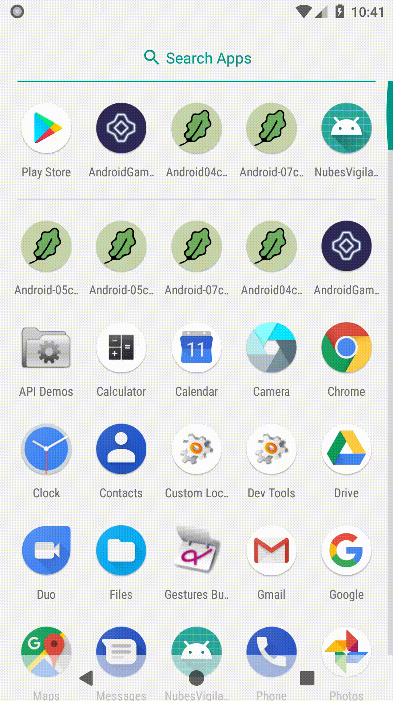

# Rozdział 5 - Świat gry i separacja

Kontynuując rewolucje z poprzedniego rozdziału, zajmę się dalszą modyfikacją istniejącej struktury kodu. Tym razem skupię się na separacji logiki gry od świata androida.

## Uniezależnienie od rozdzielczości urządzenia gracza

Zwróćmy uwagę, że obecnie animacja jest ściśle zależna od rozdzielczości. To nie powinno mieć miejsca. Dodatkowo byłoby bardzo wygodne, gdyby punkt (0, 0) znajdował się na środku obszaru rysowania, a nie w lewym górnym rogu. To samo tyczy się bitmap - niech pozycja asteroidy oznacza pozycje środka bitmapy. Klasa `Canvas` zawiera wiele użytecznych metod, które pomogą się z tym uporać.

Zmodyfikujmy metodę `onDraw` klasy `GameView`. Doprowadźmy ją do następującej postaci:

```java
@Override
protected void onDraw(Canvas canvas) {
    canvas.save();

    canvas.translate(canvas.getWidth() / 2, canvas.getHeight() / 2);

    float minDimension = Math.min(canvas.getWidth(), canvas.getHeight());
    float scale = minDimension / 2 / 540f;
    canvas.scale(scale, scale);

    canvas.drawColor(0xFF2E2957);

    for (Asteroid asteroid : this.asteroids)
        asteroid.draw(canvas);

    canvas.restore();
}
```

i zaktualizujmy metodę `createAsteroids`, klasy `GameView`:

```java
private void createAsteroids() {
    Random r = this.gameFacade.random();

    this.asteroids = new ArrayList<Asteroid>();

    for (int i = 0; i < 10; ++i) {
        Bitmap asteroidBitmap = this.gameFacade.imageManager().randomAsteroid();

        float orbitingRadius = 320f * (1f + 0.3f * r.gaussian());
        Vector2D relativePosition = Vector2D.fromPolar(orbitingRadius, r.angle());
        Vector2D velocity = Vector2D.fromCartesian(-relativePosition.y(), relativePosition.x())
            .mulInPlace(1f + 0.2f * r.gaussian())
            .mulInPlace(r.sign());

        this.asteroids.add(new Asteroid(asteroidBitmap, Vector2D.fromCartesian(0, 0), relativePosition, velocity));
    }
}
```

oraz `draw`, klasy `Asteroid`:

```java
public void draw(Canvas canvas) {
    canvas.drawBitmap(
            this.asteroidImage,
            this.position.x() - this.asteroidImage.getWidth() / 2,
            this.position.y() - this.asteroidImage.getHeight() / 2,
            this.paint
        );
}
```

Teraz aplikacja jest niezależna od urządzenia - obszar rysowania zostanie automatycznie przeskalowany względem mniejszego z wymiarów ekranu. W wyniku (z perspektywy obiektów w grze) najmniejszy z wymiarów wynosi zawsze 540. Poza tym rysowanie odbywa się względem środka obszaru roboczego i środka rysowanej bitmapy.

Czas nieco urozmaicić animację asteroid.

## Obroty, przezroczystość i skalowanie

W ogólności wyświetlając bitmapę, oprócz ustalenia miejsca rysowania, można chcieć obrócić ją, przeskalować lub narysować w pewnym stopniu przezroczystą. Przejdziemy przez każdą z tych możliwości, podając gotowy, przykładowy (często istnieją też inne możliwości zrealizowania danego rysownia) kod. Tak więc, by narysować bitmapę z zadaną przezroczystością:

```java
Vector2D position = Vector2D.fromCartesian(100f, 200f);
float alpha = 0.4f;

Paint paint = new Paint();
paint.setAlpha((int)(255 * alpha));
canvas.drawBitmap(
        bitmap,
        position.x() - bitmap.getWidth() / 2,
        position.y() - bitmap.getWidth() / 2,
        paint
    );
```

by narysować przeskalowaną bitmapę:

```java
Vector2D position = Vector2D.fromCartesian(100f, 200f);
float scale = 0.5f;

Matrix matrix = new Matrix();
matrix.setTranslate(-bitmap.getWidth() / 2, -bitmap.getHeight() / 2);
matrix.postScale(scale, scale);
matrix.postTranslate(position.x(), position.y());
canvas.drawBitmap(bitmap, matrix, null);
```

i wreszcie, by narysować bitmapę obróconą o zadany kąt (mierzony w radianach):

```java
Vector2D position = Vector2D.fromCartesian(100f, 200f);
float rotation = (float)Math.PI / 4;

Matrix matrix = new Matrix();
matrix.setTranslate(-bitmap.getWidth() / 2, -bitmap.getHeight() / 2);
matrix.postRotate((float)Math.toDegrees(rotation), 0, 0);
matrix.postTranslate(position.x(), position.y());
canvas.drawBitmap(bitmap, matrix, null);
```

Tylko teraz rodzi się pytanie - jak przeskalować, obrócić i ustawić przezroczystość jednocześnie? Oto jak:

```java
Vector2D position = Vector2D.fromCartesian(100f, 200f);
float alpha = 0.4f;
float rotation = (float)Math.PI / 4;
float scale = 0.5f;

Matrix matrix = new Matrix();
matrix.setTranslate(-bitmap.getWidth() / 2, -bitmap.getHeight() / 2);
matrix.postScale(scale, scale);
matrix.postRotate((float)Math.toDegrees(rotation), 0, 0);
matrix.postTranslate(position.x(), position.y());

Paint paint = new Paint();
paint.setAlpha((int)(255 * alpha));
canvas.drawBitmap(bitmap, matrix, paint);
```

To gdzie ten kod umieścić? W klasie asteroidy? I później kopiować go we wszystkich innych klasach obiektów gry? Takie duplikacje nieładnie pachną. To może klasa `GameView`? Tylko, czy nie jest już zbyt zatłoczona (a my przecież mieliśmy się odseparowywać od świata androida). Tak naprawdę potrzebujemy dedykowanego miejsca. Wprowadzimy więc klasę naszego własnego obszaru rysowania - `GameCanvas`, która błędzie komponentem odpowiedzialnym za izolację rysowania.

## Własne płótno i obrazy

Zmienimy cykl życia instancji klasy `GameCanvas` (w stosunku do instancji klasy `Canvas`). Zwróćmy uwagę np. na kod rysowania z obrotem. W androidzie potrzebujemy dodatkowych obiektów jak instancji klasy `Matrix`, czy `Paint`. Ponowne tworzenie ich przy renderowaniu każdej klatki byłoby zbędnym marnotrawstwem. Dlatego nasza klasa obszaru rysowania będzie działała na zasadzie blokowania (nabywania) i zwalniania (oddawania) oryginalnego obszaru rysownia androida.

Dodajmy nową klasę o nazwie `GameCanvas`:

```java
package com.github.daishe.androidgametutorial;

import android.graphics.Bitmap;
import android.graphics.Canvas;
import android.graphics.Matrix;
import android.graphics.Paint;

public class GameCanvas {

    private static final float minVisibleRange = 540f;

    private Canvas canvas = null;

    private Paint paint = new Paint();
    private Matrix matrix = new Matrix();

    public GameCanvas() {
        this.paint.setAntiAlias(true);
    }

    public void drawBitmap(Bitmap bitmap, Vector2D at) {
        this.canvas.drawBitmap(
                bitmap,
                at.x() - bitmap.getWidth() / 2,
                at.y() - bitmap.getHeight() / 2,
                this.paint
        );
    }

    public void drawBitmap(Bitmap bitmap, Vector2D at, float scale, float rotation, float alpha) {
        this.matrix.setTranslate(-bitmap.getWidth() / 2, -bitmap.getHeight() / 2);
        this.matrix.postScale(scale, scale);
        this.matrix.postRotate((float)Math.toDegrees(rotation), 0, 0);
        this.matrix.postTranslate(at.x(), at.y());

        this.paint.setAlpha((int)(255 * alpha));
        canvas.drawBitmap(bitmap, this.matrix, this.paint);
        this.paint.setAlpha(255);

        this.matrix.reset();
    }

    public void lockCanvas(Canvas canvas) {
        this.canvas = canvas;
        this.canvas.save();

        this.canvas.translate(this.canvas.getWidth() / 2, this.canvas.getHeight() / 2);
        float minDimension = Math.min(this.canvas.getWidth(), this.canvas.getHeight());
        float scale = minDimension / 2 / GameCanvas.minVisibleRange;
        this.canvas.scale(scale, scale);

        this.canvas.drawColor(0xFF2E2957);
    }

    public Canvas releaseCanvas() {
        this.canvas.restore();

        Canvas result = this.canvas;
        this.canvas = null;
        return result;
    }

}
```

Dziwić może fakt, że używamy tylko jednej instancji klasy `Matrix` i jednej `Paint` do rysowania różnych elementów. Zwykle obiekty gry mają własne macierze określające ich rotacje i pozycje. Sęk w tym, że dla obecnej aplikacji nie ma to znaczenia - pociągałoby za sobą ciągłe zmiany macierzy, ponieważ wszystkie asteroidy i tak zmieniają swoje miejsce co każdą klatkę.

Skoro tak dobrze idzie nam odseparowywanie od świata androida, to nawiązując dalej do rysowania i bitmapach, można wprowadzić jeszcze jeden mały komponent. Klasa `Bitmap` jest ściśle powiązana z android API, dlatego możemy dodać warstwę abstrakcji pod postacią klasy `Image`:

```java
package com.github.daishe.androidgametutorial;

import android.graphics.Bitmap;
import android.support.annotation.NonNull;

public class Image {

    private Bitmap data = null;

    public Image() {
        this.reset();
    }

    public Image(@NonNull Bitmap from) {
        this.reset(from);
    }

    public Image(@NonNull Image from) {
        this.reset(from);
    }

    public void reset() {
        this.data = null;
    }

    public void reset(@NonNull Bitmap from) {
        this.data = from;
    }

    public void reset(@NonNull Image from) {
        this.data = from.data;
    }

    public void draw(GameCanvas gameCanvas, Vector2D at) {
        gameCanvas.drawBitmap(this.data, at);
    }

    public void draw(GameCanvas gameCanvas, Vector2D at, float scale, float rotation, float alpha) {
        gameCanvas.drawBitmap(this.data, at, scale, rotation, alpha);
    }

}
```

Teraz powinniśmy wprowadzić do użycia dodane właśnie komponenty. W tym celu zmodyfikujmy metody `fromSvg` klasy `ImageLoader`:

```java
@NonNull
public Image fromSvg() {
    Drawable drawable = ContextCompat.getDrawable(this.context, this.resource);
    Bitmap bitmap = Bitmap.createBitmap(
            Math.round(drawable.getIntrinsicWidth() * this.scale),
            Math.round(drawable.getIntrinsicHeight() * this.scale),
            Bitmap.Config.ARGB_8888
    );

    if (Build.VERSION.SDK_INT < Build.VERSION_CODES.LOLLIPOP) {
        drawable = (DrawableCompat.wrap(drawable)).mutate();
    }

    Canvas canvas = new Canvas(bitmap);
    drawable.setBounds(
            0,
            0,
            canvas.getWidth(),
            canvas.getHeight()
    );
    drawable.setAlpha(Math.round(this.alpha * 255));
    drawable.draw(canvas);

    return new Image(bitmap);
}

@NonNull
public Image fromSvg(int resource) {
    return this.resource(resource).fromSvg();
}
```

oraz klasę `ImageManager`:

```java
package com.github.daishe.androidgametutorial;

import android.content.Context;
import android.support.annotation.NonNull;

public final class ImageManager implements GameFacadeComponent {

    private GameFacade gameFacade;

    private Image asteroidTiny0 = new Image();
    private Image asteroidTiny1 = new Image();
    private Image asteroidTiny2 = new Image();
    private Image asteroidTiny3 = new Image();
    private Image asteroidSmall0 = new Image();
    private Image asteroidSmall1 = new Image();
    private Image asteroidSmall2 = new Image();
    private Image asteroidMedium0 = new Image();
    private Image asteroidMedium1 = new Image();
    private Image asteroidLarge0 = new Image();
    private Image asteroidLarge1 = new Image();

    public ImageManager(@NonNull GameFacade gameFacade) {
        this.gameFacade = gameFacade;
    }

    public Image randomAsteroid() {
        Random r = this.gameFacade.random();
        double randomGaussian = Math.abs(r.gaussian(2));
        if (randomGaussian < 0.5) {
            switch(r.integer(4)) {
                case 0:  return this.asteroidTiny0;
                case 1:  return this.asteroidTiny1;
                case 2:  return this.asteroidTiny2;
                default: return this.asteroidTiny3;
            }
        }
        if (randomGaussian < 1.0) {
            switch(r.integer(4)) {
                case 0:  return this.asteroidSmall0;
                case 1:  return this.asteroidSmall1;
                default: return this.asteroidSmall2;
            }

        }
        if (randomGaussian < 1.5) {
            switch(r.integer(2)) {
                case 0:  return this.asteroidMedium0;
                default: return this.asteroidMedium1;
            }
        }
        switch(r.integer(2)) {
            case 0:  return this.asteroidLarge0;
            default: return this.asteroidLarge1;
        }
    }

    @Override
    public void create(@NonNull Context context) {
        float scale = 0.04f;

        this.asteroidTiny0.reset(ImageLoader.with().context(context).scale(scale).fromSvg(R.drawable.ic_asteroid_tiny_0));
        this.asteroidTiny1.reset(ImageLoader.with().context(context).scale(scale).fromSvg(R.drawable.ic_asteroid_tiny_1));
        this.asteroidTiny2.reset(ImageLoader.with().context(context).scale(scale).fromSvg(R.drawable.ic_asteroid_tiny_2));
        this.asteroidTiny3.reset(ImageLoader.with().context(context).scale(scale).fromSvg(R.drawable.ic_asteroid_tiny_3));
        this.asteroidSmall0.reset(ImageLoader.with().context(context).scale(scale).fromSvg(R.drawable.ic_asteroid_small_0));
        this.asteroidSmall1.reset(ImageLoader.with().context(context).scale(scale).fromSvg(R.drawable.ic_asteroid_small_1));
        this.asteroidSmall2.reset(ImageLoader.with().context(context).scale(scale).fromSvg(R.drawable.ic_asteroid_small_2));
        this.asteroidMedium0.reset(ImageLoader.with().context(context).scale(scale).fromSvg(R.drawable.ic_asteroid_medium_0));
        this.asteroidMedium1.reset(ImageLoader.with().context(context).scale(scale).fromSvg(R.drawable.ic_asteroid_medium_1));
        this.asteroidLarge0.reset(ImageLoader.with().context(context).scale(scale).fromSvg(R.drawable.ic_asteroid_large_0));
        this.asteroidLarge1.reset(ImageLoader.with().context(context).scale(scale).fromSvg(R.drawable.ic_asteroid_large_1));
    }

    @Override
    public void pause() {
    }

    @Override
    public void resume() {
    }

    @Override
    public void destroy() {
        this.asteroidTiny0.reset();
        this.asteroidTiny1.reset();
        this.asteroidTiny2.reset();
        this.asteroidTiny3.reset();
        this.asteroidSmall0.reset();
        this.asteroidSmall1.reset();
        this.asteroidSmall2.reset();
        this.asteroidMedium0.reset();
        this.asteroidMedium1.reset();
        this.asteroidLarge0.reset();
        this.asteroidLarge1.reset();
    }

}
```

Pozostaje jeszcze zaktualizować klasę `GameView`:

```java
package com.github.daishe.androidgametutorial;

import android.content.Context;
import android.graphics.Canvas;
import android.support.annotation.NonNull;
import android.view.SurfaceView;

import java.util.ArrayList;

public class GameView extends SurfaceView {

    private GameFacade gameFacade;
    private GameCanvas gameCanvas;

    private ArrayList<Asteroid> asteroids = null;

    private float lastUpdateTime;

    public GameView(Context context, @NonNull GameFacade gameFacade) {
        super(context);

        this.gameFacade = gameFacade;
        this.gameCanvas = new GameCanvas();

        this.lastUpdateTime = this.gameFacade.timer().timeAsFloat();
    }

    protected void update() {
        if (this.asteroids == null)
            this.createAsteroids();

        float updateTime = this.gameFacade.timer().timeAsFloat();
        float timeShift = updateTime - this.lastUpdateTime;
        timeShift = timeShift > 0 ? timeShift : 0;
        this.lastUpdateTime = updateTime;

        for (Asteroid asteroid : this.asteroids)
            asteroid.update(timeShift);
    }

    private void createAsteroids() {
        Random r = this.gameFacade.random();

        this.asteroids = new ArrayList<Asteroid>();

        for (int i = 0; i < 10; ++i) {
            Image asteroidImage = this.gameFacade.imageManager().randomAsteroid();

            float orbitingRadius = 320f * (1f + 0.3f * r.gaussian());
            Vector2D relativePosition = Vector2D.fromPolar(orbitingRadius, r.angle());
            Vector2D velocity = Vector2D.fromCartesian(-relativePosition.y(), relativePosition.x())
                .mulInPlace(1f + 0.2f * r.gaussian())
                .mulInPlace(r.sign());

            this.asteroids.add(new Asteroid(asteroidImage, Vector2D.fromCartesian(0, 0), relativePosition, velocity));
        }
    }

    @Override
    protected void onDraw(Canvas canvas) {
        this.gameCanvas.lockCanvas(canvas);
        for (Asteroid asteroid : this.asteroids)
            asteroid.draw(this.gameCanvas);
        this.gameCanvas.releaseCanvas();
    }

}
```

oraz klasę `Asteroid`:

```java
package com.github.daishe.androidgametutorial;

public class Asteroid {

    private Vector2D centerPosition;
    private MutableVector2D position = Vector2D.fromNothing();
    private MutableVector2D velocity = Vector2D.fromNothing();

    private Image asteroidImage;

    public Asteroid(Image asteroidImage, Vector2D centerPosition, Vector2D initialPosition, Vector2D initialVelocity) {
        this.centerPosition = Vector2D.from(centerPosition);
        this.position.setTo(initialPosition);
        this.velocity.setTo(initialVelocity);

        this.asteroidImage = asteroidImage;
    }

    public Vector2D position() {
        return this.position;
    }

    public Vector2D position(Vector2D position) {
        return this.position.setTo(position);
    }

    public void update(float timeShift) {
        Vector2D acceleration = Vector2D.from(this.centerPosition)
            .subInPlace(this.position);
        this.velocity.addInPlace(acceleration.mul(timeShift));
        this.position.addInPlace(this.velocity.mul(timeShift));
    }

    public void draw(GameCanvas gameCanvas) {
        this.asteroidImage.draw(gameCanvas, this.position);
    }

}
```

## Rotacje asteroid

Czas użyć wspomnianych sposobów rysownia bitmap. Możemy sprawić, że asteroidy będą wydawały się "żywsze" nadając im rotacje. Zmodyfikujmy kod klasy `Asteroid`:

```java
package com.github.daishe.androidgametutorial;

public class Asteroid {

    private Vector2D centerPosition;
    private MutableVector2D position = Vector2D.fromNothing();
    private MutableVector2D velocity = Vector2D.fromNothing();
    private float angularVelocity = 0;
    private float angularPosition = 0;

    private Image asteroidImage;

    public Asteroid(Image asteroidImage, Vector2D centerPosition, Vector2D initialPosition, Vector2D initialVelocity, float initialAngularPosition, float angularVelocity) {
        this.centerPosition = Vector2D.from(centerPosition);
        this.position.setTo(initialPosition);
        this.velocity.setTo(initialVelocity);
        this.angularVelocity = angularVelocity;
        this.angularPosition = initialAngularPosition;

        this.asteroidImage = asteroidImage;
    }

    public Vector2D position() {
        return this.position;
    }

    public Vector2D position(Vector2D position) {
        return this.position.setTo(position);
    }

    public void update(float timeShift) {
        Vector2D acceleration = Vector2D.from(this.centerPosition)
            .subInPlace(this.position);
        this.velocity.addInPlace(acceleration.mul(timeShift));
        this.position.addInPlace(this.velocity.mul(timeShift));

        this.angularPosition += this.angularVelocity * timeShift;
        this.angularPosition -= ((int)(this.angularPosition / (float)(Math.PI * 2))) * (float)(Math.PI * 2);
    }

    public void draw(GameCanvas gameCanvas) {
        this.asteroidImage.draw(gameCanvas, this.position, 1f, this.angularPosition, 1f);
    }

}
```

oraz metodę `createAsteroids` klasy `GameView`:

```java
private void createAsteroids() {
    Random r = this.gameFacade.random();

    this.asteroids = new ArrayList<Asteroid>();

    for (int i = 0; i < 10; ++i) {
        Image asteroidImage = this.gameFacade.imageManager().randomAsteroid();

        float orbitingRadius = 320f * (1f + 0.3f * r.gaussian());
        Vector2D relativePosition = Vector2D.fromPolar(orbitingRadius, r.angle());
        Vector2D velocity = Vector2D.fromCartesian(-relativePosition.y(), relativePosition.x())
            .mulInPlace(1f + 0.2f * r.gaussian())
            .mulInPlace(r.sign());

        Asteroid asteroid = new Asteroid(
                asteroidImage,
                Vector2D.fromCartesian(0, 0),
                relativePosition,
                velocity,
                r.angle(),
                r.gaussian(8) * (float)Math.PI / 2
            );
        this.asteroids.add(asteroid);
    }
}
```

Animacja asteroid prezentuje się o wiele lepiej.



Przydało by się jeszcze uprościć klasę `GameView`.

## Świat gry

Spróbujmy zabrać logikę z klasy `GameView`. Stwórz dla tej potrzeby dedykowaną klasę - `GameWorld`. Będzie ona reprezentować świat gry, stanowiąc warstwę izolacji od android API. Jej "zmartwieniem" będą obiekty w grze (w tej chwili asteroidy) i zarządzanie nimi, a nie interakcje z androidem.

Zacznijmy od stworzenia nowej klasy `GameWorld`:

```java
package com.github.daishe.androidgametutorial;

import java.util.ArrayList;

public class GameWorld {

    private GameFacade gameFacade;

    private ArrayList<Asteroid> asteroids;

    public GameWorld(GameFacade gameFacade) {
        this.gameFacade = gameFacade;

        this.asteroids = new ArrayList<Asteroid>();
        for (int i = 0; i < 10; ++i)
            this.asteroids.add(this.createAsteroid());
    }

    public void update(float timeShift) {
        for (Asteroid asteroid : this.asteroids)
            asteroid.update(timeShift);
    }

    public void draw(GameCanvas gameCanvas) {
        for (Asteroid asteroid : this.asteroids)
            asteroid.draw(gameCanvas);
    }

    private Asteroid createAsteroid() {
        Random r = this.gameFacade.random();

        Image asteroidImage = this.gameFacade.imageManager().randomAsteroid();

        float orbitingRadius = 320f * (1f + 0.3f * r.gaussian());
        Vector2D relativePosition = Vector2D.fromPolar(orbitingRadius, r.angle());
        Vector2D velocity = Vector2D.fromCartesian(-relativePosition.y(), relativePosition.x())
                .mulInPlace(1f + 0.2f * r.gaussian())
                .mulInPlace(r.sign());

        return new Asteroid(
                asteroidImage,
                Vector2D.fromCartesian(0, 0),
                relativePosition,
                velocity,
                r.angle(),
                r.gaussian(8) * (float)Math.PI / 2
            );
    }

}
```

Zmodyfikujmy teraz klasę `GameView`:

```java
package com.github.daishe.androidgametutorial;

import android.content.Context;
import android.graphics.Canvas;
import android.support.annotation.NonNull;
import android.view.SurfaceView;

public class GameView extends SurfaceView {

    private GameFacade gameFacade;
    private GameWorld world;
    private GameCanvas gameCanvas;

    private float lastUpdateTime;

    public GameView(Context context, @NonNull GameFacade gameFacade, @NonNull GameWorld world) {
        super(context);

        this.gameFacade = gameFacade;
        this.world = world;
        this.gameCanvas = new GameCanvas();

        this.lastUpdateTime = this.gameFacade.timer().timeAsFloat();
    }

    protected void update() {
        float updateTime = this.gameFacade.timer().timeAsFloat();
        float timeShift = updateTime - this.lastUpdateTime;
        timeShift = timeShift > 0 ? timeShift : 0;
        this.lastUpdateTime = updateTime;

        this.world.update(timeShift);
    }

    @Override
    protected void onDraw(Canvas canvas) {
        this.gameCanvas.lockCanvas(canvas);
        this.world.draw(this.gameCanvas);
        this.gameCanvas.releaseCanvas();
    }

}
```

oraz dodajmy nowy prywatny atrybut do klasy `MainActivity`:

```java
private GameWorld world;
```

i zmodyfikujmy metodę `onCreate`

```java
@Override
protected void onCreate(Bundle savedInstanceState) {
    super.onCreate(savedInstanceState);

    this.getWindow().addFlags(WindowManager.LayoutParams.FLAG_FULLSCREEN);
    this.getWindow().addFlags(WindowManager.LayoutParams.FLAG_KEEP_SCREEN_ON);

    this.gameFacade = this.makeGameFacade();
    this.world = new GameWorld(this.gameFacade);
    this.gameView = new GameView(this, this.gameFacade, this.world);
    this.gameThread = new GameThread(this, this.gameView);

    this.gameView.getHolder().addCallback(new GameSurfaceHolderCallback(this.gameThread));
    this.setContentView(this.gameView);

    this.gameThread.start();
}
```

## Podsumowanie

W niniejszym rozdziale kontynuowaliśmy dalej porządki i separacje logiki gry od świata androida. Czas jednak zająć się czymś troche innym - mieliśmy przecież stworzyć grę, a tu cały czas tylko animacje.

## Zmodyfikowane pliki

Jak wcześniej - lista zmodyfikowanych plików.

### Plik `Asteroid.java`

```java
package com.github.daishe.androidgametutorial;

public class Asteroid {

    private Vector2D centerPosition;
    private MutableVector2D position = Vector2D.fromNothing();
    private MutableVector2D velocity = Vector2D.fromNothing();
    private float angularVelocity = 0;
    private float angularPosition = 0;

    private Image asteroidImage;

    public Asteroid(Image asteroidImage, Vector2D centerPosition, Vector2D initialPosition, Vector2D initialVelocity, float initialAngularPosition, float angularVelocity) {
        this.centerPosition = Vector2D.from(centerPosition);
        this.position.setTo(initialPosition);
        this.velocity.setTo(initialVelocity);
        this.angularVelocity = angularVelocity;
        this.angularPosition = initialAngularPosition;

        this.asteroidImage = asteroidImage;
    }

    public Vector2D position() {
        return this.position;
    }

    public Vector2D position(Vector2D position) {
        return this.position.setTo(position);
    }

    public void update(float timeShift) {
        Vector2D acceleration = Vector2D.from(this.centerPosition)
            .subInPlace(this.position);
        this.velocity.addInPlace(acceleration.mul(timeShift));
        this.position.addInPlace(this.velocity.mul(timeShift));

        this.angularPosition += this.angularVelocity * timeShift;
        this.angularPosition -= ((int)(this.angularPosition / (float)(Math.PI * 2))) * (float)(Math.PI * 2);
    }

    public void draw(GameCanvas gameCanvas) {
        this.asteroidImage.draw(gameCanvas, this.position, 1f, this.angularPosition, 1f);
    }

}
```

### Plik `GameCanvas.java`

```java
package com.github.daishe.androidgametutorial;

import android.graphics.Bitmap;
import android.graphics.Canvas;
import android.graphics.Matrix;
import android.graphics.Paint;

public class GameCanvas {

    private static final float minVisibleRange = 540f;

    private Canvas canvas = null;

    private Paint paint = new Paint();
    private Matrix matrix = new Matrix();

    public GameCanvas() {
        this.paint.setAntiAlias(true);
    }

    public void drawBitmap(Bitmap bitmap, Vector2D at) {
        this.canvas.drawBitmap(
                bitmap,
                at.x() - bitmap.getWidth() / 2,
                at.y() - bitmap.getHeight() / 2,
                this.paint
        );
    }

    public void drawBitmap(Bitmap bitmap, Vector2D at, float scale, float rotation, float alpha) {
        this.matrix.setTranslate(-bitmap.getWidth() / 2, -bitmap.getHeight() / 2);
        this.matrix.postScale(scale, scale);
        this.matrix.postRotate((float)Math.toDegrees(rotation), 0, 0);
        this.matrix.postTranslate(at.x(), at.y());

        this.paint.setAlpha((int)(255 * alpha));
        canvas.drawBitmap(bitmap, this.matrix, this.paint);
        this.paint.setAlpha(255);

        this.matrix.reset();
    }

    public void lockCanvas(Canvas canvas) {
        this.canvas = canvas;
        this.canvas.save();

        this.canvas.translate(this.canvas.getWidth() / 2, this.canvas.getHeight() / 2);
        float minDimension = Math.min(this.canvas.getWidth(), this.canvas.getHeight());
        float scale = minDimension / 2 / GameCanvas.minVisibleRange;
        this.canvas.scale(scale, scale);

        this.canvas.drawColor(0xFF2E2957);
    }

    public Canvas releaseCanvas() {
        this.canvas.restore();

        Canvas result = this.canvas;
        this.canvas = null;
        return result;
    }

}
```

### Plik `GameView.java`

```java
package com.github.daishe.androidgametutorial;

import android.content.Context;
import android.graphics.Canvas;
import android.support.annotation.NonNull;
import android.view.SurfaceView;

public class GameView extends SurfaceView {

    private GameFacade gameFacade;
    private GameWorld world;
    private GameCanvas gameCanvas;

    private float lastUpdateTime;

    public GameView(Context context, @NonNull GameFacade gameFacade, @NonNull GameWorld world) {
        super(context);

        this.gameFacade = gameFacade;
        this.world = world;
        this.gameCanvas = new GameCanvas();

        this.lastUpdateTime = this.gameFacade.timer().timeAsFloat();
    }

    protected void update() {
        float updateTime = this.gameFacade.timer().timeAsFloat();
        float timeShift = updateTime - this.lastUpdateTime;
        timeShift = timeShift > 0 ? timeShift : 0;
        this.lastUpdateTime = updateTime;

        this.world.update(timeShift);
    }

    @Override
    protected void onDraw(Canvas canvas) {
        this.gameCanvas.lockCanvas(canvas);
        this.world.draw(this.gameCanvas);
        this.gameCanvas.releaseCanvas();
    }

}
```

### Plik `Asteroid.java`

```java
```

### Plik `GameWorld.java`

```java
package com.github.daishe.androidgametutorial;

import java.util.ArrayList;

public class GameWorld {

    private GameFacade gameFacade;

    private ArrayList<Asteroid> asteroids;

    public GameWorld(GameFacade gameFacade) {
        this.gameFacade = gameFacade;

        this.asteroids = new ArrayList<Asteroid>();
        for (int i = 0; i < 10; ++i)
            this.asteroids.add(this.createAsteroid());
    }

    public void update(float timeShift) {
        for (Asteroid asteroid : this.asteroids)
            asteroid.update(timeShift);
    }

    public void draw(GameCanvas gameCanvas) {
        for (Asteroid asteroid : this.asteroids)
            asteroid.draw(gameCanvas);
    }

    private Asteroid createAsteroid() {
        Random r = this.gameFacade.random();

        Image asteroidImage = this.gameFacade.imageManager().randomAsteroid();

        float orbitingRadius = 320f * (1f + 0.3f * r.gaussian());
        Vector2D relativePosition = Vector2D.fromPolar(orbitingRadius, r.angle());
        Vector2D velocity = Vector2D.fromCartesian(-relativePosition.y(), relativePosition.x())
                .mulInPlace(1f + 0.2f * r.gaussian())
                .mulInPlace(r.sign());

        return new Asteroid(
                asteroidImage,
                Vector2D.fromCartesian(0, 0),
                relativePosition,
                velocity,
                r.angle(),
                r.gaussian(8) * (float)Math.PI / 2
            );
    }

}
```

### Plik `Image.java`

```java
package com.github.daishe.androidgametutorial;

import android.graphics.Bitmap;
import android.support.annotation.NonNull;

public class Image {

    private Bitmap data = null;

    public Image() {
        this.reset();
    }

    public Image(@NonNull Bitmap from) {
        this.reset(from);
    }

    public Image(@NonNull Image from) {
        this.reset(from);
    }

    public void reset() {
        this.data = null;
    }

    public void reset(@NonNull Bitmap from) {
        this.data = from;
    }

    public void reset(@NonNull Image from) {
        this.data = from.data;
    }

    public void draw(GameCanvas gameCanvas, Vector2D at) {
        gameCanvas.drawBitmap(this.data, at);
    }

    public void draw(GameCanvas gameCanvas, Vector2D at, float scale, float rotation, float alpha) {
        gameCanvas.drawBitmap(this.data, at, scale, rotation, alpha);
    }

}
```

### Plik `ImageLoader.java`

```java
package com.github.daishe.androidgametutorial;

import android.content.Context;
import android.graphics.Bitmap;
import android.graphics.Canvas;
import android.graphics.drawable.Drawable;
import android.os.Build;
import android.support.annotation.NonNull;
import android.support.v4.content.ContextCompat;
import android.support.v4.graphics.drawable.DrawableCompat;

public final class ImageLoader {

    private Context context = null;
    private int resource = 0;
    private float alpha = 1.f;
    private float scale = 1.f;

    public ImageLoader() {
    }

    @NonNull
    public static ImageLoader with() {
        return new ImageLoader();
    }

    @NonNull
    public ImageLoader context(Context context) {
        this.context = context;
        return this;
    }

    @NonNull
    public ImageLoader resource(int resource) {
        this.resource = resource;
        return this;
    }

    @NonNull
    public ImageLoader alpha(float alpha) {
        this.alpha = alpha;
        return this;
    }

    @NonNull
    public ImageLoader scale(float scale) {
        this.scale = scale;
        return this;
    }

    @NonNull
    public Image fromSvg() {
        Drawable drawable = ContextCompat.getDrawable(this.context, this.resource);
        Bitmap bitmap = Bitmap.createBitmap(
                Math.round(drawable.getIntrinsicWidth() * this.scale),
                Math.round(drawable.getIntrinsicHeight() * this.scale),
                Bitmap.Config.ARGB_8888
        );

        if (Build.VERSION.SDK_INT < Build.VERSION_CODES.LOLLIPOP) {
            drawable = (DrawableCompat.wrap(drawable)).mutate();
        }

        Canvas canvas = new Canvas(bitmap);
        drawable.setBounds(
                0,
                0,
                canvas.getWidth(),
                canvas.getHeight()
        );
        drawable.setAlpha(Math.round(this.alpha * 255));
        drawable.draw(canvas);

        return new Image(bitmap);
    }

    @NonNull
    public Image fromSvg(int resource) {
        return this.resource(resource).fromSvg();
    }

}
```

### Plik `ImageManager.java`

```java
package com.github.daishe.androidgametutorial;

import android.content.Context;
import android.support.annotation.NonNull;

public final class ImageManager implements GameFacadeComponent {

    private GameFacade gameFacade;

    private Image asteroidTiny0 = new Image();
    private Image asteroidTiny1 = new Image();
    private Image asteroidTiny2 = new Image();
    private Image asteroidTiny3 = new Image();
    private Image asteroidSmall0 = new Image();
    private Image asteroidSmall1 = new Image();
    private Image asteroidSmall2 = new Image();
    private Image asteroidMedium0 = new Image();
    private Image asteroidMedium1 = new Image();
    private Image asteroidLarge0 = new Image();
    private Image asteroidLarge1 = new Image();

    public ImageManager(@NonNull GameFacade gameFacade) {
        this.gameFacade = gameFacade;
    }

    public Image randomAsteroid() {
        Random r = this.gameFacade.random();
        double randomGaussian = Math.abs(r.gaussian(2));
        if (randomGaussian < 0.5) {
            switch(r.integer(4)) {
                case 0:  return this.asteroidTiny0;
                case 1:  return this.asteroidTiny1;
                case 2:  return this.asteroidTiny2;
                default: return this.asteroidTiny3;
            }
        }
        if (randomGaussian < 1.0) {
            switch(r.integer(4)) {
                case 0:  return this.asteroidSmall0;
                case 1:  return this.asteroidSmall1;
                default: return this.asteroidSmall2;
            }

        }
        if (randomGaussian < 1.5) {
            switch(r.integer(2)) {
                case 0:  return this.asteroidMedium0;
                default: return this.asteroidMedium1;
            }
        }
        switch(r.integer(2)) {
            case 0:  return this.asteroidLarge0;
            default: return this.asteroidLarge1;
        }
    }

    @Override
    public void create(@NonNull Context context) {
        float scale = 0.04f;

        this.asteroidTiny0.reset(ImageLoader.with().context(context).scale(scale).fromSvg(R.drawable.ic_asteroid_tiny_0));
        this.asteroidTiny1.reset(ImageLoader.with().context(context).scale(scale).fromSvg(R.drawable.ic_asteroid_tiny_1));
        this.asteroidTiny2.reset(ImageLoader.with().context(context).scale(scale).fromSvg(R.drawable.ic_asteroid_tiny_2));
        this.asteroidTiny3.reset(ImageLoader.with().context(context).scale(scale).fromSvg(R.drawable.ic_asteroid_tiny_3));
        this.asteroidSmall0.reset(ImageLoader.with().context(context).scale(scale).fromSvg(R.drawable.ic_asteroid_small_0));
        this.asteroidSmall1.reset(ImageLoader.with().context(context).scale(scale).fromSvg(R.drawable.ic_asteroid_small_1));
        this.asteroidSmall2.reset(ImageLoader.with().context(context).scale(scale).fromSvg(R.drawable.ic_asteroid_small_2));
        this.asteroidMedium0.reset(ImageLoader.with().context(context).scale(scale).fromSvg(R.drawable.ic_asteroid_medium_0));
        this.asteroidMedium1.reset(ImageLoader.with().context(context).scale(scale).fromSvg(R.drawable.ic_asteroid_medium_1));
        this.asteroidLarge0.reset(ImageLoader.with().context(context).scale(scale).fromSvg(R.drawable.ic_asteroid_large_0));
        this.asteroidLarge1.reset(ImageLoader.with().context(context).scale(scale).fromSvg(R.drawable.ic_asteroid_large_1));
    }

    @Override
    public void pause() {
    }

    @Override
    public void resume() {
    }

    @Override
    public void destroy() {
        this.asteroidTiny0.reset();
        this.asteroidTiny1.reset();
        this.asteroidTiny2.reset();
        this.asteroidTiny3.reset();
        this.asteroidSmall0.reset();
        this.asteroidSmall1.reset();
        this.asteroidSmall2.reset();
        this.asteroidMedium0.reset();
        this.asteroidMedium1.reset();
        this.asteroidLarge0.reset();
        this.asteroidLarge1.reset();
    }

}
```

### Plik `MainActivity.java`

```java
package com.github.daishe.androidgametutorial;

import android.os.Bundle;
import android.support.annotation.NonNull;
import android.support.v7.app.AppCompatActivity;
import android.view.WindowManager;

public class MainActivity extends AppCompatActivity {

    private GameFacade gameFacade;
    private GameWorld world;
    private GameView gameView;
    private GameThread gameThread;

    @Override
    protected void onCreate(Bundle savedInstanceState) {
        super.onCreate(savedInstanceState);

        this.getWindow().addFlags(WindowManager.LayoutParams.FLAG_FULLSCREEN);
        this.getWindow().addFlags(WindowManager.LayoutParams.FLAG_KEEP_SCREEN_ON);

        this.gameFacade = this.makeGameFacade();
        this.world = new GameWorld(this.gameFacade);
        this.gameView = new GameView(this, this.gameFacade, this.world);
        this.gameThread = new GameThread(this, this.gameView);

        this.gameView.getHolder().addCallback(new GameSurfaceHolderCallback(this.gameThread));
        this.setContentView(this.gameView);

        this.gameThread.start();
    }

    @Override
    protected void onResume() {
        super.onResume();
        this.gameFacade.resume();
    }

    @Override
    protected void onPause() {
        super.onPause();
        this.gameFacade.pause();
    }

    @NonNull
    private GameFacade makeGameFacade() {
        GameFacade gameFacade = new GameFacade();
        gameFacade.create(this);
        return gameFacade;
    }

}
```
