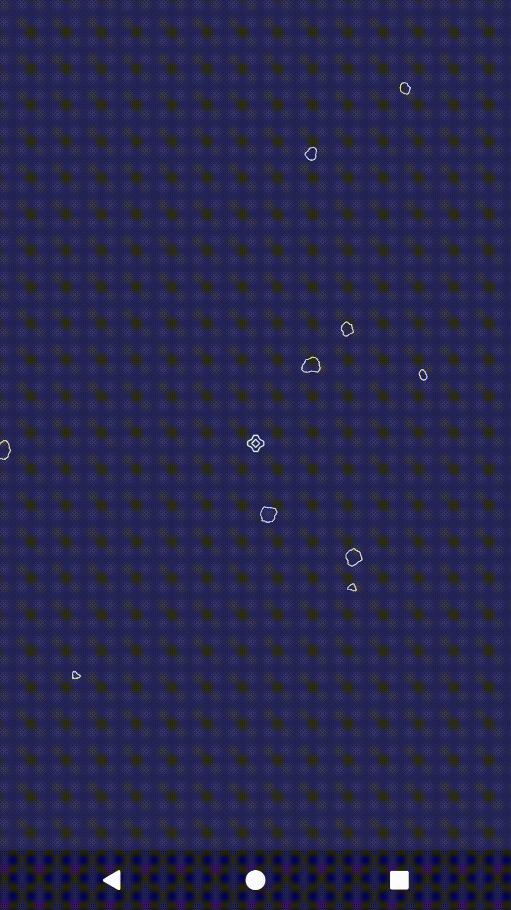
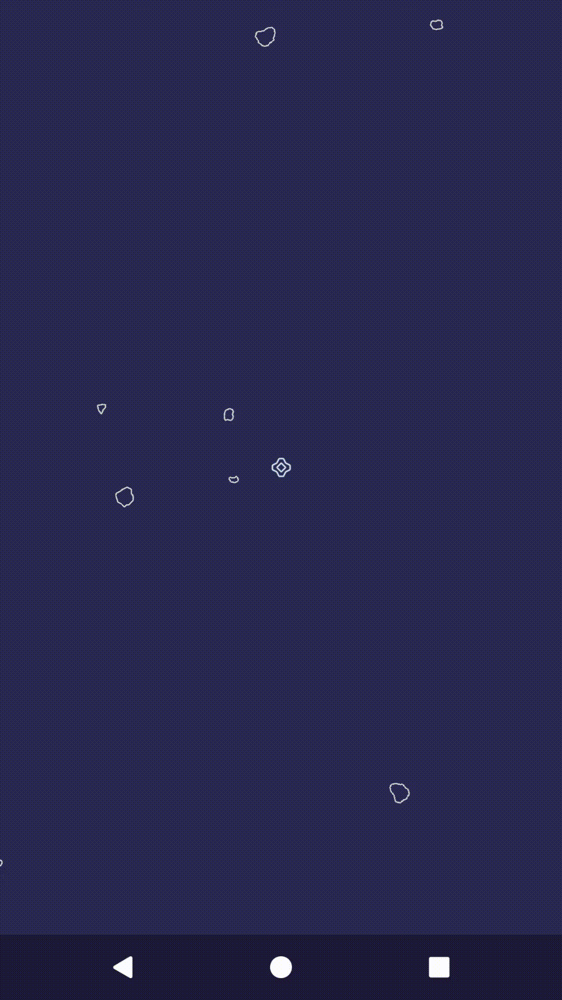

# Rozdział 6 - Ale przecież to miał być kurs o tworzeniu gier - użytkownik i dotyk

Miałem tworzyć grę, a jak do tej pory tworzyłem tylko animacje. To, co odróżnia grę od mniej lub bardziej deterministycznej animacji, to interakcja z użytkownikiem.

## Dotknięcia

Zaczniemy od stworzenia nowego komponentu fasady, który jednocześnie będzie nasłuchiwaczem na zdarzenia dotknięć. Utwórzmy nową klasę - `Touch`:

```java
package com.github.daishe.androidgametutorial;

import android.content.Context;
import android.support.annotation.NonNull;
import android.view.MotionEvent;
import android.view.View;

public final class Touch implements GameFacadeComponent, View.OnTouchListener {

    private boolean isTouched = false;
    private MutableVector2D touchPosition = Vector2D.fromNothing();
    private long touchStartTime = 0;

    public Touch() {
    }

    @Override
    public void create(@NonNull Context context) {
    }

    @Override
    public void pause() {
    }

    @Override
    public void resume() {
    }

    @Override
    public void destroy() {
        this.isTouched = false;
    }

    @Override
    public synchronized boolean onTouch(@NonNull View view, @NonNull MotionEvent event) {
        // TODO: Fill me up
        return true;
    }

}
```

Następnie uzupełnijmy wnętrze metody `onTouch`:

```java
@Override
public synchronized boolean onTouch(@NonNull View view, @NonNull MotionEvent event) {
    Vector2D centeredViewVector = Vector2D.fromCartesian(
            event.getX() - view.getWidth() / 2,
            event.getY() - view.getHeight() / 2
        );

    if (event.getAction() == MotionEvent.ACTION_DOWN)
        return this.handleTouchDown(centeredViewVector);
    else if (event.getAction() == MotionEvent.ACTION_MOVE)
        return this.handleTouchMove(centeredViewVector);
    else if (event.getAction() == MotionEvent.ACTION_UP)
        return this.handleTouchUp(centeredViewVector);

    return false;
}
```

Teraz przejdziemy przez to, co w niej się dzieje. Zaczynamy od przeliczenia pozycji kliknięcia - założymy, że punkt (0, 0) jest na środku ekranu. Następnie, zależnie od tego, z jakim typem zdarzenia dotknięcia mamy do czynienia, wywołujemy odpowiednią metodę, której zadaniem będzie uzupełnienie atrybutów `isTouched`, `touchPosition` i `touchStartTime`.

Dodajmy jeszcze brakujące prywatne metody `handleTouchDown`, `handleTouchMove` i `handleTouchUp`:

```java
private boolean handleTouchDown(@NonNull Vector2D position) {
    this.isTouched = true;
    this.touchPosition = Vector2D.from(position);
    this.touchStartTime = Time.now();
    return true;
}

private boolean handleTouchMove(@NonNull Vector2D position) {
    this.touchPosition.setTo(position);
    return true;
}

private boolean handleTouchUp(@NonNull Vector2D position) {
    this.isTouched = false;
    this.touchPosition.setTo(position);
    return true;
}
```

Wszystko fajnie, tylko jak pobrać stan dotknięcia (lub jego braku) w danej chwili? Dodajmy więc kolejną, tym razem publiczną metodę o nazwie `get`. Nim jednak do tego przejdziemy, stwórzmy pomocniczą klasę - `TouchEvent`:

```java
package com.github.daishe.androidgametutorial;

import android.support.annotation.NonNull;

public class TouchEvent {

    private final Vector2D position;
    private final float time;

    public TouchEvent(@NonNull Vector2D position, float time) {
        this.position = Vector2D.from(position);
        this.time = time;
    }

    @NonNull
    public Vector2D position() {
        return this.position;
    }

    public float time() {
        return this.time;
    }

}
```

Teraz czas na wspomnianą metodę `get` klasy `Touch`:

```java
public synchronized TouchEvent get() {
    if (this.isTouched) {
        long time = Time.now() - this.touchStartTime;
        return new TouchEvent(this.touchPosition, Timer.convertToFloatTime(time));
    }
    return null;
}
```

Pozostaje dodać nowy komponent do fasady (`GameFacade`):

```java
package com.github.daishe.androidgametutorial;

import android.content.Context;
import android.support.annotation.NonNull;

public final class GameFacade implements GameFacadeComponent {

    private Context context = null;
    private Random random = new Random();
    private Touch touch = new Touch();
    private ImageManager imageManager = new ImageManager(this);
    private Timer timer = new Timer();

    public GameFacade() {
    }

    public Context context() {
        return this.context;
    }

    @NonNull
    public Random random() {
        return this.random;
    }

    @NonNull
    public Touch touch() {
        return this.touch;
    }

    @NonNull
    public ImageManager imageManager() {
        return this.imageManager;
    }

    @NonNull
    public Timer timer() {
        return this.timer;
    }

    @Override
    public void create(@NonNull Context context) {
        this.context = context;

        this.random.create(context);
        this.touch.create(context);
        this.imageManager.create(context);
        this.timer.create(context);
    }

    @Override
    public void resume() {
        this.random.resume();
        this.touch.resume();
        this.imageManager.resume();
        this.timer.resume();
    }

    @Override
    public void pause() {
        this.timer.pause();
        this.imageManager.pause();
        this.touch.pause();
        this.random.pause();
    }

    @Override
    public void destroy() {
        this.timer.destroy();
        this.imageManager.destroy();
        this.touch.destroy();
        this.random.destroy();

        this.context = null;
    }

}
```

i zarejestrować klasę `Touch` jako nasłuchiwacz w konstruktorze klasy `GameView`:

```java
public GameView(Context context, @NonNull GameFacade gameFacade, @NonNull GameWorld world) {
    super(context);

    this.gameFacade = gameFacade;
    this.world = world;
    this.gameCanvas = new GameCanvas();

    this.lastUpdateTime = this.gameFacade.timer().timeAsFloat();

    this.setOnTouchListener(this.gameFacade.touch());
}
```

Takie podejście jest jak najbardziej poprawne i działające. Problem w tym, że dużo lepiej (dla naszej gry) byłoby, gdyby pozycja kliknięcia była pozycją w świecie gry, a nie na ekranie.

## Dotknięcia w świecie gry

Musimy więc przeliczyć pozycję dotknięcia na ekranie na pozycję w świecie gry. Problem w tym, że skalujemy świat gry, a skalowanie jest zależne od rozmiaru widoku. Osiągnięcie naszego celu będzie wymagać szerzej zakrojonych zmian.

Zaczniemy od utworzenia nowego komponentu fasady o nazwie `Screen`:

```java
package com.github.daishe.androidgametutorial;

import android.content.Context;
import android.support.annotation.NonNull;
import android.view.View;

public final class Screen implements GameFacadeComponent {

    private static final float minVisibleRange = 540f;

    private View view = null;

    public Screen() {
    }

    @NonNull
    public Vector2D physicalDimensions() {
        if (this.view != null)
            return Vector2D.fromCartesian(this.view.getWidth(), this.view.getHeight());
        return Vector2D.fromNothing();
    }

    @NonNull
    public Vector2D dimensions() {
        return this.physicalToGame(this.physicalDimensions());
    }

    public float scale() {
        Vector2D dimensions = this.physicalDimensions();
        float minDimension = Math.min(dimensions.x(), dimensions.y());
        return minDimension / 2 / Screen.minVisibleRange;
    }

    @NonNull
    public Vector2D physicalToGame(Vector2D physicalVector2D) {
        return Vector2D.from(physicalVector2D).divInPlace(this.scale());
    }

    @NonNull
    public Vector2D gameToPhysical(Vector2D gameVector2D) {
        return Vector2D.from(gameVector2D).mulInPlace(this.scale());
    }

    public void setPhysicalDimensionsSource(View view) {
        this.view = view;
    }

    @Override
    public void create(@NonNull Context context) {
    }

    @Override
    public void pause() {
    }

    @Override
    public void resume() {
    }

    @Override
    public void destroy() {
        this.view = null;
    }

}
```

i dodania go do fasady (`GameFacade`):

```java
package com.github.daishe.androidgametutorial;

import android.content.Context;
import android.support.annotation.NonNull;

public final class GameFacade implements GameFacadeComponent {

    private Context context = null;
    private Random random = new Random();
    private Screen screen = new Screen();
    private Touch touch = new Touch();
    private ImageManager imageManager = new ImageManager(this);
    private Timer timer = new Timer();

    public GameFacade() {
    }

    public Context context() {
        return this.context;
    }

    @NonNull
    public Random random() {
        return this.random;
    }

    @NonNull
    public Screen screen() {
        return this.screen;
    }

    @NonNull
    public Touch touch() {
        return this.touch;
    }

    @NonNull
    public ImageManager imageManager() {
        return this.imageManager;
    }

    @NonNull
    public Timer timer() {
        return this.timer;
    }

    @Override
    public void create(@NonNull Context context) {
        this.context = context;

        this.random.create(context);
        this.screen.create(context);
        this.touch.create(context);
        this.imageManager.create(context);
        this.timer.create(context);
    }

    @Override
    public void resume() {
        this.random.resume();
        this.screen.resume();
        this.touch.resume();
        this.imageManager.resume();
        this.timer.resume();
    }

    @Override
    public void pause() {
        this.timer.pause();
        this.imageManager.pause();
        this.touch.pause();
        this.screen.pause();
        this.random.pause();
    }

    @Override
    public void destroy() {
        this.timer.destroy();
        this.imageManager.destroy();
        this.touch.destroy();
        this.screen.destroy();
        this.random.destroy();

        this.context = null;
    }

}
```

Następnie zmodyfikujemy klasę `TouchEvent`:

```java
package com.github.daishe.androidgametutorial;

import android.support.annotation.NonNull;

public class TouchEvent {

    private GameFacade gameFacade;

    private final Vector2D position;
    private final float time;

    public TouchEvent(@NonNull GameFacade gameFacade, @NonNull Vector2D position, float time) {
        this.gameFacade = gameFacade;

        this.position = Vector2D.from(position);
        this.time = time;
    }

    @NonNull
    public Vector2D physicalPosition() {
        return this.position;
    }

    @NonNull
    public Vector2D gamePosition() {
        return this.gameFacade.screen().physicalToGame(this.position);
    }

    public float time() {
        return this.time;
    }

}
```

i zaktualizujemy klasy `Touch` i `GameFacade`. W klasie `Touch` dodajmy prywatny atrybut `gameFacade`:

```java
private GameFacade gameFacade;
```

i zmodyfikujmy konstruktor:

```java
public Touch(@NonNull GameFacade gameFacade) {
    this.gameFacade = gameFacade;
}
```

oraz metodę `get`:

```java
public synchronized TouchEvent get() {
    if (this.isTouched) {
        long time = Time.now() - this.touchStartTime;
        return new TouchEvent(this.gameFacade, this.touchPosition, Timer.convertToFloatTime(time));
    }
    return null;
}
```

W klasie `GameFacade` zaktualizujmy kod tworzenia instancji klasy `Touch`:

```java
private Touch touch = new Touch(this);
```

Teraz przejdźmy do klasy `MainActivity` i dodajmy nową prywatną metodę `configureGameFacade`:

```java
private void configureGameFacade() {
    this.gameFacade.screen().setPhysicalDimensionsSource(this.gameView);

    this.gameView.setOnTouchListener(this.gameFacade.touch());
}
```

oraz zmodyfikujemy istniejącą metodę `onCreate`:

```java
@Override
protected void onCreate(Bundle savedInstanceState) {
    super.onCreate(savedInstanceState);

    this.getWindow().addFlags(WindowManager.LayoutParams.FLAG_FULLSCREEN);
    this.getWindow().addFlags(WindowManager.LayoutParams.FLAG_KEEP_SCREEN_ON);

    this.gameFacade = this.makeGameFacade();
    this.world = new GameWorld(this.gameFacade);
    this.gameView = new GameView(this, this.gameFacade, this.world);
    this.gameThread = new GameThread(this, this.gameView);

    this.gameView.getHolder().addCallback(new GameSurfaceHolderCallback(this.gameThread));
    this.setContentView(this.gameView);

    this.configureGameFacade();
    this.gameThread.start();
}
```

Dla porządku zmodyfikujmy klasę `GameCanvas`. Usuńmy niepotrzebny atrybut `minVisibleRange`. Dalej wprowadźmy nowy prywatny atrybut `gameFacade`:

```java
private GameFacade gameFacade;
```

zmodyfikujmy konstruktor:

```java
public GameCanvas(GameFacade gameFacade) {
    this.gameFacade = gameFacade;

    this.paint.setAntiAlias(true);
}
```

oraz metodę `lockCanvas`:

```java
public void lockCanvas(Canvas canvas) {
    this.canvas = canvas;
    this.canvas.save();

    this.canvas.translate(this.canvas.getWidth() / 2, this.canvas.getHeight() / 2);
    float scale = this.gameFacade.screen().scale();
    this.canvas.scale(scale, scale);

    this.canvas.drawColor(0xFF2E2957);
}
```

Nie zapomnijmy też o konstruktorze klasy `GameView`:

```java
public GameView(Context context, @NonNull GameFacade gameFacade, @NonNull GameWorld world) {
    super(context);

    this.gameFacade = gameFacade;
    this.world = world;
    this.gameCanvas = new GameCanvas(gameFacade);

    this.lastUpdateTime = this.gameFacade.timer().timeAsFloat();
}
```

Obecnie jesteśmy w stanie wychwycić zdarzenia dotknięć ekranu. Czas użyć tej informacji. Nim jednak zamienimy animację w grę, zmodyfikujemy nasze asteroidy.

## Nowe asteroidy

Zaczniemy od dodania publicznej metody `facade` w klasie `GameWorld`:

```java
public GameFacade facade() {
    return this.gameFacade;
}
```

Następnie zmodyfikujemy klasę `Asteroid`, doprowadzając ją do następującej postaci:

```java
package com.github.daishe.androidgametutorial;

public class Asteroid {

    private static final float maxVelocity = 180f;
    private static final float killingRange = 1200f;

    private GameWorld world;

    private MutableVector2D position = Vector2D.fromNothing();
    private MutableVector2D velocity = Vector2D.fromNothing();
    private float angularVelocity;
    private float angularPosition;

    private Image asteroidImage;

    private boolean alive = false;

    public Asteroid(GameWorld world, Vector2D inWorldPosition) {
        GameFacade gameFacade = world.facade();

        this.world = world;

        this.velocity.setToPolar(
                Asteroid.maxVelocity - Math.abs(gameFacade.random().gaussian(2) * Asteroid.maxVelocity / 4),
                (float)Math.PI + inWorldPosition.theta() + gameFacade.random().gaussian(4) / 18
            );
        this.position.setTo(inWorldPosition);
        this.angularVelocity = gameFacade.random().gaussian(8) * (float)Math.PI / 2;
        this.angularPosition = gameFacade.random().angle();

        this.asteroidImage = gameFacade.imageManager().randomAsteroid();

        this.alive = true;
    }

    public GameWorld world() {
        return this.world;
    }

    public GameWorld world(GameWorld world) {
        return this.world = world;
    }

    public boolean alive() { return this.alive; }

    public boolean alive(boolean alive) { return this.alive = alive; }

    public Vector2D position() {
        return this.position;
    }

    public Vector2D position(Vector2D position) {
        return this.position.setTo(position);
    }

    public Vector2D velocity() {
        return this.velocity;
    }

    public Vector2D velocity(Vector2D velocity) {
        return this.velocity.setTo(velocity);
    }

    public void update(float timeShift) {
        if (!this.alive)
            return;

        if (Math.abs(this.position.x()) > Asteroid.killingRange || Math.abs(this.position.y()) > Asteroid.killingRange)
            this.alive = false;

        this.position.addInPlace(this.velocity.mul(timeShift));

        this.angularPosition += this.angularVelocity * timeShift;
        this.angularPosition -= ((int)(this.angularPosition / (float)(Math.PI * 2))) * (float)(Math.PI * 2);
    }

    public void draw(GameCanvas gameCanvas) {
        if (!this.alive)
            return;

        this.asteroidImage.draw(gameCanvas, this.position, 1f, this.angularPosition, 1f);
    }

}
```

Czas na klasę `GameWorld`. Dodajmy trzy prywatne, statyczne i finalne atrybuty:

```java
private static final float minSpawnRange = 1000f;
private static final float spawnSpaceRange = 200f;
private static final long asteroidsLimit = 15;
```

oraz zmodyfikujemy metodę `createAsteroid`:

```java
private Asteroid createAsteroid(Asteroid asteroid) {
    Random random = this.gameFacade.random();

    float radius = random.linear() * GameWorld.spawnSpaceRange + GameWorld.minSpawnRange;
    float theta = random.angle();
    asteroid.create(this, Vector2D.fromPolar(radius, theta));
    return asteroid;
}
```

metodę `update`:

```java
public void update(float timeShift) {
    for (Asteroid asteroid : this.asteroids)
        asteroid.update(timeShift);

    for (Asteroid asteroid : this.asteroids) {
        if (!asteroid.alive()) {
            this.createAsteroid(asteroid);
            if (this.asteroids.size() < GameWorld.asteroidsLimit)
                this.asteroids.add(this.createAsteroid(new Asteroid()));
        }
    }
}
```

i konstruktor:

```java
public GameWorld(GameFacade gameFacade) {
    this.gameFacade = gameFacade;

    this.asteroids = new ArrayList<Asteroid>();
    this.asteroids.add(this.createAsteroid(new Asteroid()));
}
```

Asteroidy przydałoby się rysować tylko wtedy, gdy są widoczne. Wprowadźmy wiec publiczną metodę `isVisible` w klasie `GameCanvas`:

```java
public boolean isVisible(Vector2D point, float toleration) {
    float width = this.canvas.getWidth() / this.lastScale / 2;
    float height = this.canvas.getHeight() / this.lastScale / 2;
    float x = point.x();
    float y = point.y();

    boolean xVisible = !(x + toleration < -width || x - toleration > width);
    boolean yVisible = !(y + toleration < -height || y - toleration > height);
    return xVisible && yVisible;
}
```

dodajmy brakujący prywatny atrybut `lastScale`:

```java
private float lastScale = 1f;
```

i zaktualizujmy metodę `lockCanvas`:

```java
public void lockCanvas(Canvas canvas) {
    this.canvas = canvas;
    this.canvas.save();

    this.canvas.translate(this.canvas.getWidth() / 2, this.canvas.getHeight() / 2);
    this.lastScale = this.gameFacade.screen().scale();
    this.canvas.scale(this.lastScale, this.lastScale);

    this.canvas.drawColor(0xFF2E2957);
}
```

Rodzi się jednak pewien problem - co przyjąć za `toleration`? Jakąś arbitralnie dobraną wartość? Takie rozwiązanie brzydko pachnie. Dlatego zastosujemy inne - zmodyfikujmy klasę `Image`. Doprowadzimy ją do następującej postaci:

```java
package com.github.daishe.androidgametutorial;

import android.graphics.Bitmap;
import android.support.annotation.NonNull;

public class Image {

    private Bitmap data = null;

    private float diagonal = 0;

    public Image() {
        this.reset();
    }

    public Image(@NonNull Bitmap from) {
        this.reset(from);
    }

    public Image(@NonNull Image from) {
        this.reset(from);
    }

    public float diagonal() {
        return this.diagonal;
    }

    public void reset() {
        this.data = null;
        this.diagonal = 0;
    }

    public void reset(@NonNull Bitmap from) {
        this.data = from;

        float x = this.data.getWidth();
        float y = this.data.getHeight();
        this.diagonal = (float)Math.sqrt(x * x + y * y);
    }

    public void reset(@NonNull Image from) {
        this.data = from.data;
        this.diagonal = from.diagonal;
    }

    public void draw(GameCanvas gameCanvas, Vector2D at) {
        gameCanvas.drawBitmap(this.data, at);
    }

    public void draw(GameCanvas gameCanvas, Vector2D at, float scale, float rotation, float alpha) {
        gameCanvas.drawBitmap(this.data, at, scale, rotation, alpha);
    }

}
```

Następnie zaktualizujemy metodę `draw` klasy `Asteroid`:

```java
public void draw(GameCanvas gameCanvas) {
    if (!this.alive || !gameCanvas.isVisible(this.position, this.asteroidImage.diagonal() / 2))
        return;

    this.asteroidImage.draw(gameCanvas, this.position, 1f, this.angularPosition, 1f);
}
```

Mamy nowe asteroidy. Wróćmy więc do użytkownika i interakcji z nim.

## Statek gracza

Zaczniemy od dodania nowego zasobu wektorowego. Znajdźmy plik `ship.svg` w katalogu zasobów (katalog `assets`) i załadujmy go analogicznie jak w rozdziale 3. Jako nazwę zasobu wybierzemy `ic_ship`.

Następnie zmodyfikujmy klasę `ImageManager`. Dodajmy nowy prywatny atrybut `ship`:

```java
private Image ship = new Image();
```

i publiczną metodę `ship`:

```java
public Image ship() {
    return this.ship;
}
```

Teraz pozostaje zaktualizować metody `create` i `destroy`. Do pierwszej z nich dodajmy linie ładującą zasób wektorowy:

```java
this.ship.reset(ImageLoader.with().context(context).scale(scale).fromSvg(R.drawable.ic_ship));
```

a do drugiej kod resetujący atrybut `ship`:

```java
this.ship.reset();
```

Czas na dodanie nowego obiektu do świata gry. Utwórzmy nową klasę - `PlayerShip`:

```java
package com.github.daishe.androidgametutorial;

public class PlayerShip {

    private GameWorld world;

    private Image shipImage;

    private boolean alive = false;

    public PlayerShip() {
    }

    public PlayerShip create(GameWorld world) {
        this.world = world;
        this.shipImage = world.facade().imageManager().ship();
        this.alive = true;
        return this;
    }

    public GameWorld world() {
        return this.world;
    }

    public GameWorld world(GameWorld world) {
        return this.world = world;
    }

    public boolean alive() {
        return this.alive;
    }

    public boolean alive(boolean alive) {
        return this.alive = alive;
    }

    public void update(float timeShift) {
        // Nothing to do
    }

    public void draw(GameCanvas gameCanvas) {
        if (!this.alive)
            return;

        this.shipImage.draw(gameCanvas, Vector2D.fromCartesian(0, 0));
    }

}
```

Następnie zaktualizujmy klasę `GameWorld`. Dodamy prywatny atrybut o nazwie `playerShip`:

```java
private PlayerShip playerShip;
```

i zaktualizujemy konstruktor:

```java
public GameWorld(GameFacade gameFacade) {
    this.gameFacade = gameFacade;

    this.playerShip = new PlayerShip().create(this);

    this.asteroids = new ArrayList<Asteroid>();
    this.asteroids.add(this.createAsteroid(new Asteroid()));
}
```

Zaktualizujmy również logikę aktualizacji i wyświetlania świata gry. W metodzie `update` dodajmy:

```java
this.playerShip.update(timeShift);
```

a w metodzie `draw`:

```java
this.playerShip.draw(gameCanvas);
```



Gracz ma już swój statek. Pora zacząć reagować na jego akcje.

## Reakcja na akcje użytkownika

Naszym celem będzie wprowadzenie logiki, dzięki której gracz będzie mógł strzelać w kierunku nadlatujących asteroid. Wystrzelony pocisk (rakieta) będzie po prostu małym kołem. Dodajmy więc nową klasę - `Rocket`:

```java
package com.github.daishe.androidgametutorial;

public class Rocket {

    private static final float maxVelocity = 300f;
    private static final float killingRange = 1200f;
    private static final float radius = 5f;

    private GameWorld world;

    private MutableVector2D position = Vector2D.fromNothing();
    private MutableVector2D velocity = Vector2D.fromNothing();

    private boolean alive = false;

    public Rocket() {
    }

    public Rocket create(GameWorld world, Vector2D targetPosition) {
        GameFacade gameFacade = world.facade();

        this.world = world;

        this.position.setTo(Vector2D.fromNothing());
        this.velocity.setTo(targetPosition).normalizeInPlace().mulInPlace(Rocket.maxVelocity);

        this.alive = true;

        return this;
    }

    public GameWorld world() {
        return this.world;
    }

    public GameWorld world(GameWorld world) {
        return this.world = world;
    }

    public boolean alive() { return this.alive; }

    public boolean alive(boolean alive) { return this.alive = alive; }

    public Vector2D position() {
        return this.position;
    }

    public Vector2D position(Vector2D position) {
        return this.position.setTo(position);
    }

    public Vector2D velocity() {
        return this.velocity;
    }

    public Vector2D velocity(Vector2D velocity) {
        return this.velocity.setTo(velocity);
    }

    public void update(float timeShift) {
        if (!this.alive)
            return;

        if (Math.abs(this.position.x()) > Rocket.killingRange || Math.abs(this.position.y()) > Rocket.killingRange)
            this.alive = false;

        this.position.addInPlace(this.velocity.mul(timeShift));
    }

    public void draw(GameCanvas gameCanvas) {
        if (!this.alive || !gameCanvas.isVisible(this.position, Rocket.radius))
            return;

        gameCanvas.drawCircle(Rocket.radius, this.position, 1f, 0xFFFF0800);
    }

}
```

i wprowadźmy brakującą metodę `drawCircle` w klasie `GameCanvas`:

```java
public void drawCircle(float radius, Vector2D at, float alpha, int color) {
    this.paint.setColor(color);
    this.paint.setAlpha((int)(255 * alpha));
    this.canvas.drawCircle(at.x(), at.y(), radius, this.paint);
    this.paint.setAlpha(255);
    this.paint.setColor(0xFF000000);
}
```

Ostatecznie zaktualizujmy klasę `GameWorld`. Dodajmy prywatny atrybut `rocket`:

```java
private Rocket rocket;
```

i zaktualizujmy konstruktor:

```java
public GameWorld(GameFacade gameFacade) {
    this.gameFacade = gameFacade;

    this.playerShip = new PlayerShip().create(this);

    this.asteroids = new ArrayList<Asteroid>();
    this.asteroids.add(this.createAsteroid(new Asteroid()));

    this.rocket = new Rocket();
}
```

Przechodząc dalej, zaktualizujmy logikę metody `update`:

```java
public void update(float timeShift) {
    TouchEvent touchEvent = this.facade().touch().get();
    if (touchEvent != null && !this.rocket.alive() && this.playerShip.alive())
        this.rocket.create(this, touchEvent.gamePosition());

    this.playerShip.update(timeShift);
    for (Asteroid asteroid : this.asteroids)
        asteroid.update(timeShift);
    this.rocket.update(timeShift);

    for (Asteroid asteroid : this.asteroids) {
        if (!asteroid.alive()) {
            this.createAsteroid(asteroid);
            if (this.asteroids.size() < GameWorld.asteroidsLimit)
                this.asteroids.add(this.createAsteroid(new Asteroid()));
        }
    }
}
```

i metody `draw`:

```java
public void draw(GameCanvas gameCanvas) {
    this.playerShip.draw(gameCanvas);
    for (Asteroid asteroid : this.asteroids)
        asteroid.draw(gameCanvas);
    this.rocket.draw(gameCanvas);
}
```



## Podsumowanie

W tym rozdziale (w końcu) stworzyliśmy grę, a nie animację. Tylko to takie oszustwo, bo co prawda gracz może strzelać rakietami, ale nic się nie dzieje. Zajmiemy się tym problemem.

## Zmodyfikowane pliki

Jak zawsze poniżej znajduje się lista zmodyfikowanych plików.

### Plik `Asteroid.java`

```java
package com.github.daishe.androidgametutorial;

public class Asteroid {

    private static final float maxVelocity = 180f;
    private static final float killingRange = 1200f;

    private GameWorld world;

    private MutableVector2D position = Vector2D.fromNothing();
    private MutableVector2D velocity = Vector2D.fromNothing();
    private float angularVelocity;
    private float angularPosition;

    private Image asteroidImage;

    private boolean alive = false;

    public Asteroid() {
    }

    public Asteroid create(GameWorld world, Vector2D inWorldPosition) {
        GameFacade gameFacade = world.facade();

        this.world = world;

        this.velocity.setToPolar(
                Asteroid.maxVelocity - Math.abs(gameFacade.random().gaussian(2) * Asteroid.maxVelocity / 4),
                (float)Math.PI + inWorldPosition.theta() + gameFacade.random().gaussian(4) / 18
            );
        this.position.setTo(inWorldPosition);
        this.angularVelocity = gameFacade.random().gaussian(8) * (float)Math.PI / 2;
        this.angularPosition = gameFacade.random().angle();

        this.asteroidImage = gameFacade.imageManager().randomAsteroid();

        this.alive = true;

        return this;
    }

    public GameWorld world() {
        return this.world;
    }

    public GameWorld world(GameWorld world) {
        return this.world = world;
    }

    public boolean alive() { return this.alive; }

    public boolean alive(boolean alive) { return this.alive = alive; }

    public Vector2D position() {
        return this.position;
    }

    public Vector2D position(Vector2D position) {
        return this.position.setTo(position);
    }

    public Vector2D velocity() {
        return this.velocity;
    }

    public Vector2D velocity(Vector2D velocity) {
        return this.velocity.setTo(velocity);
    }

    public void update(float timeShift) {
        if (!this.alive)
            return;

        if (Math.abs(this.position.x()) > Asteroid.killingRange || Math.abs(this.position.y()) > Asteroid.killingRange)
            this.alive = false;

        this.position.addInPlace(this.velocity.mul(timeShift));

        this.angularPosition += this.angularVelocity * timeShift;
        this.angularPosition -= ((int)(this.angularPosition / (float)(Math.PI * 2))) * (float)(Math.PI * 2);
    }

    public void draw(GameCanvas gameCanvas) {
        if (!this.alive || !gameCanvas.isVisible(this.position, this.asteroidImage.diagonal() / 2))
            return;

        this.asteroidImage.draw(gameCanvas, this.position, 1f, this.angularPosition, 1f);
    }

}
```

### Plik `GameCanvas.java`

```java
package com.github.daishe.androidgametutorial;

import android.graphics.Bitmap;
import android.graphics.Canvas;
import android.graphics.Matrix;
import android.graphics.Paint;

public class GameCanvas {

    private GameFacade gameFacade;

    private Canvas canvas = null;

    private Paint paint = new Paint();
    private Matrix matrix = new Matrix();

    private float lastScale = 1f;

    public GameCanvas(GameFacade gameFacade) {
        this.gameFacade = gameFacade;

        this.paint.setAntiAlias(true);
    }

    public boolean isVisible(Vector2D point, float toleration) {
        float width = this.canvas.getWidth() / this.lastScale / 2;
        float height = this.canvas.getHeight() / this.lastScale / 2;
        float x = point.x();
        float y = point.y();

        boolean xVisible = !(x + toleration < -width || x - toleration > width);
        boolean yVisible = !(y + toleration < -height || y - toleration > height);
        return xVisible && yVisible;
    }

    public void drawCircle(float radius, Vector2D at, float alpha, int color) {
        this.paint.setColor(color);
        this.paint.setAlpha((int)(255 * alpha));
        this.canvas.drawCircle(at.x(), at.y(), radius, this.paint);
        this.paint.setAlpha(255);
        this.paint.setColor(0xFF000000);
    }

    public void drawBitmap(Bitmap bitmap, Vector2D at) {
        this.canvas.drawBitmap(
                bitmap,
                at.x() - bitmap.getWidth() / 2,
                at.y() - bitmap.getHeight() / 2,
                this.paint
        );
    }

    public void drawBitmap(Bitmap bitmap, Vector2D at, float scale, float rotation, float alpha) {
        this.matrix.setTranslate(-bitmap.getWidth() / 2, -bitmap.getHeight() / 2);
        this.matrix.postScale(scale, scale);
        this.matrix.postRotate((float)Math.toDegrees(rotation), 0, 0);
        this.matrix.postTranslate(at.x(), at.y());

        this.paint.setAlpha((int)(255 * alpha));
        canvas.drawBitmap(bitmap, this.matrix, this.paint);
        this.paint.setAlpha(255);

        this.matrix.reset();
    }

    public void lockCanvas(Canvas canvas) {
        this.canvas = canvas;
        this.canvas.save();

        this.canvas.translate(this.canvas.getWidth() / 2, this.canvas.getHeight() / 2);
        this.lastScale = this.gameFacade.screen().scale();
        this.canvas.scale(this.lastScale, this.lastScale);

        this.canvas.drawColor(0xFF2E2957);
    }

    public Canvas releaseCanvas() {
        this.canvas.restore();

        Canvas result = this.canvas;
        this.canvas = null;
        return result;
    }

}
```

### Plik `GameFacade.java`

```java
package com.github.daishe.androidgametutorial;

import android.content.Context;
import android.support.annotation.NonNull;

public final class GameFacade implements GameFacadeComponent {

    private Context context = null;
    private Random random = new Random();
    private Screen screen = new Screen();
    private Touch touch = new Touch(this);
    private ImageManager imageManager = new ImageManager(this);
    private Timer timer = new Timer();

    public GameFacade() {
    }

    public Context context() {
        return this.context;
    }

    @NonNull
    public Random random() {
        return this.random;
    }

    @NonNull
    public Screen screen() {
        return this.screen;
    }

    @NonNull
    public Touch touch() {
        return this.touch;
    }

    @NonNull
    public ImageManager imageManager() {
        return this.imageManager;
    }

    @NonNull
    public Timer timer() {
        return this.timer;
    }

    @Override
    public void create(@NonNull Context context) {
        this.context = context;

        this.random.create(context);
        this.screen.create(context);
        this.touch.create(context);
        this.imageManager.create(context);
        this.timer.create(context);
    }

    @Override
    public void resume() {
        this.random.resume();
        this.screen.resume();
        this.touch.resume();
        this.imageManager.resume();
        this.timer.resume();
    }

    @Override
    public void pause() {
        this.timer.pause();
        this.imageManager.pause();
        this.touch.pause();
        this.screen.pause();
        this.random.pause();
    }

    @Override
    public void destroy() {
        this.timer.destroy();
        this.imageManager.destroy();
        this.touch.destroy();
        this.screen.destroy();
        this.random.destroy();

        this.context = null;
    }

}
```

### Plik `GameView.java`

```java
package com.github.daishe.androidgametutorial;

import android.content.Context;
import android.graphics.Canvas;
import android.support.annotation.NonNull;
import android.view.SurfaceView;

public class GameView extends SurfaceView {

    private GameFacade gameFacade;
    private GameWorld world;
    private GameCanvas gameCanvas;

    private float lastUpdateTime;

    public GameView(Context context, @NonNull GameFacade gameFacade, @NonNull GameWorld world) {
        super(context);

        this.gameFacade = gameFacade;
        this.world = world;
        this.gameCanvas = new GameCanvas(gameFacade);

        this.lastUpdateTime = this.gameFacade.timer().timeAsFloat();
    }

    protected void update() {
        float updateTime = this.gameFacade.timer().timeAsFloat();
        float timeShift = updateTime - this.lastUpdateTime;
        timeShift = timeShift > 0 ? timeShift : 0;
        this.lastUpdateTime = updateTime;

        this.world.update(timeShift);
    }

    @Override
    protected void onDraw(Canvas canvas) {
        this.gameCanvas.lockCanvas(canvas);
        this.world.draw(this.gameCanvas);
        this.gameCanvas.releaseCanvas();
    }

}
```

### Plik `GameWorld.java`

```java
package com.github.daishe.androidgametutorial;

import java.util.ArrayList;

public class GameWorld {

    private static final float minSpawnRange = 1000f;
    private static final float spawnSpaceRange = 200f;
    private static final long asteroidsLimit = 15;

    private GameFacade gameFacade;

    private PlayerShip playerShip;
    private ArrayList<Asteroid> asteroids;
    private Rocket rocket;

    public GameWorld(GameFacade gameFacade) {
        this.gameFacade = gameFacade;

        this.playerShip = new PlayerShip().create(this);

        this.asteroids = new ArrayList<Asteroid>();
        this.asteroids.add(this.createAsteroid(new Asteroid()));

        this.rocket = new Rocket();
    }

    public GameFacade facade() {
        return this.gameFacade;
    }

    public void update(float timeShift) {
        TouchEvent touchEvent = this.facade().touch().get();
        if (touchEvent != null && !this.rocket.alive() && this.playerShip.alive())
            this.rocket.create(this, touchEvent.gamePosition());

        this.playerShip.update(timeShift);
        for (Asteroid asteroid : this.asteroids)
            asteroid.update(timeShift);
        this.rocket.update(timeShift);

        for (Asteroid asteroid : this.asteroids) {
            if (!asteroid.alive()) {
                this.createAsteroid(asteroid);
                if (this.asteroids.size() < GameWorld.asteroidsLimit)
                    this.asteroids.add(this.createAsteroid(new Asteroid()));
            }
        }
    }

    public void draw(GameCanvas gameCanvas) {
        this.playerShip.draw(gameCanvas);
        for (Asteroid asteroid : this.asteroids)
            asteroid.draw(gameCanvas);
        this.rocket.draw(gameCanvas);
    }

    private Asteroid createAsteroid(Asteroid asteroid) {
        Random random = this.gameFacade.random();

        float radius = random.linear() * GameWorld.spawnSpaceRange + GameWorld.minSpawnRange;
        float theta = random.angle();
        asteroid.create(this, Vector2D.fromPolar(radius, theta));
        return asteroid;
    }

}
```

### Plik `Image.java`

```java
package com.github.daishe.androidgametutorial;

import android.graphics.Bitmap;
import android.support.annotation.NonNull;

public class Image {

    private Bitmap data = null;

    private float radius = 0;
    private float diagonal = 0;

    public Image() {
        this.reset();
    }

    public Image(@NonNull Bitmap from) {
        this.reset(from);
    }

    public Image(@NonNull Image from) {
        this.reset(from);
    }

    public float radius() {
        return this.radius;
    }

    public float diagonal() {
        return this.diagonal;
    }

    public void reset() {
        this.data = null;
        this.radius = 0;
    }

    public void reset(@NonNull Bitmap from) {
        this.data = from;

        float x = this.data.getWidth();
        float y = this.data.getHeight();
        this.radius = Math.max(x, y) / 2;
        this.diagonal = (float)Math.sqrt(x * x + y * y);
    }

    public void reset(@NonNull Image from) {
        this.data = from.data;
        this.radius = from.radius;
        this.diagonal = from.diagonal;
    }

    public void draw(GameCanvas gameCanvas, Vector2D at) {
        gameCanvas.drawBitmap(this.data, at);
    }

    public void draw(GameCanvas gameCanvas, Vector2D at, float scale, float rotation, float alpha) {
        gameCanvas.drawBitmap(this.data, at, scale, rotation, alpha);
    }

}
```

### Plik `ImageManager.java`

```java
package com.github.daishe.androidgametutorial;

import android.content.Context;
import android.support.annotation.NonNull;

public final class ImageManager implements GameFacadeComponent {

    private GameFacade gameFacade;

    private Image ship = new Image();

    private Image asteroidTiny0 = new Image();
    private Image asteroidTiny1 = new Image();
    private Image asteroidTiny2 = new Image();
    private Image asteroidTiny3 = new Image();
    private Image asteroidSmall0 = new Image();
    private Image asteroidSmall1 = new Image();
    private Image asteroidSmall2 = new Image();
    private Image asteroidMedium0 = new Image();
    private Image asteroidMedium1 = new Image();
    private Image asteroidLarge0 = new Image();
    private Image asteroidLarge1 = new Image();

    public ImageManager(@NonNull GameFacade gameFacade) {
        this.gameFacade = gameFacade;
    }

    public Image ship() {
        return this.ship;
    }

    public Image randomAsteroid() {
        Random r = this.gameFacade.random();
        double randomGaussian = Math.abs(r.gaussian(2));
        if (randomGaussian < 0.5) {
            switch(r.integer(4)) {
                case 0:  return this.asteroidTiny0;
                case 1:  return this.asteroidTiny1;
                case 2:  return this.asteroidTiny2;
                default: return this.asteroidTiny3;
            }
        }
        if (randomGaussian < 1.0) {
            switch(r.integer(4)) {
                case 0:  return this.asteroidSmall0;
                case 1:  return this.asteroidSmall1;
                default: return this.asteroidSmall2;
            }

        }
        if (randomGaussian < 1.5) {
            switch(r.integer(2)) {
                case 0:  return this.asteroidMedium0;
                default: return this.asteroidMedium1;
            }
        }
        switch(r.integer(2)) {
            case 0:  return this.asteroidLarge0;
            default: return this.asteroidLarge1;
        }
    }

    @Override
    public void create(@NonNull Context context) {
        float scale = 0.04f;

        this.ship.reset(ImageLoader.with().context(context).scale(scale).fromSvg(R.drawable.ic_ship));

        this.asteroidTiny0.reset(ImageLoader.with().context(context).scale(scale).fromSvg(R.drawable.ic_asteroid_tiny_0));
        this.asteroidTiny1.reset(ImageLoader.with().context(context).scale(scale).fromSvg(R.drawable.ic_asteroid_tiny_1));
        this.asteroidTiny2.reset(ImageLoader.with().context(context).scale(scale).fromSvg(R.drawable.ic_asteroid_tiny_2));
        this.asteroidTiny3.reset(ImageLoader.with().context(context).scale(scale).fromSvg(R.drawable.ic_asteroid_tiny_3));
        this.asteroidSmall0.reset(ImageLoader.with().context(context).scale(scale).fromSvg(R.drawable.ic_asteroid_small_0));
        this.asteroidSmall1.reset(ImageLoader.with().context(context).scale(scale).fromSvg(R.drawable.ic_asteroid_small_1));
        this.asteroidSmall2.reset(ImageLoader.with().context(context).scale(scale).fromSvg(R.drawable.ic_asteroid_small_2));
        this.asteroidMedium0.reset(ImageLoader.with().context(context).scale(scale).fromSvg(R.drawable.ic_asteroid_medium_0));
        this.asteroidMedium1.reset(ImageLoader.with().context(context).scale(scale).fromSvg(R.drawable.ic_asteroid_medium_1));
        this.asteroidLarge0.reset(ImageLoader.with().context(context).scale(scale).fromSvg(R.drawable.ic_asteroid_large_0));
        this.asteroidLarge1.reset(ImageLoader.with().context(context).scale(scale).fromSvg(R.drawable.ic_asteroid_large_1));
    }

    @Override
    public void pause() {
    }

    @Override
    public void resume() {
    }

    @Override
    public void destroy() {
        this.ship.reset();

        this.asteroidTiny0.reset();
        this.asteroidTiny1.reset();
        this.asteroidTiny2.reset();
        this.asteroidTiny3.reset();
        this.asteroidSmall0.reset();
        this.asteroidSmall1.reset();
        this.asteroidSmall2.reset();
        this.asteroidMedium0.reset();
        this.asteroidMedium1.reset();
        this.asteroidLarge0.reset();
        this.asteroidLarge1.reset();
    }

}
```

### Plik `MainActivity.java`

```java
package com.github.daishe.androidgametutorial;

import android.os.Bundle;
import android.support.annotation.NonNull;
import android.support.v7.app.AppCompatActivity;
import android.view.WindowManager;

public class MainActivity extends AppCompatActivity {

    private GameFacade gameFacade;
    private GameWorld world;
    private GameView gameView;
    private GameThread gameThread;

    @Override
    protected void onCreate(Bundle savedInstanceState) {
        super.onCreate(savedInstanceState);

        this.getWindow().addFlags(WindowManager.LayoutParams.FLAG_FULLSCREEN);
        this.getWindow().addFlags(WindowManager.LayoutParams.FLAG_KEEP_SCREEN_ON);

        this.gameFacade = this.makeGameFacade();
        this.world = new GameWorld(this.gameFacade);
        this.gameView = new GameView(this, this.gameFacade, this.world);
        this.gameThread = new GameThread(this, this.gameView);

        this.gameView.getHolder().addCallback(new GameSurfaceHolderCallback(this.gameThread));
        this.setContentView(this.gameView);

        this.configureGameFacade();
        this.gameThread.start();
    }

    @Override
    protected void onResume() {
        super.onResume();
        this.gameFacade.resume();
    }

    @Override
    protected void onPause() {
        super.onPause();
        this.gameFacade.pause();
    }

    @NonNull
    private GameFacade makeGameFacade() {
        GameFacade gameFacade = new GameFacade();
        gameFacade.create(this);
        return gameFacade;
    }

    private void configureGameFacade() {
        this.gameFacade.screen().setPhysicalDimensionsSource(this.gameView);

        this.gameView.setOnTouchListener(this.gameFacade.touch());
    }

}
```

### Plik `PlayerShip.java`

```java
package com.github.daishe.androidgametutorial;

public class PlayerShip {

    private GameWorld world;

    private Image shipImage;

    private boolean alive = false;

    public PlayerShip() {
    }

    public PlayerShip create(GameWorld world) {
        this.world = world;
        this.shipImage = world.facade().imageManager().ship();
        this.alive = true;
        return this;
    }

    public GameWorld world() {
        return this.world;
    }

    public GameWorld world(GameWorld world) {
        return this.world = world;
    }

    public boolean alive() {
        return this.alive;
    }

    public boolean alive(boolean alive) {
        return this.alive = alive;
    }

    public void update(float timeShift) {
        // Nothing to do
    }

    public void draw(GameCanvas gameCanvas) {
        if (!this.alive)
            return;

        this.shipImage.draw(gameCanvas, Vector2D.fromCartesian(0, 0));
    }

}
```

### Plik `Rocket.java`

```java
package com.github.daishe.androidgametutorial;

public class Rocket {

    private static final float maxVelocity = 300f;
    private static final float killingRange = 1200f;
    private static final float radius = 5f;

    private GameWorld world;

    private MutableVector2D position = Vector2D.fromNothing();
    private MutableVector2D velocity = Vector2D.fromNothing();

    private boolean alive = false;

    public Rocket() {
    }

    public Rocket create(GameWorld world, Vector2D targetPosition) {
        GameFacade gameFacade = world.facade();

        this.world = world;

        this.position.setTo(Vector2D.fromNothing());
        this.velocity.setTo(targetPosition).normalizeInPlace().mulInPlace(Rocket.maxVelocity);

        this.alive = true;

        return this;
    }

    public GameWorld world() {
        return this.world;
    }

    public GameWorld world(GameWorld world) {
        return this.world = world;
    }

    public boolean alive() { return this.alive; }

    public boolean alive(boolean alive) { return this.alive = alive; }

    public Vector2D position() {
        return this.position;
    }

    public Vector2D position(Vector2D position) {
        return this.position.setTo(position);
    }

    public Vector2D velocity() {
        return this.velocity;
    }

    public Vector2D velocity(Vector2D velocity) {
        return this.velocity.setTo(velocity);
    }

    public void update(float timeShift) {
        if (!this.alive)
            return;

        if (Math.abs(this.position.x()) > Rocket.killingRange || Math.abs(this.position.y()) > Rocket.killingRange)
            this.alive = false;

        this.position.addInPlace(this.velocity.mul(timeShift));
    }

    public void draw(GameCanvas gameCanvas) {
        if (!this.alive || !gameCanvas.isVisible(this.position, Rocket.radius))
            return;

        gameCanvas.drawCircle(Rocket.radius, this.position, 1f, 0xFFFF0800);
    }

}
```

### Plik `Screen.java`

```java
package com.github.daishe.androidgametutorial;

import android.content.Context;
import android.support.annotation.NonNull;
import android.view.View;

public final class Screen implements GameFacadeComponent {

    private static final float minVisibleRange = 540f;

    private View view = null;

    public Screen() {
    }

    @NonNull
    public Vector2D physicalDimensions() {
        if (this.view != null)
            return Vector2D.fromCartesian(this.view.getWidth(), this.view.getHeight());
        return Vector2D.fromNothing();
    }

    @NonNull
    public Vector2D dimensions() {
        return this.physicalToGame(this.physicalDimensions());
    }

    public float scale() {
        Vector2D dimensions = this.physicalDimensions();
        float minDimension = Math.min(dimensions.x(), dimensions.y());
        return minDimension / 2 / Screen.minVisibleRange;
    }

    @NonNull
    public Vector2D physicalToGame(Vector2D physicalVector2D) {
        return Vector2D.from(physicalVector2D).divInPlace(this.scale());
    }

    @NonNull
    public Vector2D gameToPhysical(Vector2D gameVector2D) {
        return Vector2D.from(gameVector2D).mulInPlace(this.scale());
    }

    public void setPhysicalDimensionsSource(View view) {
        this.view = view;
    }

    @Override
    public void create(@NonNull Context context) {
    }

    @Override
    public void pause() {
    }

    @Override
    public void resume() {
    }

    @Override
    public void destroy() {
        this.view = null;
    }

}
```

### Plik `Touch.java`

```java
package com.github.daishe.androidgametutorial;

import android.content.Context;
import android.support.annotation.NonNull;
import android.view.MotionEvent;
import android.view.View;

public final class Touch implements GameFacadeComponent, View.OnTouchListener {

    private GameFacade gameFacade;

    private boolean isTouched = false;
    private MutableVector2D touchPosition = Vector2D.fromNothing();
    private long touchStartTime = 0;

    public Touch(@NonNull GameFacade gameFacade) {
        this.gameFacade = gameFacade;
    }

    public synchronized TouchEvent get() {
        if (this.isTouched) {
            long time = Time.now() - this.touchStartTime;
            return new TouchEvent(this.gameFacade, this.touchPosition, Timer.convertToFloatTime(time));
        }
        return null;
    }

    @Override
    public void create(@NonNull Context context) {
    }

    @Override
    public void pause() {
    }

    @Override
    public void resume() {
    }

    @Override
    public void destroy() {
        this.isTouched = false;
    }

    @Override
    public synchronized boolean onTouch(@NonNull View view, @NonNull MotionEvent event) {
        Vector2D centeredViewVector = Vector2D.fromCartesian(
                event.getX() - view.getWidth() / 2,
                event.getY() - view.getHeight() / 2
            );

        if (event.getAction() == MotionEvent.ACTION_DOWN)
            return this.handleTouchDown(centeredViewVector);
        else if (event.getAction() == MotionEvent.ACTION_MOVE)
            return this.handleTouchMove(centeredViewVector);
        else if (event.getAction() == MotionEvent.ACTION_UP)
            return this.handleTouchUp(centeredViewVector);

        return false;
    }

    private boolean handleTouchDown(@NonNull Vector2D position) {
        this.isTouched = true;
        this.touchPosition = Vector2D.from(position);
        this.touchStartTime = Time.now();
        return true;
    }

    private boolean handleTouchMove(@NonNull Vector2D position) {
        this.touchPosition.setTo(position);
        return true;
    }

    private boolean handleTouchUp(@NonNull Vector2D position) {
        this.isTouched = false;
        this.touchPosition.setTo(position);
        return true;
    }

}
```

### Plik `TouchEvent.java`

```java
package com.github.daishe.androidgametutorial;

import android.support.annotation.NonNull;

public class TouchEvent {

    private GameFacade gameFacade;

    private final Vector2D position;
    private final float time;

    public TouchEvent(@NonNull GameFacade gameFacade, @NonNull Vector2D position, float time) {
        this.gameFacade = gameFacade;

        this.position = Vector2D.from(position);
        this.time = time;
    }

    @NonNull
    public Vector2D physicalPosition() {
        return this.position;
    }

    @NonNull
    public Vector2D gamePosition() {
        return this.gameFacade.screen().physicalToGame(this.position);
    }

    public float time() {
        return this.time;
    }

}
```
