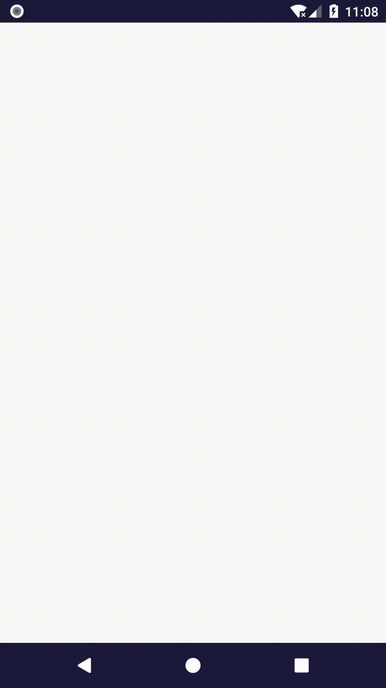
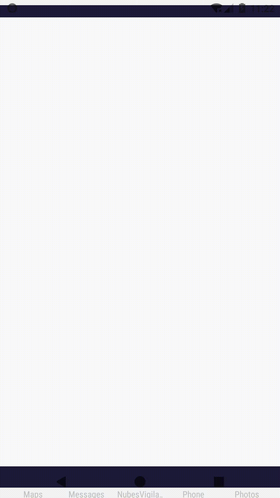

# Rozdział 7 - Kolizje i ich detekcja

Niby stworzyłem grę, ale coś nie gra. Problem polega na tym, że cokolwiek użytkownik nie zrobi, nic (ostatecznie) się nie zmienia. Teraz się tym zajmę i sprawie, że obiekty w świecie gry zaczną ze sobą wchodzić w kolizje. Asteroidy staną się zabójcze dla gracza, a rakiety dla asteroid.

## Algorytm detekcji kolizji

Dokładny algorytm detekcji kolizji jest złożony obliczeniowo. Dlatego pójdziemy trochę na skróty - zauważmy, że wszystkie obiekty w grze są (relatywnie) okrągłe. Dlatego nasze zadanie będzie sprowadzać się do detekcji przecięcia dwóch okręgów. To jednak nie wystarczy - sprawdzanie przeciąć dwóch okręgów jest również złożone. Zauważmy jednak, że większość obiektów, przez większość czasu nie koliduje ze sobą. Dlatego nasza procedura detekcji będzie składać się z 2 kroków:

1. Sprawdzenia (szybkim sposobem), czy obiekty są blisko siebie. Takim szybkim sposobem jest np. tzw. axis-aligned bounding boxes collision detection (inaczej AABB collision detection). Jest to detekcja przecięcia, ale nie siatek samych obiektów, ale okalających te obiekty prostopadłościanów, czy w przypadku grafiki 2D - prostokątów. Detekcja przecięć takich figur jest szybsza niż okręgów. Jeśli takim sposobem stwierdzimy, że obiekty są blisko siebie (nastąpiło przecięcie figur okalających), to zastosujemy dokładniejszą metodę.
2. Właściwa detekcja kolizji - w naszym przypadku sprawdzenie przecięcia okręgów.

Cały algorytm jest pewnym przybliżeniem, jednak jeśli obiekty będą niewielkie, obłe i szybko poruszające błąd powinien być nie do zauważenia. Warto też zwrócić uwagę, że założenie o obłości i okręgi kolizji to nie pierwsze stosowane przez nasz przybieżenie - obiekty świata gry poruszają się pomiędzy klatkami zależnie od wyliczonej różnicy czasu. Nie będziemy sprawdzać, co się dzieje z obiektami pomiędzy kolejnymi aktualizacjami. Moglibyśmy mieć do czynienia z przypadkiem, w który obiekt poruszałby się tak szybko, że przenikałby przez inne. Pamiętajmy, że gra to nie naukowa symulacja obiektów fizycznych.

Zacznijmy od dodania nowej klasy, w której zamkniemy logikę detekcji kolizji - `Collision`:

```java
package com.github.daishe.androidgametutorial;

public class Collision {

    public static boolean at(Vector2D objectAPosition, float objectARadius, Vector2D objectBPosition, float objectBRadius) {
        float xDelta = objectAPosition.x() - objectBPosition.x();
        float yDelta = objectAPosition.y() - objectBPosition.y();
        float radiusSum = objectARadius + objectBRadius;

        boolean isXNear = xDelta > -radiusSum && xDelta < radiusSum;
        boolean isYNear = yDelta > -radiusSum && yDelta < radiusSum;
        boolean isNear = isXNear && isYNear;

        if (!isNear)
            return false;

        MutableVector2D positionDifference = Vector2D.from(objectAPosition).subInPlace(objectBPosition);
        return positionDifference.radiusSquare() < radiusSum * radiusSum;
    }

}
```

## Zastosowanie algorytmu

Potrzebujemy promienia okręgu kolizji dla każdego obiektu, a ten jest zależny od grafiki. Dlatego zaktualizujmy kod klasy `Image`:

```java
package com.github.daishe.androidgametutorial;

import android.graphics.Bitmap;
import android.support.annotation.NonNull;

public class Image {

    private Bitmap data = null;

    private float radius = 0;
    private float diagonal = 0;

    public Image() {
        this.reset();
    }

    public Image(@NonNull Bitmap from) {
        this.reset(from);
    }

    public Image(@NonNull Image from) {
        this.reset(from);
    }

    public float radius() {
        return this.radius;
    }

    public float diagonal() {
        return this.diagonal;
    }

    public void reset() {
        this.data = null;
        this.radius = 0;
        this.diagonal = 0;
    }

    public void reset(@NonNull Bitmap from) {
        this.data = from;

        float x = this.data.getWidth();
        float y = this.data.getHeight();
        this.radius = Math.max(x, y) / 2;
        this.diagonal = (float)Math.sqrt(x * x + y * y);
    }

    public void reset(@NonNull Image from) {
        this.data = from.data;
        this.radius = from.radius;
        this.diagonal = from.diagonal;
    }

    public void draw(GameCanvas gameCanvas, Vector2D at) {
        gameCanvas.drawBitmap(this.data, at);
    }

    public void draw(GameCanvas gameCanvas, Vector2D at, float scale, float rotation, float alpha) {
        gameCanvas.drawBitmap(this.data, at, scale, rotation, alpha);
    }

}
```

Teraz zajmiemy się obiektami świata gry. Na początek klasa `Asteroid`. Dodajmy do niej nową metodę o nazwie `collisionRadius`:

```java
public float collisionRadius() {
    return this.asteroidImage.radius();
}
```

Dalej klasa `PlayerShip`. Również wprowadźmy metodę `collisionRadius`:

```java
public float collisionRadius() {
    return this.shipImage.radius();
}
```

Jeszcze klasa `Rocket`. Jak wcześniej stworzymy metodę `collisionRadius`:

```java
public float collisionRadius() {
    return Rocket.radius;
}
```

Teraz pozostało nam główne zadanie - aktualizacja klasy świata gry (`GameWorld`). Dodajmy kilka prywatnych metod:

```java
private void resolveCollisions() {
    this.resolveCollisionsBetweenPlayerShipAndAsteroid();
    this.resolveCollisionsBetweenAsteroidAndAsteroid();
    this.resolveCollisionsBetweenAsteroidAndRocket();
}

private void resolveCollisionsBetweenPlayerShipAndAsteroid() {
    if (!this.playerShip.alive())
        return;

    for (int i = 0; i < this.asteroids.size(); ++i) {
        Asteroid asteroid = this.asteroids.get(i);

        if (!asteroid.alive())
            continue;

        boolean collision = Collision.at(
                Vector2D.fromCartesian(0, 0),
                this.playerShip.collisionRadius(),
                asteroid.position(),
                asteroid.collisionRadius()
            );

        if (collision) {
            this.playerShip.alive(false);
            asteroid.alive(false);
        }
    }
}

private void resolveCollisionsBetweenAsteroidAndAsteroid() {
    for (int i = 0; i < this.asteroids.size(); ++i) {
        Asteroid first = this.asteroids.get(i);

        if (!first.alive())
            continue;

        for (int j = i + 1; j < this.asteroids.size(); ++j) {
            Asteroid second = this.asteroids.get(j);

            if (!second.alive())
                continue;

            boolean collision = Collision.at(
                    first.position(),
                    first.collisionRadius(),
                    second.position(),
                    second.collisionRadius()
                );

            if (collision) {
                first.alive(false);
                second.alive(false);
            }
        }
    }
}

private void resolveCollisionsBetweenAsteroidAndRocket() {
    if (!this.rocket.alive())
        return;

    for (int i = 0; i < this.asteroids.size(); ++i) {
        Asteroid asteroid = this.asteroids.get(i);

        if (!asteroid.alive())
            continue;

        boolean collision= Collision.at(
                asteroid.position(),
                asteroid.collisionRadius(),
                this.rocket.position(),
                this.rocket.collisionRadius()
            );

        if (collision) {
            asteroid.alive(false);
            this.rocket.alive(false);
        }
    }
}
```

i uzupełnijmy metodę `update`:

```java
public void update(float timeShift) {
    TouchEvent touchEvent = this.facade().touch().get();
    if (touchEvent != null && !this.rocket.alive() && this.playerShip.alive())
        this.rocket.create(this, touchEvent.gamePosition());

    this.playerShip.update(timeShift);
    for (Asteroid asteroid : this.asteroids)
        asteroid.update(timeShift);
    this.rocket.update(timeShift);

    this.resolveCollisions();

    for (Asteroid asteroid : this.asteroids) {
        if (!asteroid.alive()) {
            this.createAsteroid(asteroid);
            if (this.asteroids.size() < GameWorld.asteroidsLimit)
                this.asteroids.add(this.createAsteroid(new Asteroid()));
        }
    }
}
```



Wszystko działa, jak należy. Tylko rakieta wygląda słabo. Spróbujmy coś na to poradzić.

## Animacja rakiety

Zaczniemy od wprowadzenia nowej klasy o nazwie `DynamicAlpha`:

```java
package com.github.daishe.androidgametutorial;

public class DynamicAlpha {

    private final float phaseTime;
    private float currentTime;

    private float initialAlpha;
    private float finalAlpha;
    private float currentAlpha;

    public DynamicAlpha(float initialAlpha, float finalAlpha, float phaseTime) {
        this.phaseTime = phaseTime;
        this.currentTime = 0;

        this.initialAlpha = initialAlpha;
        this.finalAlpha = finalAlpha;
        this.currentAlpha = initialAlpha;
    }

    public void update(float timeShift) {
        this.currentTime += timeShift;
        while (this.currentTime > this.phaseTime) {
            this.currentTime -= this.phaseTime;
            float alpha = this.initialAlpha;
            this.initialAlpha = this.finalAlpha;
            this.finalAlpha = alpha;
        }

        float mul = this.currentTime / this.phaseTime;
        this.currentAlpha = (this.finalAlpha - this.initialAlpha) * mul + this.initialAlpha;
    }

    public float get() {
        return this.currentAlpha;
    }

}
```

Będzie ona odpowiedzialna za dynamiczne dobieranie przezroczystości i śledzenie jej zmian (zależnie od czasu). Następnie zaktualizujmy kod klasy `Rocket`. Dodajmy prywatny atrybut `alpha`:

```java
private DynamicAlpha alpha = new DynamicAlpha(0.9f, 0.25f, 0.3f);
```

zaktualizujmy kod metody `update`:

```java
public void update(float timeShift) {
    if (!this.alive)
        return;

    if (Math.abs(this.position.x()) > Rocket.killingRange || Math.abs(this.position.y()) > Rocket.killingRange)
        this.alive = false;

    this.alpha.update(timeShift);

    this.position.addInPlace(this.velocity.mul(timeShift));
}
```

i metody `draw`:

```java
public void draw(GameCanvas gameCanvas) {
    if (!this.alive || !gameCanvas.isVisible(this.position, Rocket.radius))
        return;

    gameCanvas.drawCircle(Rocket.radius, this.position, this.alpha.get(), 0xFFFF0800);
}
```



## Podsumowanie

Tym razem zdecydowanie mamy grę. Nim jednak przejdziemy do dalszej rozbudowy, przydałoby się nabrać prawności, że wszystko działa poprawnie. Ot, np. skąd wiemy z naprawdę jaką ilością klatek działa gra? Oczywiście, do zbadania tego możemy użyć różnych sposobów debugowania. Pamiętajmy jednak, że mamy grę - informacje debugowania możemy zwizualizować.

## Zmodyfikowane pliki

Jak wcześniej - lista wszystkich zmodyfikowanych plików w tym rozdziale.

### Plik `Asteroid.java`

```java
package com.github.daishe.androidgametutorial;

public class Asteroid {

    private static final float maxVelocity = 180f;
    private static final float killingRange = 1200f;

    private GameWorld world;

    private MutableVector2D position = Vector2D.fromNothing();
    private MutableVector2D velocity = Vector2D.fromNothing();
    private float angularVelocity;
    private float angularPosition;

    private Image asteroidImage;

    private boolean alive = false;

    public Asteroid() {
    }

    public Asteroid create(GameWorld world, Vector2D inWorldPosition) {
        GameFacade gameFacade = world.facade();

        this.world = world;

        this.velocity.setToPolar(
                Asteroid.maxVelocity - Math.abs(gameFacade.random().gaussian(2) * Asteroid.maxVelocity / 4),
                (float)Math.PI + inWorldPosition.theta() + gameFacade.random().gaussian(4) / 18
            );
        this.position.setTo(inWorldPosition);
        this.angularVelocity = gameFacade.random().gaussian(8) * (float)Math.PI / 2;
        this.angularPosition = gameFacade.random().angle();

        this.asteroidImage = gameFacade.imageManager().randomAsteroid();

        this.alive = true;

        return this;
    }

    public GameWorld world() {
        return this.world;
    }

    public GameWorld world(GameWorld world) {
        return this.world = world;
    }

    public boolean alive() { return this.alive; }

    public boolean alive(boolean alive) { return this.alive = alive; }

    public Vector2D position() {
        return this.position;
    }

    public Vector2D position(Vector2D position) {
        return this.position.setTo(position);
    }

    public Vector2D velocity() {
        return this.velocity;
    }

    public Vector2D velocity(Vector2D velocity) {
        return this.velocity.setTo(velocity);
    }

    public float collisionRadius() {
        return this.asteroidImage.radius();
    }

    public void update(float timeShift) {
        if (!this.alive)
            return;

        if (Math.abs(this.position.x()) > Asteroid.killingRange || Math.abs(this.position.y()) > Asteroid.killingRange)
            this.alive = false;

        this.position.addInPlace(this.velocity.mul(timeShift));

        this.angularPosition += this.angularVelocity * timeShift;
        this.angularPosition -= ((int)(this.angularPosition / (float)(Math.PI * 2))) * (float)(Math.PI * 2);
    }

    public void draw(GameCanvas gameCanvas) {
        if (!this.alive || !gameCanvas.isVisible(this.position, this.asteroidImage.diagonal() / 2))
            return;

        this.asteroidImage.draw(gameCanvas, this.position, 1f, this.angularPosition, 1f);
    }

}
```

### Plik `Collision.java`

```java
package com.github.daishe.androidgametutorial;

public class Collision {

    public static boolean at(Vector2D objectAPosition, float objectARadius, Vector2D objectBPosition, float objectBRadius) {
        float xDelta = objectAPosition.x() - objectBPosition.x();
        float yDelta = objectAPosition.y() - objectBPosition.y();
        float radiusSum = objectARadius + objectBRadius;

        boolean isXNear = xDelta > -radiusSum && xDelta < radiusSum;
        boolean isYNear = yDelta > -radiusSum && yDelta < radiusSum;
        boolean isNear = isXNear && isYNear;

        if (!isNear)
            return false;

        MutableVector2D positionDifference = Vector2D.from(objectAPosition).subInPlace(objectBPosition);
        return positionDifference.radiusSquare() < radiusSum * radiusSum;
    }

}
```

### Plik `DynamicAlpha.java`

```java
package com.github.daishe.androidgametutorial;

public class DynamicAlpha {

    private final float phaseTime;
    private float currentTime;

    private float initialAlpha;
    private float finalAlpha;
    private float currentAlpha;

    public DynamicAlpha(float initialAlpha, float finalAlpha, float phaseTime) {
        this.phaseTime = phaseTime;
        this.currentTime = 0;

        this.initialAlpha = initialAlpha;
        this.finalAlpha = finalAlpha;
        this.currentAlpha = initialAlpha;
    }

    public void update(float timeShift) {
        this.currentTime += timeShift;
        while (this.currentTime > this.phaseTime) {
            this.currentTime -= this.phaseTime;
            float alpha = this.initialAlpha;
            this.initialAlpha = this.finalAlpha;
            this.finalAlpha = alpha;
        }

        float mul = this.currentTime / this.phaseTime;
        this.currentAlpha = (this.finalAlpha - this.initialAlpha) * mul + this.initialAlpha;
    }

    public float get() {
        return this.currentAlpha;
    }

}
```

### Plik `GameWorld.java`

```java
package com.github.daishe.androidgametutorial;

import java.util.ArrayList;

public class GameWorld {

    private static final float minSpawnRange = 1000f;
    private static final float spawnSpaceRange = 200f;
    private static final long asteroidsLimit = 15;

    private GameFacade gameFacade;

    private PlayerShip playerShip;
    private ArrayList<Asteroid> asteroids;
    private Rocket rocket;

    public GameWorld(GameFacade gameFacade) {
        this.gameFacade = gameFacade;

        this.playerShip = new PlayerShip().create(this);

        this.asteroids = new ArrayList<Asteroid>();
        this.asteroids.add(this.createAsteroid(new Asteroid()));

        this.rocket = new Rocket();
    }

    public GameFacade facade() {
        return this.gameFacade;
    }

    public void update(float timeShift) {
        TouchEvent touchEvent = this.facade().touch().get();
        if (touchEvent != null && !this.rocket.alive() && this.playerShip.alive())
            this.rocket.create(this, touchEvent.gamePosition());

        this.playerShip.update(timeShift);
        for (Asteroid asteroid : this.asteroids)
            asteroid.update(timeShift);
        this.rocket.update(timeShift);

        this.resolveCollisions();

        for (Asteroid asteroid : this.asteroids) {
            if (!asteroid.alive()) {
                this.createAsteroid(asteroid);
                if (this.asteroids.size() < GameWorld.asteroidsLimit)
                    this.asteroids.add(this.createAsteroid(new Asteroid()));
            }
        }
    }

    public void draw(GameCanvas gameCanvas) {
        this.playerShip.draw(gameCanvas);
        for (Asteroid asteroid : this.asteroids)
            asteroid.draw(gameCanvas);
        this.rocket.draw(gameCanvas);
    }

    private Asteroid createAsteroid(Asteroid asteroid) {
        Random random = this.gameFacade.random();

        float radius = random.linear() * GameWorld.spawnSpaceRange + GameWorld.minSpawnRange;
        float theta = random.angle();
        asteroid.create(this, Vector2D.fromPolar(radius, theta));
        return asteroid;
    }

    private void resolveCollisions() {
        this.resolveCollisionsBetweenPlayerShipAndAsteroid();
        this.resolveCollisionsBetweenAsteroidAndAsteroid();
        this.resolveCollisionsBetweenAsteroidAndRocket();
    }

    private void resolveCollisionsBetweenPlayerShipAndAsteroid() {
        if (!this.playerShip.alive())
            return;

        for (int i = 0; i < this.asteroids.size(); ++i) {
            Asteroid asteroid = this.asteroids.get(i);

            if (!asteroid.alive())
                continue;

            boolean collision = Collision.at(
                    Vector2D.fromCartesian(0, 0),
                    this.playerShip.collisionRadius(),
                    asteroid.position(),
                    asteroid.collisionRadius()
                );

            if (collision) {
                this.playerShip.alive(false);
                asteroid.alive(false);
            }
        }
    }

    private void resolveCollisionsBetweenAsteroidAndAsteroid() {
        for (int i = 0; i < this.asteroids.size(); ++i) {
            Asteroid first = this.asteroids.get(i);

            if (!first.alive())
                continue;

            for (int j = i + 1; j < this.asteroids.size(); ++j) {
                Asteroid second = this.asteroids.get(j);

                if (!second.alive())
                    continue;

                boolean collision = Collision.at(
                        first.position(),
                        first.collisionRadius(),
                        second.position(),
                        second.collisionRadius()
                    );

                if (collision) {
                    first.alive(false);
                    second.alive(false);
                }
            }
        }
    }

    private void resolveCollisionsBetweenAsteroidAndRocket() {
        if (!this.rocket.alive())
            return;

        for (int i = 0; i < this.asteroids.size(); ++i) {
            Asteroid asteroid = this.asteroids.get(i);

            if (!asteroid.alive())
                continue;

            boolean collision= Collision.at(
                    asteroid.position(),
                    asteroid.collisionRadius(),
                    this.rocket.position(),
                    this.rocket.collisionRadius()
                );

            if (collision) {
                asteroid.alive(false);
                this.rocket.alive(false);
            }
        }
    }

}
```

### Plik `Image.java`

```java
package com.github.daishe.androidgametutorial;

import android.graphics.Bitmap;
import android.support.annotation.NonNull;

public class Image {

    private Bitmap data = null;

    private float radius = 0;
    private float diagonal = 0;

    public Image() {
        this.reset();
    }

    public Image(@NonNull Bitmap from) {
        this.reset(from);
    }

    public Image(@NonNull Image from) {
        this.reset(from);
    }

    public float radius() {
        return this.radius;
    }

    public float diagonal() {
        return this.diagonal;
    }

    public void reset() {
        this.data = null;
        this.radius = 0;
        this.diagonal = 0;
    }

    public void reset(@NonNull Bitmap from) {
        this.data = from;

        float x = this.data.getWidth();
        float y = this.data.getHeight();
        this.radius = Math.max(x, y) / 2;
        this.diagonal = (float)Math.sqrt(x * x + y * y);
    }

    public void reset(@NonNull Image from) {
        this.data = from.data;
        this.radius = from.radius;
        this.diagonal = from.diagonal;
    }

    public void draw(GameCanvas gameCanvas, Vector2D at) {
        gameCanvas.drawBitmap(this.data, at);
    }

    public void draw(GameCanvas gameCanvas, Vector2D at, float scale, float rotation, float alpha) {
        gameCanvas.drawBitmap(this.data, at, scale, rotation, alpha);
    }

}
```

### Plik `PlayerShip.java`

```java
package com.github.daishe.androidgametutorial;

public class PlayerShip {

    private GameWorld world;

    private Image shipImage;

    private boolean alive = false;

    public PlayerShip() {
    }

    public PlayerShip create(GameWorld world) {
        this.world = world;
        this.shipImage = world.facade().imageManager().ship();
        this.alive = true;
        return this;
    }

    public GameWorld world() {
        return this.world;
    }

    public GameWorld world(GameWorld world) {
        return this.world = world;
    }

    public boolean alive() {
        return this.alive;
    }

    public boolean alive(boolean alive) {
        return this.alive = alive;
    }

    public float collisionRadius() {
        return this.shipImage.radius();
    }

    public void update(float timeShift) {
        // Nothing to do
    }

    public void draw(GameCanvas gameCanvas) {
        if (!this.alive)
            return;

        this.shipImage.draw(gameCanvas, Vector2D.fromCartesian(0, 0));
    }

}
```

### Plik `Rocket.java`

```java
package com.github.daishe.androidgametutorial;

public class Rocket {

    private static final float maxVelocity = 300f;
    private static final float killingRange = 1200f;
    private static final float radius = 5f;

    private GameWorld world;

    private MutableVector2D position = Vector2D.fromNothing();
    private MutableVector2D velocity = Vector2D.fromNothing();

    private DynamicAlpha alpha = new DynamicAlpha(0.9f, 0.25f, 0.3f);

    private boolean alive = false;

    public Rocket() {
    }

    public Rocket create(GameWorld world, Vector2D targetPosition) {
        GameFacade gameFacade = world.facade();

        this.world = world;

        this.position.setTo(Vector2D.fromNothing());
        this.velocity.setTo(targetPosition).normalizeInPlace().mulInPlace(Rocket.maxVelocity);

        this.alive = true;

        return this;
    }

    public GameWorld world() {
        return this.world;
    }

    public GameWorld world(GameWorld world) {
        return this.world = world;
    }

    public boolean alive() { return this.alive; }

    public boolean alive(boolean alive) { return this.alive = alive; }

    public Vector2D position() {
        return this.position;
    }

    public Vector2D position(Vector2D position) {
        return this.position.setTo(position);
    }

    public Vector2D velocity() {
        return this.velocity;
    }

    public Vector2D velocity(Vector2D velocity) {
        return this.velocity.setTo(velocity);
    }

    public float collisionRadius() {
        return Rocket.radius;
    }

    public void update(float timeShift) {
        if (!this.alive)
            return;

        if (Math.abs(this.position.x()) > Rocket.killingRange || Math.abs(this.position.y()) > Rocket.killingRange)
            this.alive = false;

        this.alpha.update(timeShift);

        this.position.addInPlace(this.velocity.mul(timeShift));
    }

    public void draw(GameCanvas gameCanvas) {
        if (!this.alive || !gameCanvas.isVisible(this.position, Rocket.radius))
            return;

        gameCanvas.drawCircle(Rocket.radius, this.position, this.alpha.get(), 0xFFFF0800);
    }

}
```
