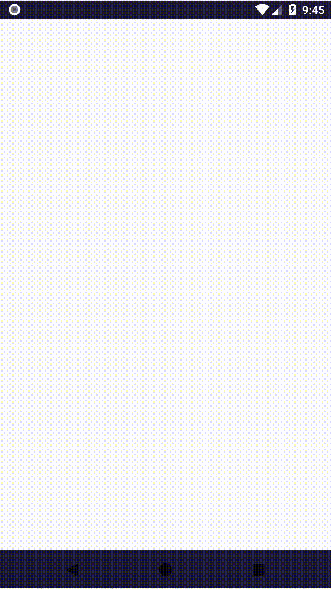

# Rozdział 8 - Konfiguracja i informacje do debugowania

Jak wspomniałem na końcu poprzedniego rozdziału, przydałoby się wyświetlać pewne informacje do debugowania aplikacji. Takie dane pomagają nie tylko rozwiązywać problemy powstałe podczas rozwoju aplikacji, ale (w pierwszej kolejności) w ogóle je dostrzegać.

## Konfiguracja

Wyświetlanie owych informacji do debugowania można by uaktywniać prostym przełącznikiem w kodzie. Tylko gdzie umieścić przełącznik? W tej chwili nie mamy dobrego miejsca, dlatego dodamy nowy komponent fasady - `Configuration`:

```java
package com.github.daishe.androidgametutorial;

import android.content.Context;
import android.support.annotation.NonNull;

public final class Configuration implements GameFacadeComponent {

    public boolean drawFramesPerSecond = true;
    public float framesPerSecondCalcInterval = 0.1f;
    public boolean drawPhysicsDebugInfo = true;

    public Configuration() {
    }

    @Override
    public void create(@NonNull Context context) {
    }

    @Override
    public void pause() {
    }

    @Override
    public void resume() {
    }

    @Override
    public void destroy() {
    }

}
```

i zarejestrujemy go w fasadzie (`GameFacade`):

```java
package com.github.daishe.androidgametutorial;

import android.content.Context;
import android.support.annotation.NonNull;

public final class GameFacade implements GameFacadeComponent {

    private Context context = null;
    private Configuration configuration = new Configuration();
    private Random random = new Random();
    private Screen screen = new Screen();
    private Touch touch = new Touch(this);
    private ImageManager imageManager = new ImageManager(this);
    private Timer timer = new Timer();

    public GameFacade() {
    }

    public Context context() {
        return this.context;
    }

    @NonNull
    public Configuration configuration() {
        return this.configuration;
    }

    @NonNull
    public Random random() {
        return this.random;
    }

    @NonNull
    public Screen screen() {
        return this.screen;
    }

    @NonNull
    public Touch touch() {
        return this.touch;
    }

    @NonNull
    public ImageManager imageManager() {
        return this.imageManager;
    }

    @NonNull
    public Timer timer() {
        return this.timer;
    }

    @Override
    public void create(@NonNull Context context) {
        this.context = context;

        this.configuration.create(context);
        this.random.create(context);
        this.screen.create(context);
        this.touch.create(context);
        this.imageManager.create(context);
        this.timer.create(context);
    }

    @Override
    public void resume() {
        this.configuration.resume();
        this.random.resume();
        this.screen.resume();
        this.touch.resume();
        this.imageManager.resume();
        this.timer.resume();
    }

    @Override
    public void pause() {
        this.timer.pause();
        this.imageManager.pause();
        this.touch.pause();
        this.screen.pause();
        this.random.pause();
        this.configuration.pause();
    }

    @Override
    public void destroy() {
        this.timer.destroy();
        this.imageManager.destroy();
        this.touch.destroy();
        this.screen.destroy();
        this.random.destroy();
        this.configuration.destroy();

        this.context = null;
    }

}
```

## Rysowanie wektorów, przestrzeni kolizji i dotknięć

Nim zaczniemy zmieniać logikę rysowania, musimy zaopatrzyć się w zestaw metod do rysowania. Dodajmy kilka nowych do klasy `GameCanvas`:

```java
public void drawVector2D(Vector2D vector, Vector2D at, int color) {
    this.paint.setColor(color);
    this.canvas.drawLine(
            at.x(),
            at.y(),
            at.x() + vector.x(),
            at.y() + vector.y(),
            this.paint
        );
    this.paint.setColor(0xFF000000);
}

public void drawDebugTouch(Vector2D at) {
    this.drawCircle(20f, at, 0.5f, Color.YELLOW);
}

public void drawDebugAcceleration(Vector2D at, Vector2D acceleration) {
    this.drawVector2D(acceleration, at, Color.YELLOW);
}

public void drawDebugVelocity(Vector2D at, Vector2D velocity) {
    this.drawVector2D(velocity, at, Color.GREEN);
}

public void drawDebugCollisionBox(Vector2D at, float radius) {
    this.paint.setColor(Color.WHITE);
    this.paint.setStyle(Paint.Style.STROKE);

    // Collision circle
    this.canvas.drawCircle(at.x(), at.y(), radius, this.paint);

    // Collision box
    this.canvas.drawLine(at.x() - radius, at.y() - radius, at.x() + radius, at.y() - radius, this.paint);
    this.canvas.drawLine(at.x() - radius, at.y() - radius, at.x() - radius, at.y() + radius, this.paint);
    this.canvas.drawLine(at.x() + radius, at.y() + radius, at.x() - radius, at.y() + radius, this.paint);
    this.canvas.drawLine(at.x() + radius, at.y() + radius, at.x() + radius, at.y() - radius, this.paint);

    this.paint.setStyle(Paint.Style.FILL);
    this.paint.setColor(0xFF000000);
}
```

Zmodyfikujmy też metodę `lockCanvas`:

```java
public void lockCanvas(Canvas canvas) {
    this.canvas = canvas;
    this.canvas.save();

    this.canvas.translate(this.canvas.getWidth() / 2, this.canvas.getHeight() / 2);
    this.lastScale = this.gameFacade.screen().scale();
    this.canvas.scale(this.lastScale, this.lastScale);

    this.canvas.drawColor(0xFF2E2957);

    if (this.gameFacade.configuration().drawPhysicsDebugInfo) {
        // Dimensional vectors
        this.drawVector2D(Vector2D.fromCartesian(100, 0), Vector2D.fromCartesian(0, 0), Color.RED);
        this.drawVector2D(Vector2D.fromCartesian(0, 100), Vector2D.fromCartesian(0, 0), Color.RED);

        // Dimensional vectors sum
        this.drawVector2D(Vector2D.fromCartesian(100, 100), Vector2D.fromCartesian(0, 0), Color.RED);
    }
}
```

Teraz przejdźmy do klasy `GameWorld` i zmodyfikujmy metodę `draw`:

```java
public void draw(GameCanvas gameCanvas) {
    this.playerShip.draw(gameCanvas);
    for (Asteroid asteroid : this.asteroids)
        asteroid.draw(gameCanvas);
    this.rocket.draw(gameCanvas);

    if (this.gameFacade.configuration().drawPhysicsDebugInfo) {
        TouchEvent touchEvent = this.gameFacade.touch().get();
        if (touchEvent != null)
            gameCanvas.drawDebugTouch(touchEvent.gamePosition());
    }
}
```

Czas na obiekty świata gry. Zaczniemy od klasy `Asteroid`. Zaktualizujmy metodę `draw`:

```java
public void draw(GameCanvas gameCanvas) {
    if (!this.alive || !gameCanvas.isVisible(this.position, this.asteroidImage.diagonal() / 2))
        return;

    if (this.world.facade().configuration().drawPhysicsDebugInfo) {
        gameCanvas.drawDebugVelocity(this.position, this.velocity);
        gameCanvas.drawDebugCollisionBox(this.position, this.asteroidImage.radius());
    }

    this.asteroidImage.draw(gameCanvas, this.position, 1f, this.angularPosition, 1f);
}
```

Następnie klasa `PlayerShip`. Tu również zaktualizujemy metodę `draw`:

```java
public void draw(GameCanvas gameCanvas) {
    if (!this.alive)
        return;

    if (this.world.facade().configuration().drawPhysicsDebugInfo)
        gameCanvas.drawDebugCollisionBox(Vector2D.fromCartesian(0, 0), this.shipImage.radius());

    this.shipImage.draw(gameCanvas, Vector2D.fromCartesian(0, 0));
}
```

Dalej klasa `Rocket` i ponownie metoda `draw`:

```java
public void draw(GameCanvas gameCanvas) {
    if (!this.alive || !gameCanvas.isVisible(this.position, Rocket.radius))
        return;

    if (this.world.facade().configuration().drawPhysicsDebugInfo) {
        gameCanvas.drawDebugVelocity(this.position, this.velocity);
        gameCanvas.drawDebugCollisionBox(this.position, Rocket.radius);
    }

    gameCanvas.drawCircle(Rocket.radius, this.position, this.alpha.get(), 0xFFFF0800);
}
```

## Pomiar ilości klatek w czasie

Brakuje nam jeszcze jednej istotnej informacji diagnostycznej - ilości klatek na sekundę. Doprowadźmy klasę `GameThread` do następującej postaci:

```java
package com.github.daishe.androidgametutorial;

import android.app.Activity;
import android.graphics.Canvas;
import android.graphics.Color;
import android.graphics.Paint;
import android.support.annotation.NonNull;
import android.view.SurfaceHolder;

import java.lang.ref.WeakReference;
import java.util.concurrent.atomic.AtomicBoolean;

public class GameThread extends Thread {

    private static final int framesPerSecond = 30;

    private WeakReference<Activity> activityWeakReference;
    private GameFacade gameFacade;
    private GameView view;

    private long lastFrameStartTimePoint = 0;
    private long lastFrameTimeDelta = 0;

    private long lastFPSCalcTimePoint = 0;
    private float fps = 0;

    private AtomicBoolean isDrawing = new AtomicBoolean(false);

    public GameThread(Activity activity, GameFacade gameFacade, GameView view) {
        this.activityWeakReference = new WeakReference<Activity>(activity);
        this.gameFacade = gameFacade;
        this.view = view;
    }

    public boolean drawing() {
        return this.isDrawing.get();
    }

    public boolean drawing(boolean isDrawing) {
        this.isDrawing.set(isDrawing);
        return isDrawing;
    }

    @Override
    public synchronized void start() {
        long now = System.nanoTime();
        this.lastFrameStartTimePoint = now;
        this.lastFPSCalcTimePoint = now;
        super.start();
    }

    @Override
    public void run() {
        while (!Thread.interrupted() && this.isMainActivityRunning()) {
            try {
                long frameLogicStartTimePoint = Time.now();

                this.lastFrameTimeDelta = frameLogicStartTimePoint - this.lastFrameStartTimePoint;
                this.lastFrameStartTimePoint = frameLogicStartTimePoint;

                if (this.drawing()) {
                    this.executeUpdate();
                    this.executeDraw();
                }

                long frameLogicStopTimePoint = Time.now();

                long frameLogicTimeDelta = Math.max(0, frameLogicStopTimePoint - frameLogicStartTimePoint);
                long sleepTime = Math.max(0, (this.ticksPerFrame() - frameLogicTimeDelta) / (Time.resolution() / 1000));
                Thread.sleep(sleepTime);
            }
            catch (InterruptedException e) {
                break;
            }
            catch (Exception e) {
            }
        }
    }

    private boolean isMainActivityRunning() {
        Activity activity = this.activityWeakReference.get();
        return activity != null && !activity.isFinishing();
    }

    private long ticksPerFrame() {
        double resolution = (double)Time.resolution();
        return Math.round(resolution / GameThread.framesPerSecond);
    }

    private void executeUpdate() {
        this.view.update();
        this.updateFPS();
    }

    private void updateFPS() {
        if (this.gameFacade.configuration().drawFramesPerSecond) {
            long calcInterval = (long) (this.gameFacade.configuration().framesPerSecondCalcInterval * Time.resolution());

            if (this.lastFrameStartTimePoint - this.lastFPSCalcTimePoint > calcInterval) {
                this.lastFPSCalcTimePoint = this.lastFrameStartTimePoint;
                if (this.lastFrameTimeDelta != 0) {
                    double value = Time.resolution() / (double) this.lastFrameTimeDelta;
                    this.fps = Math.round(value * 1000) / 1000f;
                } else {
                    this.fps = 0;
                }
            }
        }
    }

    private void executeDraw() {
        SurfaceHolder surfaceHolder = this.view.getHolder();
        Canvas canvas = null;
        try {
            canvas = surfaceHolder.lockCanvas();
            if (canvas != null) {
                this.view.onDraw(canvas);
                this.drawFPS(canvas);
            }
        }
        finally {
            if (canvas != null)
                surfaceHolder.unlockCanvasAndPost(canvas);
        }
    }

    private void drawFPS(@NonNull Canvas canvas) {
        if (this.gameFacade.configuration().drawFramesPerSecond) {
            Paint paint = new Paint();
            paint.setTextSize(75);
            if (this.fps > GameThread.framesPerSecond * 0.9)
                paint.setColor(Color.GREEN);
            else if (this.fps > GameThread.framesPerSecond * 0.5)
                paint.setColor(Color.YELLOW);
            else
                paint.setColor(Color.RED);

            canvas.drawText(String.valueOf(this.fps), 10, 85, paint);
        }
    }

}
```

i zaktualizujmy tworzenie jej instancji w klasie `MainActivity` (metoda `onCreate`):

```java
this.gameThread = new GameThread(this, this.gameFacade, this.gameView);
```



Zwróćmy uwagę na to, że mamy sporą ilość rozrzuconych po kodzie stałych konfiguracyjnych. W dodatku niektóre z nich są zduplikowane (jak `killingRange` w klasach `Asteroid` i `Rocket`). Stworzona przez nas klasa `Configuration` jest dużo lepszym miejscem do ich trzymania. Przenieśmy więc wszystkie ustawienia do klasy `Configuration`.

## Konfiguracja w jednym miejscu

Zaczniemy zebrania wszystkich porozrzucanych atrybutów konfiguracyjnych i dodania ich do centralnej konfiguracji (klasa `Configuration`):

```java
public long framesPerSecond = 30;

public float minVisibleRange = 540f;
public float minSpawnRange = 1000f;
public float spawnSpaceRange = 200f;
public float killingRange = 1200f;

public long asteroidsLimit = 15;
public float asteroidMaxVelocity = 180f;

public float rocketMaxVelocity = 300f;
```

Następnie zabierzmy się za aktualizacje kodu klas. Zaczniemy od klasy `Asteroid`. Usuńmy zbędne atrybuty (`maxVelocity` i `killingRange`), a następnie zmodyfikujmy kod metody `create`:

```java
public Asteroid create(GameWorld world, Vector2D inWorldPosition) {
    GameFacade gameFacade = world.facade();
    Configuration configuration = gameFacade.configuration();

    this.world = world;

    this.velocity.setToPolar(
            configuration.asteroidMaxVelocity - Math.abs(gameFacade.random().gaussian(2) * configuration.asteroidMaxVelocity / 4),
            (float)Math.PI + inWorldPosition.theta() + gameFacade.random().gaussian(4) / 18
        );
    this.position.setTo(inWorldPosition);
    this.angularVelocity = gameFacade.random().gaussian(8) * (float)Math.PI / 2;
    this.angularPosition = gameFacade.random().angle();

    this.asteroidImage = gameFacade.imageManager().randomAsteroid();

    this.alive = true;

    return this;
}
```

i metody `update`:

```java
public void update(float timeShift) {
    if (!this.alive)
        return;

    Configuration configuration = this.world.facade().configuration();

    if (Math.abs(this.position.x()) > configuration.killingRange || Math.abs(this.position.y()) > configuration.killingRange)
        this.alive = false;

    this.position.addInPlace(this.velocity.mul(timeShift));

    this.angularPosition += this.angularVelocity * timeShift;
    this.angularPosition -= ((int)(this.angularPosition / (float)(Math.PI * 2))) * (float)(Math.PI * 2);
}
```

Dalej przejdźmy do klasy `Rocket`. Tu również usuńmy zbędne atrybuty (`maxVelocity` i `killingRange`) i zaktualizujmy metodę `create`:

```java
public Rocket create(GameWorld world, Vector2D targetPosition) {
    GameFacade gameFacade = world.facade();

    this.world = world;

    this.position.setTo(Vector2D.fromNothing());
    this.velocity.setTo(targetPosition)
        .normalizeInPlace()
        .mulInPlace(gameFacade.configuration().rocketMaxVelocity);

    this.alive = true;

    return this;
}
```

i metodę `update`:

```java
public void update(float timeShift) {
    if (!this.alive)
        return;

    Configuration configuration = this.world.facade().configuration();

    if (Math.abs(this.position.x()) > configuration.killingRange || Math.abs(this.position.y()) > configuration.killingRange)
        this.alive = false;

    this.alpha.update(timeShift);

    this.position.addInPlace(this.velocity.mul(timeShift));
}
```

Zajmiemy się klasą `GameWorld`. Jak wcześniej usuńmy zbędne atrybuty. Tym razem to `minSpawnRange`, `spawnSpaceRange` i `asteroidsLimit`. Następnie naprawmy metody `update`:

```java
public void update(float timeShift) {
    Configuration configuration = this.gameFacade.configuration();

    TouchEvent touchEvent = this.facade().touch().get();
    if (touchEvent != null && !this.rocket.alive() && this.playerShip.alive())
        this.rocket.create(this, touchEvent.gamePosition());

    this.playerShip.update(timeShift);
    for (Asteroid asteroid : this.asteroids)
        asteroid.update(timeShift);
    this.rocket.update(timeShift);

    this.resolveCollisions();

    for (Asteroid asteroid : this.asteroids) {
        if (!asteroid.alive()) {
            this.createAsteroid(asteroid);
            if (this.asteroids.size() < configuration.asteroidsLimit)
                this.asteroids.add(this.createAsteroid(new Asteroid()));
        }
    }
}
```

i `createAsteroid`:

```java
private Asteroid createAsteroid(Asteroid asteroid) {
    Configuration configuration = this.gameFacade.configuration();
    Random random = this.gameFacade.random();

    float radius = random.linear() * configuration.spawnSpaceRange + configuration.minSpawnRange;
    float theta = random.angle();
    asteroid.create(this, Vector2D.fromPolar(radius, theta));
    return asteroid;
}
```

W klasie `Screen` usuńmy zbędny atrybut `minVisibleRange`, a na jego miejsce dodajmy nowy - `gameFacade`:

```java
private GameFacade gameFacade;
```

oraz zmodyfikujmy konstruktor:

```java
public Screen(@NonNull GameFacade gameFacade) {
    this.gameFacade = gameFacade;
}
```

Pozostaje naprawić metodę `scale`:

```java
public float scale() {
    Vector2D dimensions = this.physicalDimensions();
    float minDimension = Math.min(dimensions.x(), dimensions.y());
    return minDimension / 2 / this.gameFacade.configuration().minVisibleRange;
}
```

Pamiętajmy o zaktualizowaniu tworzenia instancji klasy `Screen` w fasadzie (klasa `GameFacade`):

```java
private Screen screen = new Screen(this);
```

Na koniec pozostała klasa `GameThread`. Usuńmy atrybut `framesPerSecond` i zaktualizujmy metody `ticksPerFrame`:

```java
private long ticksPerFrame() {
    double resolution = (double)Time.resolution();
    return Math.round(resolution / this.gameFacade.configuration().framesPerSecond);
}
```

oraz `drawFPS`:

```java
private void drawFPS(@NonNull Canvas canvas) {
    Configuration configuration = this.gameFacade.configuration();

    if (configuration.drawFramesPerSecond) {
        Paint paint = new Paint();
        paint.setTextSize(75);
        if (this.fps > configuration.framesPerSecond * 0.9)
            paint.setColor(Color.GREEN);
        else if (this.fps > configuration.framesPerSecond * 0.5)
            paint.setColor(Color.YELLOW);
        else
            paint.setColor(Color.RED);

        canvas.drawText(String.valueOf(this.fps), 10, 85, paint);
    }
}
```

## Nielimitowane klatki

Skoro już jesteśmy przy klasie `GameThread`, to dodajmy w konfiguracji przełącznik wyłączający limitowanie ilości klatek. W klasie `Configuration` dodajmy nowy atrybut o nazwie `unboundFrameRate`:

```java
public boolean unboundFrameRate = false;
```

i zmodyfikujmy metodę `run` klasy `GameThread`:

```java
@Override
public void run() {
    while (!Thread.interrupted() && this.isMainActivityRunning()) {
        try {
            long frameLogicStartTimePoint = Time.now();

            this.lastFrameTimeDelta = frameLogicStartTimePoint - this.lastFrameStartTimePoint;
            this.lastFrameStartTimePoint = frameLogicStartTimePoint;

            if (this.drawing()) {
                this.executeUpdate();
                this.executeDraw();
            }

            long frameLogicStopTimePoint = Time.now();

            if (!this.gameFacade.configuration().unboundFrameRate) {
                long frameLogicTimeDelta = Math.max(0, frameLogicStopTimePoint - frameLogicStartTimePoint);
                long sleepTime = Math.max(0, (this.ticksPerFrame() - frameLogicTimeDelta) / (Time.resolution() / 1000));
                Thread.sleep(sleepTime);
            }
        }
        catch (InterruptedException e) {
            break;
        }
        catch (Exception e) {
        }
    }
}
```

## Wizualizacja skalowania aplikacji

Teraz gdy mamy centralną konfigurację, możemy dodać jeszcze jedną drobną rzecz - oznaczenie minimalnego zasięgu widoczności w grze. W klasie `GameCanvas` zmodyfikujmy metodę `lockCanvas`:

```java
public void lockCanvas(Canvas canvas) {
    this.canvas = canvas;
    this.canvas.save();

    this.canvas.translate(this.canvas.getWidth() / 2, this.canvas.getHeight() / 2);
    this.lastScale = this.gameFacade.screen().scale();
    this.canvas.scale(this.lastScale, this.lastScale);

    this.canvas.drawColor(0xFF2E2957);

    if (this.gameFacade.configuration().drawPhysicsDebugInfo) {
        // Dimensional vectors
        this.drawVector2D(Vector2D.fromCartesian(100, 0), Vector2D.fromCartesian(0, 0), Color.RED);
        this.drawVector2D(Vector2D.fromCartesian(0, 100), Vector2D.fromCartesian(0, 0), Color.RED);

        // Dimensional vectors sum
        this.drawVector2D(Vector2D.fromCartesian(100, 100), Vector2D.fromCartesian(0, 0), Color.RED);

        // Minimum visible range
        this.paint.setStyle(Paint.Style.STROKE);
        this.paint.setColor(Color.RED);
        this.canvas.drawCircle(0, 0, this.gameFacade.configuration().minVisibleRange, this.paint);
        this.paint.setStyle(Paint.Style.FILL);
    }
}
```

## Podsumowanie

W tym rozdziale dodaliśmy logikę wyświetlania różnych informacji, które mogą okazać się pomocne w przyszłości do usuwania błędów. Wprowadziliśmy też centralną konfigurację. Nim przejdziemy dalej, możemy nieco poeksperymentować z przełącznikami oraz wartościami i zobaczyć, jakie będą efekty.

W następnym rozdziale zajmiemy się dostarczaniem wrażeń dla innego zmysłu niż wzrok - zajmiemy się słuchem.

## Zmodyfikowane pliki

Lista zmodyfikowanych plików w tej części kursu.

### Plik `Asteroid.java`

```java
package com.github.daishe.androidgametutorial;

public class Asteroid {

    private GameWorld world;

    private MutableVector2D position = Vector2D.fromNothing();
    private MutableVector2D velocity = Vector2D.fromNothing();
    private float angularVelocity;
    private float angularPosition;

    private Image asteroidImage;

    private boolean alive = false;

    public Asteroid() {
    }

    public Asteroid create(GameWorld world, Vector2D inWorldPosition) {
        GameFacade gameFacade = world.facade();
        Configuration configuration = gameFacade.configuration();

        this.world = world;

        this.velocity.setToPolar(
                configuration.asteroidMaxVelocity - Math.abs(gameFacade.random().gaussian(2) * configuration.asteroidMaxVelocity / 4),
                (float)Math.PI + inWorldPosition.theta() + gameFacade.random().gaussian(4) / 18
            );
        this.position.setTo(inWorldPosition);
        this.angularVelocity = gameFacade.random().gaussian(8) * (float)Math.PI / 2;
        this.angularPosition = gameFacade.random().angle();

        this.asteroidImage = gameFacade.imageManager().randomAsteroid();

        this.alive = true;

        return this;
    }

    public GameWorld world() {
        return this.world;
    }

    public GameWorld world(GameWorld world) {
        return this.world = world;
    }

    public boolean alive() { return this.alive; }

    public boolean alive(boolean alive) { return this.alive = alive; }

    public Vector2D position() {
        return this.position;
    }

    public Vector2D position(Vector2D position) {
        return this.position.setTo(position);
    }

    public Vector2D velocity() {
        return this.velocity;
    }

    public Vector2D velocity(Vector2D velocity) {
        return this.velocity.setTo(velocity);
    }

    public float collisionRadius() {
        return this.asteroidImage.radius();
    }

    public void update(float timeShift) {
        if (!this.alive)
            return;

        Configuration configuration = this.world.facade().configuration();

        if (Math.abs(this.position.x()) > configuration.killingRange || Math.abs(this.position.y()) > configuration.killingRange)
            this.alive = false;

        this.position.addInPlace(this.velocity.mul(timeShift));

        this.angularPosition += this.angularVelocity * timeShift;
        this.angularPosition -= ((int)(this.angularPosition / (float)(Math.PI * 2))) * (float)(Math.PI * 2);
    }

    public void draw(GameCanvas gameCanvas) {
        if (!this.alive || !gameCanvas.isVisible(this.position, this.asteroidImage.diagonal() / 2))
            return;

        if (this.world.facade().configuration().drawPhysicsDebugInfo) {
            gameCanvas.drawDebugVelocity(this.position, this.velocity);
            gameCanvas.drawDebugCollisionBox(this.position, this.asteroidImage.radius());
        }

        this.asteroidImage.draw(gameCanvas, this.position, 1f, this.angularPosition, 1f);
    }

}
```

### Plik `Configuration.java`

```java
package com.github.daishe.androidgametutorial;

import android.content.Context;
import android.support.annotation.NonNull;

public final class Configuration implements GameFacadeComponent {

    public long framesPerSecond = 30;
    public boolean unboundFrameRate = false;

    public float minVisibleRange = 540f;
    public float minSpawnRange = 1000f;
    public float spawnSpaceRange = 200f;
    public float killingRange = 1200f;

    public long asteroidsLimit = 15;
    public float asteroidMaxVelocity = 180f;

    public float rocketMaxVelocity = 300f;

    public boolean drawFramesPerSecond = true;
    public float framesPerSecondCalcInterval = 0.1f;
    public boolean drawPhysicsDebugInfo = true;

    public Configuration() {
    }

    @Override
    public void create(@NonNull Context context) {
    }

    @Override
    public void pause() {
    }

    @Override
    public void resume() {
    }

    @Override
    public void destroy() {
    }

}
```

### Plik `GameCanvas.java`

```java
package com.github.daishe.androidgametutorial;

import android.graphics.Bitmap;
import android.graphics.Canvas;
import android.graphics.Color;
import android.graphics.Matrix;
import android.graphics.Paint;

public class GameCanvas {

    private GameFacade gameFacade;

    private Canvas canvas = null;

    private Paint paint = new Paint();
    private Matrix matrix = new Matrix();

    private float lastScale = 1f;

    public GameCanvas(GameFacade gameFacade) {
        this.gameFacade = gameFacade;

        this.paint.setAntiAlias(true);
    }

    public boolean isVisible(Vector2D point, float toleration) {
        float width = this.canvas.getWidth() / this.lastScale / 2;
        float height = this.canvas.getHeight() / this.lastScale / 2;
        float x = point.x();
        float y = point.y();

        boolean xVisible = !(x + toleration < -width || x - toleration > width);
        boolean yVisible = !(y + toleration < -height || y - toleration > height);
        return xVisible && yVisible;
    }

    public void drawVector2D(Vector2D vector, Vector2D at, int color) {
        this.paint.setColor(color);
        this.canvas.drawLine(
                at.x(),
                at.y(),
                at.x() + vector.x(),
                at.y() + vector.y(),
                this.paint
        );
        this.paint.setColor(0xFF000000);
    }

    public void drawCircle(float radius, Vector2D at, float alpha, int color) {
        this.paint.setColor(color);
        this.paint.setAlpha((int)(255 * alpha));
        this.canvas.drawCircle(at.x(), at.y(), radius, this.paint);
        this.paint.setAlpha(255);
        this.paint.setColor(0xFF000000);
    }

    public void drawBitmap(Bitmap bitmap, Vector2D at) {
        this.canvas.drawBitmap(
                bitmap,
                at.x() - bitmap.getWidth() / 2,
                at.y() - bitmap.getHeight() / 2,
                this.paint
        );
    }

    public void drawBitmap(Bitmap bitmap, Vector2D at, float scale, float rotation, float alpha) {
        this.matrix.setTranslate(-bitmap.getWidth() / 2, -bitmap.getHeight() / 2);
        this.matrix.postScale(scale, scale);
        this.matrix.postRotate((float)Math.toDegrees(rotation), 0, 0);
        this.matrix.postTranslate(at.x(), at.y());

        this.paint.setAlpha((int)(255 * alpha));
        canvas.drawBitmap(bitmap, this.matrix, this.paint);
        this.paint.setAlpha(255);

        this.matrix.reset();
    }

    public void drawDebugTouch(Vector2D at) {
        this.drawCircle(20f, at, 0.5f, Color.YELLOW);
    }

    public void drawDebugAcceleration(Vector2D at, Vector2D acceleration) {
        this.drawVector2D(acceleration, at, Color.YELLOW);
    }

    public void drawDebugVelocity(Vector2D at, Vector2D velocity) {
        this.drawVector2D(velocity, at, Color.GREEN);
    }

    public void drawDebugCollisionBox(Vector2D at, float radius) {
        this.paint.setColor(Color.WHITE);
        this.paint.setStyle(Paint.Style.STROKE);

        // Collision circle
        this.canvas.drawCircle(at.x(), at.y(), radius, this.paint);

        // Collision box
        this.canvas.drawLine(at.x() - radius, at.y() - radius, at.x() + radius, at.y() - radius, this.paint);
        this.canvas.drawLine(at.x() - radius, at.y() - radius, at.x() - radius, at.y() + radius, this.paint);
        this.canvas.drawLine(at.x() + radius, at.y() + radius, at.x() - radius, at.y() + radius, this.paint);
        this.canvas.drawLine(at.x() + radius, at.y() + radius, at.x() + radius, at.y() - radius, this.paint);

        this.paint.setStyle(Paint.Style.FILL);
        this.paint.setColor(0xFF000000);
    }

    public void lockCanvas(Canvas canvas) {
        this.canvas = canvas;
        this.canvas.save();

        this.canvas.translate(this.canvas.getWidth() / 2, this.canvas.getHeight() / 2);
        this.lastScale = this.gameFacade.screen().scale();
        this.canvas.scale(this.lastScale, this.lastScale);

        this.canvas.drawColor(0xFF2E2957);

        if (this.gameFacade.configuration().drawPhysicsDebugInfo) {
            // Dimensional vectors
            this.drawVector2D(Vector2D.fromCartesian(100, 0), Vector2D.fromCartesian(0, 0), Color.RED);
            this.drawVector2D(Vector2D.fromCartesian(0, 100), Vector2D.fromCartesian(0, 0), Color.RED);

            // Dimensional vectors sum
            this.drawVector2D(Vector2D.fromCartesian(100, 100), Vector2D.fromCartesian(0, 0), Color.RED);

            // Minimum visible range
            this.paint.setStyle(Paint.Style.STROKE);
            this.paint.setColor(Color.RED);
            this.canvas.drawCircle(0, 0, this.gameFacade.configuration().minVisibleRange, this.paint);
            this.paint.setStyle(Paint.Style.FILL);
        }
    }

    public Canvas releaseCanvas() {
        this.canvas.restore();

        Canvas result = this.canvas;
        this.canvas = null;
        return result;
    }

}
```

### Plik `GameFacade.java`

```java
package com.github.daishe.androidgametutorial;

import android.content.Context;
import android.support.annotation.NonNull;

public final class GameFacade implements GameFacadeComponent {

    private Context context = null;
    private Configuration configuration = new Configuration();
    private Random random = new Random();
    private Screen screen = new Screen(this);
    private Touch touch = new Touch(this);
    private ImageManager imageManager = new ImageManager(this);
    private Timer timer = new Timer();

    public GameFacade() {
    }

    public Context context() {
        return this.context;
    }

    @NonNull
    public Configuration configuration() {
        return this.configuration;
    }

    @NonNull
    public Random random() {
        return this.random;
    }

    @NonNull
    public Screen screen() {
        return this.screen;
    }

    @NonNull
    public Touch touch() {
        return this.touch;
    }

    @NonNull
    public ImageManager imageManager() {
        return this.imageManager;
    }

    @NonNull
    public Timer timer() {
        return this.timer;
    }

    @Override
    public void create(@NonNull Context context) {
        this.context = context;

        this.configuration.create(context);
        this.random.create(context);
        this.screen.create(context);
        this.touch.create(context);
        this.imageManager.create(context);
        this.timer.create(context);
    }

    @Override
    public void resume() {
        this.configuration.resume();
        this.random.resume();
        this.screen.resume();
        this.touch.resume();
        this.imageManager.resume();
        this.timer.resume();
    }

    @Override
    public void pause() {
        this.timer.pause();
        this.imageManager.pause();
        this.touch.pause();
        this.screen.pause();
        this.random.pause();
        this.configuration.pause();
    }

    @Override
    public void destroy() {
        this.timer.destroy();
        this.imageManager.destroy();
        this.touch.destroy();
        this.screen.destroy();
        this.random.destroy();
        this.configuration.destroy();

        this.context = null;
    }

}
```

### Plik `GameThread.java`

```java
package com.github.daishe.androidgametutorial;

import android.app.Activity;
import android.graphics.Canvas;
import android.graphics.Color;
import android.graphics.Paint;
import android.support.annotation.NonNull;
import android.view.SurfaceHolder;

import java.lang.ref.WeakReference;
import java.util.concurrent.atomic.AtomicBoolean;

public class GameThread extends Thread {

    private WeakReference<Activity> activityWeakReference;
    private GameFacade gameFacade;
    private GameView view;

    private long lastFrameStartTimePoint = 0;
    private long lastFrameTimeDelta = 0;

    private long lastFPSCalcTimePoint = 0;
    private float fps = 0;

    private AtomicBoolean isDrawing = new AtomicBoolean(false);

    public GameThread(Activity activity, GameFacade gameFacade, GameView view) {
        this.activityWeakReference = new WeakReference<Activity>(activity);
        this.gameFacade = gameFacade;
        this.view = view;
    }

    public boolean drawing() {
        return this.isDrawing.get();
    }

    public boolean drawing(boolean isDrawing) {
        this.isDrawing.set(isDrawing);
        return isDrawing;
    }

    @Override
    public synchronized void start() {
        long now = System.nanoTime();
        this.lastFrameStartTimePoint = now;
        this.lastFPSCalcTimePoint = now;
        super.start();
    }

    @Override
    public void run() {
        while (!Thread.interrupted() && this.isMainActivityRunning()) {
            try {
                long frameLogicStartTimePoint = Time.now();

                this.lastFrameTimeDelta = frameLogicStartTimePoint - this.lastFrameStartTimePoint;
                this.lastFrameStartTimePoint = frameLogicStartTimePoint;

                if (this.drawing()) {
                    this.executeUpdate();
                    this.executeDraw();
                }

                long frameLogicStopTimePoint = Time.now();

                if (!this.gameFacade.configuration().unboundFrameRate) {
                    long frameLogicTimeDelta = Math.max(0, frameLogicStopTimePoint - frameLogicStartTimePoint);
                    long sleepTime = Math.max(0, (this.ticksPerFrame() - frameLogicTimeDelta) / (Time.resolution() / 1000));
                    Thread.sleep(sleepTime);
                }
            }
            catch (InterruptedException e) {
                break;
            }
            catch (Exception e) {
            }
        }
    }

    private boolean isMainActivityRunning() {
        Activity activity = this.activityWeakReference.get();
        return activity != null && !activity.isFinishing();
    }

    private long ticksPerFrame() {
        double resolution = (double)Time.resolution();
        return Math.round(resolution / this.gameFacade.configuration().framesPerSecond);
    }

    private void executeUpdate() {
        this.view.update();
        this.updateFPS();
    }

    private void updateFPS() {
        if (this.gameFacade.configuration().drawFramesPerSecond) {
            long calcInterval = (long) (this.gameFacade.configuration().framesPerSecondCalcInterval * Time.resolution());

            if (this.lastFrameStartTimePoint - this.lastFPSCalcTimePoint > calcInterval) {
                this.lastFPSCalcTimePoint = this.lastFrameStartTimePoint;
                if (this.lastFrameTimeDelta != 0) {
                    double value = Time.resolution() / (double) this.lastFrameTimeDelta;
                    this.fps = Math.round(value * 1000) / 1000f;
                } else {
                    this.fps = 0;
                }
            }
        }
    }

    private void executeDraw() {
        SurfaceHolder surfaceHolder = this.view.getHolder();
        Canvas canvas = null;
        try {
            canvas = surfaceHolder.lockCanvas();
            if (canvas != null) {
                this.view.onDraw(canvas);
                this.drawFPS(canvas);
            }
        }
        finally {
            if (canvas != null)
                surfaceHolder.unlockCanvasAndPost(canvas);
        }
    }

    private void drawFPS(@NonNull Canvas canvas) {
        Configuration configuration = this.gameFacade.configuration();

        if (configuration.drawFramesPerSecond) {
            Paint paint = new Paint();
            paint.setTextSize(75);
            if (this.fps > configuration.framesPerSecond * 0.9)
                paint.setColor(Color.GREEN);
            else if (this.fps > configuration.framesPerSecond * 0.5)
                paint.setColor(Color.YELLOW);
            else
                paint.setColor(Color.RED);

            canvas.drawText(String.valueOf(this.fps), 10, 85, paint);
        }
    }

}
```

### Plik `GameWorld.java`

```java
package com.github.daishe.androidgametutorial;

import java.util.ArrayList;

public class GameWorld {

    private GameFacade gameFacade;

    private PlayerShip playerShip;
    private ArrayList<Asteroid> asteroids;
    private Rocket rocket;

    public GameWorld(GameFacade gameFacade) {
        this.gameFacade = gameFacade;

        this.playerShip = new PlayerShip().create(this);

        this.asteroids = new ArrayList<Asteroid>();
        this.asteroids.add(this.createAsteroid(new Asteroid()));

        this.rocket = new Rocket();
    }

    public GameFacade facade() {
        return this.gameFacade;
    }

    public void update(float timeShift) {
        Configuration configuration = this.gameFacade.configuration();

        TouchEvent touchEvent = this.facade().touch().get();
        if (touchEvent != null && !this.rocket.alive() && this.playerShip.alive())
            this.rocket.create(this, touchEvent.gamePosition());

        this.playerShip.update(timeShift);
        for (Asteroid asteroid : this.asteroids)
            asteroid.update(timeShift);
        this.rocket.update(timeShift);

        this.resolveCollisions();

        for (Asteroid asteroid : this.asteroids) {
            if (!asteroid.alive()) {
                this.createAsteroid(asteroid);
                if (this.asteroids.size() < configuration.asteroidsLimit)
                    this.asteroids.add(this.createAsteroid(new Asteroid()));
            }
        }
    }

    public void draw(GameCanvas gameCanvas) {
        this.playerShip.draw(gameCanvas);
        for (Asteroid asteroid : this.asteroids)
            asteroid.draw(gameCanvas);
        this.rocket.draw(gameCanvas);

        if (this.gameFacade.configuration().drawPhysicsDebugInfo) {
            TouchEvent touchEvent = this.gameFacade.touch().get();
            if (touchEvent != null)
                gameCanvas.drawDebugTouch(touchEvent.gamePosition());
        }
    }

    private Asteroid createAsteroid(Asteroid asteroid) {
        Configuration configuration = this.gameFacade.configuration();
        Random random = this.gameFacade.random();

        float radius = random.linear() * configuration.spawnSpaceRange + configuration.minSpawnRange;
        float theta = random.angle();
        asteroid.create(this, Vector2D.fromPolar(radius, theta));
        return asteroid;
    }

    private void resolveCollisions() {
        this.resolveCollisionsBetweenPlayerShipAndAsteroid();
        this.resolveCollisionsBetweenAsteroidAndAsteroid();
        this.resolveCollisionsBetweenAsteroidAndRocket();
    }

    private void resolveCollisionsBetweenPlayerShipAndAsteroid() {
        if (!this.playerShip.alive())
            return;

        for (int i = 0; i < this.asteroids.size(); ++i) {
            Asteroid asteroid = this.asteroids.get(i);

            if (!asteroid.alive())
                continue;

            boolean collision = Collision.at(
                    Vector2D.fromCartesian(0, 0),
                    this.playerShip.collisionRadius(),
                    asteroid.position(),
                    asteroid.collisionRadius()
                );

            if (collision) {
                this.playerShip.alive(false);
                asteroid.alive(false);
            }
        }
    }

    private void resolveCollisionsBetweenAsteroidAndAsteroid() {
        for (int i = 0; i < this.asteroids.size(); ++i) {
            Asteroid first = this.asteroids.get(i);

            if (!first.alive())
                continue;

            for (int j = i + 1; j < this.asteroids.size(); ++j) {
                Asteroid second = this.asteroids.get(j);

                if (!second.alive())
                    continue;

                boolean collision = Collision.at(
                        first.position(),
                        first.collisionRadius(),
                        second.position(),
                        second.collisionRadius()
                    );

                if (collision) {
                    first.alive(false);
                    second.alive(false);
                }
            }
        }
    }

    private void resolveCollisionsBetweenAsteroidAndRocket() {
        if (!this.rocket.alive())
            return;

        for (int i = 0; i < this.asteroids.size(); ++i) {
            Asteroid asteroid = this.asteroids.get(i);

            if (!asteroid.alive())
                continue;

            boolean collision= Collision.at(
                    asteroid.position(),
                    asteroid.collisionRadius(),
                    this.rocket.position(),
                    this.rocket.collisionRadius()
                );

            if (collision) {
                asteroid.alive(false);
                this.rocket.alive(false);
            }
        }
    }

}
```

### Plik `MainActivity.java`

```java
package com.github.daishe.androidgametutorial;

import android.os.Bundle;
import android.support.annotation.NonNull;
import android.support.v7.app.AppCompatActivity;
import android.view.WindowManager;

public class MainActivity extends AppCompatActivity {

    private GameFacade gameFacade;
    private GameWorld world;
    private GameView gameView;
    private GameThread gameThread;

    @Override
    protected void onCreate(Bundle savedInstanceState) {
        super.onCreate(savedInstanceState);

        this.getWindow().addFlags(WindowManager.LayoutParams.FLAG_FULLSCREEN);
        this.getWindow().addFlags(WindowManager.LayoutParams.FLAG_KEEP_SCREEN_ON);

        this.gameFacade = this.makeGameFacade();
        this.world = new GameWorld(this.gameFacade);
        this.gameView = new GameView(this, this.gameFacade, this.world);
        this.gameThread = new GameThread(this, this.gameFacade, this.gameView);

        this.gameView.getHolder().addCallback(new GameSurfaceHolderCallback(this.gameThread));
        this.setContentView(this.gameView);

        this.configureGameFacade();
        this.gameThread.start();
    }

    @Override
    protected void onResume() {
        super.onResume();
        this.gameFacade.resume();
    }

    @Override
    protected void onPause() {
        super.onPause();
        this.gameFacade.pause();
    }

    @NonNull
    private GameFacade makeGameFacade() {
        GameFacade gameFacade = new GameFacade();
        gameFacade.create(this);
        return gameFacade;
    }

    private void configureGameFacade() {
        this.gameFacade.screen().setPhysicalDimensionsSource(this.gameView);

        this.gameView.setOnTouchListener(this.gameFacade.touch());
    }

}
```

### Plik `PlayerShip.java`

```java
package com.github.daishe.androidgametutorial;

public class PlayerShip {

    private GameWorld world;

    private Image shipImage;

    private boolean alive = false;

    public PlayerShip() {
    }

    public PlayerShip create(GameWorld world) {
        this.world = world;
        this.shipImage = world.facade().imageManager().ship();
        this.alive = true;
        return this;
    }

    public GameWorld world() {
        return this.world;
    }

    public GameWorld world(GameWorld world) {
        return this.world = world;
    }

    public boolean alive() {
        return this.alive;
    }

    public boolean alive(boolean alive) {
        return this.alive = alive;
    }

    public float collisionRadius() {
        return this.shipImage.radius();
    }

    public void update(float timeShift) {
        // Nothing to do
    }

    public void draw(GameCanvas gameCanvas) {
        if (!this.alive)
            return;

        if (this.world.facade().configuration().drawPhysicsDebugInfo)
            gameCanvas.drawDebugCollisionBox(Vector2D.fromCartesian(0, 0), this.shipImage.radius());

        this.shipImage.draw(gameCanvas, Vector2D.fromCartesian(0, 0));
    }

}
```

### Plik `Rocket.java`

```java
package com.github.daishe.androidgametutorial;

public class Rocket {

    private static final float radius = 5f;

    private GameWorld world;

    private MutableVector2D position = Vector2D.fromNothing();
    private MutableVector2D velocity = Vector2D.fromNothing();

    private DynamicAlpha alpha = new DynamicAlpha(0.9f, 0.25f, 0.3f);

    private boolean alive = false;

    public Rocket() {
    }

    public Rocket create(GameWorld world, Vector2D targetPosition) {
        GameFacade gameFacade = world.facade();

        this.world = world;

        this.position.setTo(Vector2D.fromNothing());
        this.velocity.setTo(targetPosition)
            .normalizeInPlace()
            .mulInPlace(gameFacade.configuration().rocketMaxVelocity);

        this.alive = true;

        return this;
    }

    public GameWorld world() {
        return this.world;
    }

    public GameWorld world(GameWorld world) {
        return this.world = world;
    }

    public boolean alive() { return this.alive; }

    public boolean alive(boolean alive) { return this.alive = alive; }

    public Vector2D position() {
        return this.position;
    }

    public Vector2D position(Vector2D position) {
        return this.position.setTo(position);
    }

    public Vector2D velocity() {
        return this.velocity;
    }

    public Vector2D velocity(Vector2D velocity) {
        return this.velocity.setTo(velocity);
    }

    public float collisionRadius() {
        return Rocket.radius;
    }

    public void update(float timeShift) {
        if (!this.alive)
            return;

        Configuration configuration = this.world.facade().configuration();

        if (Math.abs(this.position.x()) > configuration.killingRange || Math.abs(this.position.y()) > configuration.killingRange)
            this.alive = false;

        this.alpha.update(timeShift);

        this.position.addInPlace(this.velocity.mul(timeShift));
    }

    public void draw(GameCanvas gameCanvas) {
        if (!this.alive || !gameCanvas.isVisible(this.position, Rocket.radius))
            return;

        if (this.world.facade().configuration().drawPhysicsDebugInfo) {
            gameCanvas.drawDebugVelocity(this.position, this.velocity);
            gameCanvas.drawDebugCollisionBox(this.position, Rocket.radius);
        }

        gameCanvas.drawCircle(Rocket.radius, this.position, this.alpha.get(), 0xFFFF0800);
    }

}
```

### Plik `Screen.java`

```java
package com.github.daishe.androidgametutorial;

import android.content.Context;
import android.support.annotation.NonNull;
import android.view.View;

public final class Screen implements GameFacadeComponent {

    private GameFacade gameFacade;
    private View view = null;

    public Screen(@NonNull GameFacade gameFacade) {
        this.gameFacade = gameFacade;
    }

    @NonNull
    public Vector2D physicalDimensions() {
        if (this.view != null)
            return Vector2D.fromCartesian(this.view.getWidth(), this.view.getHeight());
        return Vector2D.fromNothing();
    }

    @NonNull
    public Vector2D dimensions() {
        return this.physicalToGame(this.physicalDimensions());
    }

    public float scale() {
        Vector2D dimensions = this.physicalDimensions();
        float minDimension = Math.min(dimensions.x(), dimensions.y());
        return minDimension / 2 / this.gameFacade.configuration().minVisibleRange;
    }

    @NonNull
    public Vector2D physicalToGame(Vector2D physicalVector2D) {
        return Vector2D.from(physicalVector2D).divInPlace(this.scale());
    }

    @NonNull
    public Vector2D gameToPhysical(Vector2D gameVector2D) {
        return Vector2D.from(gameVector2D).mulInPlace(this.scale());
    }

    public void setPhysicalDimensionsSource(View view) {
        this.view = view;
    }

    @Override
    public void create(@NonNull Context context) {
    }

    @Override
    public void pause() {
    }

    @Override
    public void resume() {
    }

    @Override
    public void destroy() {
        this.view = null;
    }

}
```
