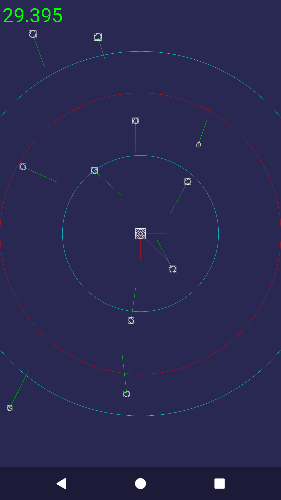

# Rozdział 9 - Dźwięk

Zgodnie z założeniem, tym razem rozbuduję aplikację, dodając dźwięki do świata gry. Jednak powinienem nieco sprostować, o co dokładnie mi chodzi. W grach (w ogólności) można spotkać różne rodzaje dźwięków. Są dźwięki świata, jak odgłosy uderzeń, czy strzałów, ale jest też np. muzyka w tle. W tym rozdziale zajmę się pierwszą z wymienionych grup, a dokładniej sprawię, że zderzenia staną się słyszalne.

## Zarządzanie dźwiękami

Dźwiękami w androidzie zarządza się w nieco inny sposób niż np. bitmapami. Właścicielem wszystkich dźwięków jest obiekt klasy `SoundPool`. Dokładniej ujmując, jest on właścicielem wszystkich dźwięków stworzonych przy jego użyciu, tak więc nie ma tu dedykowanej klasy reprezentującej dany dźwięk, jak w przypadku bitmap i klasy `Bitmap`. Dźwięki tworzymy, używając ich identyfikatorów, a te z kolei otrzymujemy w momencie wydania polecenia załadowania zasobu. Stworzonym dźwiękiem sterujemy natomiast przy użyciu identyfikatora strumienia (otrzymujemy go w momencie wydania polecenia odtworzenia danego dźwięku).

Ponadto jesteśmy ograniczeni co do maksymalnej ilości dźwięków, które będziemy równocześnie odtwarzać (musimy tę wartość dobrać arbitralnie).

Wszystkie identyfikatory (zasobu, dźwięku i strumienia), to po prostu liczby typu `int`, więc łatwo o pomyłkę. By nico to uporządkować, zaczniemy od stworzenia nowego komponentu fasady. Dodajmy nową klasę o nazwie `SoundManager`:

```java
package com.github.daishe.androidgametutorial;

import android.annotation.TargetApi;
import android.content.Context;
import android.media.AudioAttributes;
import android.media.AudioManager;
import android.media.SoundPool;
import android.os.Build;
import android.support.annotation.NonNull;
import android.util.SparseArray;

public final class SoundManager implements GameFacadeComponent {

    private GameFacade gameFacade;

    private SoundPool soundPool;

    private SparseArray<SoundSample> sampleIdToSoundSample = new SparseArray<SoundSample>();
    private SparseArray<SoundStream> streamIdToSoundStream = new SparseArray<SoundStream>();

    public SoundManager(GameFacade gameFacade) {
        this.gameFacade = gameFacade;
    }

    public boolean ready() {
        for (int i = 0; i < this.sampleIdToSoundSample.size(); ++i)
            if (!this.sampleIdToSoundSample.valueAt(i).ready())
                return false;
        return true;
    }

    public SoundStream play(@NonNull SoundSample soundSample, float leftVolume, float rightVolume) {
        int streamId = this.soundPool.play(soundSample.id(), leftVolume, rightVolume, 1, 0, 1);
        if (streamId == 0)
            return null;

        SoundStream soundStream = new SoundStream(this.gameFacade, soundSample, streamId);
        this.streamIdToSoundStream.put(streamId, soundStream);
        return soundStream;
    }

    public void setVolume(@NonNull SoundStream soundStream, float leftVolume, float rightVolume) {
        if (this.streamIdToSoundStream.get(soundStream.id()) == soundStream)
            this.soundPool.setVolume(soundStream.id(), leftVolume, rightVolume);
    }

    @Override
    public void create(@NonNull Context context) {
        this.soundPool = (Build.VERSION.SDK_INT >= Build.VERSION_CODES.LOLLIPOP) ? makeNewSoundPool() : makeOldSoundPool();

        this.soundPool.setOnLoadCompleteListener((soundPool, sampleId, status) -> {
            if (status == 0)
                this.sampleIdToSoundSample.get(sampleId).ready(true);
        });
    }

    @Override
    public void pause() {
        this.soundPool.autoPause();
    }

    @Override
    public void resume() {
        this.soundPool.autoResume();
    }

    @Override
    public void destroy() {
        for (int i = 0; i < this.sampleIdToSoundSample.size(); ++i) {
            SoundSample soundSample = this.sampleIdToSoundSample.valueAt(i);
            soundSample.ready(false);
            this.soundPool.unload(soundSample.id());
            soundSample.clear();
        }
        this.soundPool.release();
        this.soundPool = null;

        this.sampleIdToSoundSample.clear();
        this.streamIdToSoundStream.clear();
    }

    private void loadResource(@NonNull Context context, @NonNull SoundSample soundSample, int resourceId) {
        soundSample.id(this.soundPool.load(context, resourceId, 1));
        this.sampleIdToSoundSample.append(soundSample.id(), soundSample);
    }

    @TargetApi(Build.VERSION_CODES.LOLLIPOP)
    @NonNull
    private SoundPool makeNewSoundPool() {
        AudioAttributes attributes = new AudioAttributes.Builder()
                .setUsage(AudioAttributes.USAGE_GAME)
                .setContentType(AudioAttributes.CONTENT_TYPE_SONIFICATION)
                .build();
        return new SoundPool.Builder()
                .setMaxStreams(this.gameFacade.configuration().maxSimultaneousSoundStreams)
                .setAudioAttributes(attributes)
                .build();
    }

    @SuppressWarnings("deprecation")
    @NonNull
    private SoundPool makeOldSoundPool() {
        return new SoundPool(
                this.gameFacade.configuration().maxSimultaneousSoundStreams,
                AudioManager.STREAM_MUSIC,
                0
        );
    }

}
```

i dwie brakujące klasy pomocnicze. Pierwsza z nich to `SoundSample`:

```java
package com.github.daishe.androidgametutorial;

import android.support.annotation.NonNull;

import java.util.concurrent.atomic.AtomicBoolean;

public class SoundSample {

    private GameFacade gameFacade;

    private int id;
    private AtomicBoolean ready = new AtomicBoolean(false);

    public SoundSample(@NonNull GameFacade gameFacade) {
        this.gameFacade = gameFacade;
        this.clear();
    }

    public int id() {
        return this.id;
    }

    public int id(int id) {
        return this.id = id;
    }

    public boolean ready() {
        return this.ready.get();
    }

    public boolean ready(boolean setTo) {
        this.ready.set(setTo);
        return setTo;
    }

    public void clear() {
        this.id(0);
        this.ready(false);
    }

    public SoundStream play() {
        return this.gameFacade.soundManager().play(this, 1, 1);
    }

    public SoundStream play(float volume) {
        return this.gameFacade.soundManager().play(this, volume, volume);
    }

    public SoundStream play(float leftVolume, float rightVolume) {
        return this.gameFacade.soundManager().play(this, leftVolume, rightVolume);
    }

}
```

a druga, to `SoundStream`:

```java
package com.github.daishe.androidgametutorial;

import android.support.annotation.NonNull;

public class SoundStream {

    private GameFacade gameFacade;

    private SoundSample soundSample;
    private final int id;

    public SoundStream(@NonNull GameFacade gameFacade, @NonNull SoundSample soundSample, int id) {
        this.gameFacade = gameFacade;
        this.soundSample = soundSample;
        this.id = id;
    }

    @NonNull
    public SoundSample sample() {
        return this.soundSample;
    }

    public int id() {
        return this.id;
    }

    public void setVolume(@NonNull SoundStream soundStream, float volume) {
        this.gameFacade.soundManager().setVolume(soundStream, volume, volume);
    }

    public void setVolume(@NonNull SoundStream soundStream, float leftVolume, float rightVolume) {
        this.gameFacade.soundManager().setVolume(soundStream, leftVolume, rightVolume);
    }

}
```

Teraz pozostaje dodać brakujący atrybut do klasy `Configuration`:

```java
public int maxSimultaneousSoundStreams = 20;
```

Pamiętajmy o tym, że by używać wyrażeń lambda, potrzebujemy (minimum) Javy w wersji 1.8. Jeśli mamy domyślnie ustawioną niższą wersję, musimy to naprawić. W Android Studio wybieramy `File`, `Project Structure`, a dalej `Modules`, `app`. Odpowiednio ustawiamy wartości dla `Source Compatibility` i `Target Compatibility` (minimalna potrzebna wartość to `1.8`).

Utworzyliśmy nowy komponent fasady. Trzeba go jeszcze do niej dodać (klasa `GameFacade`):

```java
package com.github.daishe.androidgametutorial;

import android.content.Context;
import android.support.annotation.NonNull;

public final class GameFacade implements GameFacadeComponent {

    private Context context = null;
    private Configuration configuration = new Configuration();
    private Random random = new Random();
    private Screen screen = new Screen(this);
    private Touch touch = new Touch(this);
    private SoundManager soundManager = new SoundManager(this);
    private ImageManager imageManager = new ImageManager(this);
    private Timer timer = new Timer();

    public GameFacade() {
    }

    public Context context() {
        return this.context;
    }

    @NonNull
    public Configuration configuration() {
        return this.configuration;
    }

    @NonNull
    public Random random() {
        return this.random;
    }

    @NonNull
    public Screen screen() {
        return this.screen;
    }

    @NonNull
    public Touch touch() {
        return this.touch;
    }

    @NonNull
    public SoundManager soundManager() {
        return this.soundManager;
    }

    @NonNull
    public ImageManager imageManager() {
        return this.imageManager;
    }

    @NonNull
    public Timer timer() {
        return this.timer;
    }

    @Override
    public void create(@NonNull Context context) {
        this.context = context;

        this.configuration.create(context);
        this.random.create(context);
        this.screen.create(context);
        this.touch.create(context);
        this.soundManager.create(context);
        this.imageManager.create(context);
        this.timer.create(context);
    }

    @Override
    public void resume() {
        this.configuration.resume();
        this.random.resume();
        this.screen.resume();
        this.touch.resume();
        this.soundManager.resume();
        this.imageManager.resume();
        this.timer.resume();
    }

    @Override
    public void pause() {
        this.timer.pause();
        this.imageManager.pause();
        this.soundManager.pause();
        this.touch.pause();
        this.screen.pause();
        this.random.pause();
        this.configuration.pause();
    }

    @Override
    public void destroy() {
        this.timer.destroy();
        this.imageManager.destroy();
        this.soundManager.destroy();
        this.touch.destroy();
        this.screen.destroy();
        this.random.destroy();
        this.configuration.destroy();

        this.context = null;
    }

}
```

## Zasoby dźwiękowe

Czas dodać odpowiednie pliki z dźwiękami. W Android Studio utwórzmy nowy katalog zasobów - `res`, `New`, `Android Resource Directory`. W oknie dialogowym wprowadźmy następujące ustawienia:

- Directory name: `raw`
- Resource type: `raw`
- Source set: `main`
- Chosen qualifiers: *brak*

Następnie z katalogu zasobów kursu (katalog `assets`) skopiujmy pliki `large_collision_sound.wav` i `small_collision_sound.wav` do świeżo utworzonego katalogu `raw`.

Pozostaje zaktualizować klasę `SoundManager`. Dodajmy dwa prywatne atrybuty:

```java
private SoundSample smallCollisionSound;
private SoundSample largeCollisionSound;
```

i dwie publiczne metody:

```java
public SoundSample smallCollisionSound() {
    return this.smallCollisionSound;
}

public SoundSample largeCollisionSound() {
    return this.largeCollisionSound;
}
```

oraz zaktualizujmy konstruktor:

```java
public SoundManager(GameFacade gameFacade) {
    this.gameFacade = gameFacade;

    this.smallCollisionSound = new SoundSample(this.gameFacade);
    this.largeCollisionSound = new SoundSample(this.gameFacade);
}
```

Przechodząc dalej, zmodyfikujmy metodę `create`:

```java
@Override
public void create(@NonNull Context context) {
    this.soundPool = (Build.VERSION.SDK_INT >= Build.VERSION_CODES.LOLLIPOP) ? makeNewSoundPool() : makeOldSoundPool();

    this.soundPool.setOnLoadCompleteListener((soundPool, sampleId, status) -> {
        if (status == 0)
            this.sampleIdToSoundSample.get(sampleId).ready(true);
    });

    this.loadResource(context, this.smallCollisionSound, R.raw.small_collision_sound);
    this.loadResource(context, this.largeCollisionSound, R.raw.large_collision_sound);
}
```

## Kolizje z dźwiękiem

Wreszcie zmodyfikujmy świat gry. Zaktualizujmy metody `resolveCollisionsBetweenPlayerShipAndAsteroid`, `resolveCollisionsBetweenAsteroidAndAsteroid` i `resolveCollisionsBetweenAsteroidAndRocket` w klasie `GameWorld`:

```java
private void resolveCollisionsBetweenPlayerShipAndAsteroid() {
    if (!this.playerShip.alive())
        return;

    for (int i = 0; i < this.asteroids.size(); ++i) {
        Asteroid asteroid = this.asteroids.get(i);

        if (!asteroid.alive())
            continue;

        boolean collision = Collision.at(
                Vector2D.fromCartesian(0, 0),
                this.playerShip.collisionRadius(),
                asteroid.position(),
                asteroid.collisionRadius()
            );

        if (collision) {
            this.playerShip.alive(false);
            asteroid.alive(false);
            this.facade().soundManager().largeCollisionSound().play();
        }
    }
}

private void resolveCollisionsBetweenAsteroidAndAsteroid() {
    for (int i = 0; i < this.asteroids.size(); ++i) {
        Asteroid first = this.asteroids.get(i);

        if (!first.alive())
            continue;

        for (int j = i + 1; j < this.asteroids.size(); ++j) {
            Asteroid second = this.asteroids.get(j);

            if (!second.alive())
                continue;

            boolean collision = Collision.at(
                    first.position(),
                    first.collisionRadius(),
                    second.position(),
                    second.collisionRadius()
                );

            if (collision) {
                first.alive(false);
                second.alive(false);
                this.facade().soundManager().smallCollisionSound().play();
            }
        }
    }
}

private void resolveCollisionsBetweenAsteroidAndRocket() {
    if (!this.rocket.alive())
        return;

    for (int i = 0; i < this.asteroids.size(); ++i) {
        Asteroid asteroid = this.asteroids.get(i);

        if (!asteroid.alive())
            continue;

        boolean collision = Collision.at(
                asteroid.position(),
                asteroid.collisionRadius(),
                this.rocket.position(),
                this.rocket.collisionRadius()
            );

        if (collision) {
            asteroid.alive(false);
            this.rocket.alive(false);
            this.facade().soundManager().smallCollisionSound().play();
        }
    }
}
```

I już mamy dźwięk. Tylko taki mało ciekawy. Jeśli kolizja nastąpi poza ekranem, to użytkownik też usławszy dźwięk. Ponadto zawsze słychać dźwięk z tą samą głośnością, bez względu na to, jak daleko nastąpiła kolizja.

Spróbujmy to zmienić.

## Dźwięk osadzony w świecie gry

Zaczniemy od dodania nowej metody do klasy `SoundSample`:

```java
public SoundStream play(Vector2D relativePosition) {
    Configuration configuration = this.gameFacade.configuration();

    float distance = relativePosition.radius();

    float volume = 0;
    if (distance < configuration.clearHearingRange)
        volume = 1;
    else if (distance < configuration.clearHearingRange + configuration.decayingHearingSpaceRange)
        volume = (configuration.clearHearingRange + configuration.decayingHearingSpaceRange - distance) / configuration.decayingHearingSpaceRange;
    else
        volume = 0;

    if (Float.isNaN(volume) || volume <= 0)
        return null;
    return this.gameFacade.soundManager().play(this, volume, volume);
}
```

i dodania brakujących atrybutów do konfiguracji (klasa `Configuration`):

```java
public float clearHearingRange = 300f;
public float decayingHearingSpaceRange = 400f;
```

Rodzi się jednak pytanie: skąd będziemy wiedzieć, gdzie w świecie gry jest źródło dźwięku? W przypadku kolizji dwóch obiektów za źródło możemy przyjąć punkt, w którym doszło do kolizji. Obecnie nie znamy tego punktu, dlatego zmodyfikujmy metodę `at` klasy `Collision`:

```java
public static Vector2D at(Vector2D objectAPosition, float objectARadius, Vector2D objectBPosition, float objectBRadius) {
    float xDelta = objectAPosition.x() - objectBPosition.x();
    float yDelta = objectAPosition.y() - objectBPosition.y();
    float radiusSum = objectARadius + objectBRadius;

    boolean isXNear = xDelta > -radiusSum && xDelta < radiusSum;
    boolean isYNear = yDelta > -radiusSum && yDelta < radiusSum;
    boolean isNear = isXNear && isYNear;

    if (!isNear)
        return null;

    MutableVector2D positionDifference = Vector2D.from(objectAPosition).subInPlace(objectBPosition);
    boolean inCollision = positionDifference.radiusSquare() < radiusSum * radiusSum;

    if (!inCollision)
        return null;

    return positionDifference.mulInPlace(objectBRadius / radiusSum).addInPlace(objectBPosition);
}
```

Na koniec raz jeszcze zaktualizujmy metody `resolveCollisionsBetweenPlayerShipAndAsteroid`, `resolveCollisionsBetweenAsteroidAndAsteroid` i `resolveCollisionsBetweenAsteroidAndRocket` w klasie `GameWorld`:

```java
private void resolveCollisionsBetweenPlayerShipAndAsteroid() {
    if (!this.playerShip.alive())
        return;

    for (int i = 0; i < this.asteroids.size(); ++i) {
        Asteroid asteroid = this.asteroids.get(i);

        if (!asteroid.alive())
            continue;

        Vector2D collisionPoint = Collision.at(
                Vector2D.fromCartesian(0, 0),
                this.playerShip.collisionRadius(),
                asteroid.position(),
                asteroid.collisionRadius()
            );

        if (collisionPoint != null) {
            this.playerShip.alive(false);
            asteroid.alive(false);
            this.facade().soundManager().largeCollisionSound().play(collisionPoint);
        }
    }
}

private void resolveCollisionsBetweenAsteroidAndAsteroid() {
    for (int i = 0; i < this.asteroids.size(); ++i) {
        Asteroid first = this.asteroids.get(i);

        if (!first.alive())
            continue;

        for (int j = i + 1; j < this.asteroids.size(); ++j) {
            Asteroid second = this.asteroids.get(j);

            if (!second.alive())
                continue;

            Vector2D collisionPoint = Collision.at(
                    first.position(),
                    first.collisionRadius(),
                    second.position(),
                    second.collisionRadius()
                );

            if (collisionPoint != null) {
                first.alive(false);
                second.alive(false);
                this.facade().soundManager().smallCollisionSound().play(collisionPoint);
            }
        }
    }
}

private void resolveCollisionsBetweenAsteroidAndRocket() {
    if (!this.rocket.alive())
        return;

    for (int i = 0; i < this.asteroids.size(); ++i) {
        Asteroid asteroid = this.asteroids.get(i);

        if (!asteroid.alive())
            continue;

        Vector2D collisionPoint = Collision.at(
                asteroid.position(),
                asteroid.collisionRadius(),
                this.rocket.position(),
                this.rocket.collisionRadius()
            );

        if (collisionPoint != null) {
            asteroid.alive(false);
            this.rocket.alive(false);
            this.facade().soundManager().smallCollisionSound().play(collisionPoint);
        }
    }
}
```

[Obrona statku z dźwiękiem](./res/point-defense-with-sound.webm)

Dokładnie o taki efekt chodziło.

## Informacje do debugowania dźwięku

Na sam koniec dodajmy jeszcze drobna rzecz - zwizualizujmy (w celach debugowania) obszary słyszalności dźwięku. Zmodyfikujmy metodę `lockCanvas` klasy `GameCanvas`:

```java
public void lockCanvas(Canvas canvas) {
    this.canvas = canvas;
    this.canvas.save();

    this.canvas.translate(this.canvas.getWidth() / 2, this.canvas.getHeight() / 2);
    this.lastScale = this.gameFacade.screen().scale();
    this.canvas.scale(this.lastScale, this.lastScale);

    this.canvas.drawColor(0xFF2E2957);

    if (this.gameFacade.configuration().drawPhysicsDebugInfo) {
        Configuration configuration = this.gameFacade.configuration();

        // Dimensional vectors
        this.drawVector2D(Vector2D.fromCartesian(100, 0), Vector2D.fromCartesian(0, 0), Color.RED);
        this.drawVector2D(Vector2D.fromCartesian(0, 100), Vector2D.fromCartesian(0, 0), Color.RED);

        // Dimensional vectors sum
        this.drawVector2D(Vector2D.fromCartesian(100, 100), Vector2D.fromCartesian(0, 0), Color.RED);

        // Minimum visible range
        this.paint.setStyle(Paint.Style.STROKE);
        this.paint.setColor(Color.RED);
        this.canvas.drawCircle(0, 0, configuration.minVisibleRange, this.paint);
        this.paint.setStyle(Paint.Style.FILL);

        // Hearing range
        this.paint.setStyle(Paint.Style.STROKE);
        this.paint.setColor(Color.CYAN);
        this.canvas.drawCircle(0, 0, configuration.clearHearingRange, this.paint);
        this.canvas.drawCircle(0, 0, configuration.clearHearingRange + configuration.decayingHearingSpaceRange, this.paint);
        this.paint.setColor(0xFF000000);
        this.paint.setStyle(Paint.Style.FILL);
    }
}
```



## Podsumowanie

W tej części kursu poczyniliśmy kroki w zupełnie inną, niż do tej pory stronę - rozwinęliśmy grę, ale nie wizualnie, a dodając dźwięk. W następnym rozdziale wrócimy do edycji wizualnych i skupimy się na wprawieniu statku gracza w ruch przy użyciu informacji o orientacji urządzenia użytkownika w świecie rzeczywistym.

## Zmodyfikowane pliki

Jak wcześniej - ściąga, czyli lista zmodyfikowanych plików.

### Plik `Collision.java`

```java
package com.github.daishe.androidgametutorial;

public class Collision {

    public static Vector2D at(Vector2D objectAPosition, float objectARadius, Vector2D objectBPosition, float objectBRadius) {
        float xDelta = objectAPosition.x() - objectBPosition.x();
        float yDelta = objectAPosition.y() - objectBPosition.y();
        float radiusSum = objectARadius + objectBRadius;

        boolean isXNear = xDelta > -radiusSum && xDelta < radiusSum;
        boolean isYNear = yDelta > -radiusSum && yDelta < radiusSum;
        boolean isNear = isXNear && isYNear;

        if (!isNear)
            return null;

        MutableVector2D positionDifference = Vector2D.from(objectAPosition).subInPlace(objectBPosition);
        boolean inCollision = positionDifference.radiusSquare() < radiusSum * radiusSum;

        if (!inCollision)
            return null;

        return positionDifference.mulInPlace(objectBRadius / radiusSum).addInPlace(objectBPosition);
    }

}
```

### Plik `Configuration.java`

```java
package com.github.daishe.androidgametutorial;

import android.content.Context;
import android.support.annotation.NonNull;

public final class Configuration implements GameFacadeComponent {

    public long framesPerSecond = 30;
    public boolean unboundFrameRate = false;

    public float minVisibleRange = 540f;
    public float minSpawnRange = 1000f;
    public float spawnSpaceRange = 200f;
    public float killingRange = 1200f;

    public float clearHearingRange = 300f;
    public float decayingHearingSpaceRange = 400f;
    public int maxSimultaneousSoundStreams = 20;

    public long asteroidsLimit = 15;
    public float asteroidMaxVelocity = 180f;

    public float rocketMaxVelocity = 300f;

    public boolean drawFramesPerSecond = true;
    public float framesPerSecondCalcInterval = 0.1f;
    public boolean drawPhysicsDebugInfo = true;

    public Configuration() {
    }

    @Override
    public void create(@NonNull Context context) {
    }

    @Override
    public void pause() {
    }

    @Override
    public void resume() {
    }

    @Override
    public void destroy() {
    }

}
```

### Plik `GameCanvas.java`

```java
package com.github.daishe.androidgametutorial;

import android.graphics.Bitmap;
import android.graphics.Canvas;
import android.graphics.Color;
import android.graphics.Matrix;
import android.graphics.Paint;

public class GameCanvas {

    private GameFacade gameFacade;

    private Canvas canvas = null;

    private Paint paint = new Paint();
    private Matrix matrix = new Matrix();

    private float lastScale = 1f;

    public GameCanvas(GameFacade gameFacade) {
        this.gameFacade = gameFacade;

        this.paint.setAntiAlias(true);
    }

    public boolean isVisible(Vector2D point, float toleration) {
        float width = this.canvas.getWidth() / this.lastScale / 2;
        float height = this.canvas.getHeight() / this.lastScale / 2;
        float x = point.x();
        float y = point.y();

        boolean xVisible = !(x + toleration < -width || x - toleration > width);
        boolean yVisible = !(y + toleration < -height || y - toleration > height);
        return xVisible && yVisible;
    }

    public void drawVector2D(Vector2D vector, Vector2D at, int color) {
        this.paint.setColor(color);
        this.canvas.drawLine(
                at.x(),
                at.y(),
                at.x() + vector.x(),
                at.y() + vector.y(),
                this.paint
        );
        this.paint.setColor(0xFF000000);
    }

    public void drawCircle(float radius, Vector2D at, float alpha, int color) {
        this.paint.setColor(color);
        this.paint.setAlpha((int)(255 * alpha));
        this.canvas.drawCircle(at.x(), at.y(), radius, this.paint);
        this.paint.setAlpha(255);
        this.paint.setColor(0xFF000000);
    }

    public void drawBitmap(Bitmap bitmap, Vector2D at) {
        this.canvas.drawBitmap(
                bitmap,
                at.x() - bitmap.getWidth() / 2,
                at.y() - bitmap.getHeight() / 2,
                this.paint
        );
    }

    public void drawBitmap(Bitmap bitmap, Vector2D at, float scale, float rotation, float alpha) {
        this.matrix.setTranslate(-bitmap.getWidth() / 2, -bitmap.getHeight() / 2);
        this.matrix.postScale(scale, scale);
        this.matrix.postRotate((float)Math.toDegrees(rotation), 0, 0);
        this.matrix.postTranslate(at.x(), at.y());

        this.paint.setAlpha((int)(255 * alpha));
        canvas.drawBitmap(bitmap, this.matrix, this.paint);
        this.paint.setAlpha(255);

        this.matrix.reset();
    }

    public void drawDebugTouch(Vector2D at) {
        this.drawCircle(20f, at, 0.5f, Color.YELLOW);
    }

    public void drawDebugAcceleration(Vector2D at, Vector2D acceleration) {
        this.drawVector2D(acceleration, at, Color.YELLOW);
    }

    public void drawDebugVelocity(Vector2D at, Vector2D velocity) {
        this.drawVector2D(velocity, at, Color.GREEN);
    }

    public void drawDebugCollisionBox(Vector2D at, float radius) {
        this.paint.setColor(Color.WHITE);
        this.paint.setStyle(Paint.Style.STROKE);

        // Collision circle
        this.canvas.drawCircle(at.x(), at.y(), radius, this.paint);

        // Collision box
        this.canvas.drawLine(at.x() - radius, at.y() - radius, at.x() + radius, at.y() - radius, this.paint);
        this.canvas.drawLine(at.x() - radius, at.y() - radius, at.x() - radius, at.y() + radius, this.paint);
        this.canvas.drawLine(at.x() + radius, at.y() + radius, at.x() - radius, at.y() + radius, this.paint);
        this.canvas.drawLine(at.x() + radius, at.y() + radius, at.x() + radius, at.y() - radius, this.paint);

        this.paint.setStyle(Paint.Style.FILL);
        this.paint.setColor(0xFF000000);
    }

    public void lockCanvas(Canvas canvas) {
        this.canvas = canvas;
        this.canvas.save();

        this.canvas.translate(this.canvas.getWidth() / 2, this.canvas.getHeight() / 2);
        this.lastScale = this.gameFacade.screen().scale();
        this.canvas.scale(this.lastScale, this.lastScale);

        this.canvas.drawColor(0xFF2E2957);

        if (this.gameFacade.configuration().drawPhysicsDebugInfo) {
            Configuration configuration = this.gameFacade.configuration();

            // Dimensional vectors
            this.drawVector2D(Vector2D.fromCartesian(100, 0), Vector2D.fromCartesian(0, 0), Color.RED);
            this.drawVector2D(Vector2D.fromCartesian(0, 100), Vector2D.fromCartesian(0, 0), Color.RED);

            // Dimensional vectors sum
            this.drawVector2D(Vector2D.fromCartesian(100, 100), Vector2D.fromCartesian(0, 0), Color.RED);

            // Minimum visible range
            this.paint.setStyle(Paint.Style.STROKE);
            this.paint.setColor(Color.RED);
            this.canvas.drawCircle(0, 0, configuration.minVisibleRange, this.paint);
            this.paint.setStyle(Paint.Style.FILL);

            // Hearing range
            this.paint.setStyle(Paint.Style.STROKE);
            this.paint.setColor(Color.CYAN);
            this.canvas.drawCircle(0, 0, configuration.clearHearingRange, this.paint);
            this.canvas.drawCircle(0, 0, configuration.clearHearingRange + configuration.decayingHearingSpaceRange, this.paint);
            this.paint.setColor(0xFF000000);
            this.paint.setStyle(Paint.Style.FILL);
        }
    }

    public Canvas releaseCanvas() {
        this.canvas.restore();

        Canvas result = this.canvas;
        this.canvas = null;
        return result;
    }

}
```

### Plik `GameFacade.java`

```java
package com.github.daishe.androidgametutorial;

import android.content.Context;
import android.support.annotation.NonNull;

public final class GameFacade implements GameFacadeComponent {

    private Context context = null;
    private Configuration configuration = new Configuration();
    private Random random = new Random();
    private Screen screen = new Screen(this);
    private Touch touch = new Touch(this);
    private SoundManager soundManager = new SoundManager(this);
    private ImageManager imageManager = new ImageManager(this);
    private Timer timer = new Timer();

    public GameFacade() {
    }

    public Context context() {
        return this.context;
    }

    @NonNull
    public Configuration configuration() {
        return this.configuration;
    }

    @NonNull
    public Random random() {
        return this.random;
    }

    @NonNull
    public Screen screen() {
        return this.screen;
    }

    @NonNull
    public Touch touch() {
        return this.touch;
    }

    @NonNull
    public SoundManager soundManager() {
        return this.soundManager;
    }

    @NonNull
    public ImageManager imageManager() {
        return this.imageManager;
    }

    @NonNull
    public Timer timer() {
        return this.timer;
    }

    @Override
    public void create(@NonNull Context context) {
        this.context = context;

        this.configuration.create(context);
        this.random.create(context);
        this.screen.create(context);
        this.touch.create(context);
        this.soundManager.create(context);
        this.imageManager.create(context);
        this.timer.create(context);
    }

    @Override
    public void resume() {
        this.configuration.resume();
        this.random.resume();
        this.screen.resume();
        this.touch.resume();
        this.soundManager.resume();
        this.imageManager.resume();
        this.timer.resume();
    }

    @Override
    public void pause() {
        this.timer.pause();
        this.imageManager.pause();
        this.soundManager.pause();
        this.touch.pause();
        this.screen.pause();
        this.random.pause();
        this.configuration.pause();
    }

    @Override
    public void destroy() {
        this.timer.destroy();
        this.imageManager.destroy();
        this.soundManager.destroy();
        this.touch.destroy();
        this.screen.destroy();
        this.random.destroy();
        this.configuration.destroy();

        this.context = null;
    }

}
```

### Plik `GameWorld.java`

```java
package com.github.daishe.androidgametutorial;

import java.util.ArrayList;

public class GameWorld {

    private GameFacade gameFacade;

    private PlayerShip playerShip;
    private ArrayList<Asteroid> asteroids;
    private Rocket rocket;

    public GameWorld(GameFacade gameFacade) {
        this.gameFacade = gameFacade;

        this.playerShip = new PlayerShip().create(this);

        this.asteroids = new ArrayList<Asteroid>();
        this.asteroids.add(this.createAsteroid(new Asteroid()));

        this.rocket = new Rocket();
    }

    public GameFacade facade() {
        return this.gameFacade;
    }

    public void update(float timeShift) {
        Configuration configuration = this.gameFacade.configuration();

        TouchEvent touchEvent = this.facade().touch().get();
        if (touchEvent != null && !this.rocket.alive() && this.playerShip.alive())
            this.rocket.create(this, touchEvent.gamePosition());

        this.playerShip.update(timeShift);
        for (Asteroid asteroid : this.asteroids)
            asteroid.update(timeShift);
        this.rocket.update(timeShift);

        this.resolveCollisions();

        for (Asteroid asteroid : this.asteroids) {
            if (!asteroid.alive()) {
                this.createAsteroid(asteroid);
                if (this.asteroids.size() < configuration.asteroidsLimit)
                    this.asteroids.add(this.createAsteroid(new Asteroid()));
            }
        }
    }

    public void draw(GameCanvas gameCanvas) {
        this.playerShip.draw(gameCanvas);
        for (Asteroid asteroid : this.asteroids)
            asteroid.draw(gameCanvas);
        this.rocket.draw(gameCanvas);

        if (this.gameFacade.configuration().drawPhysicsDebugInfo) {
            TouchEvent touchEvent = this.gameFacade.touch().get();
            if (touchEvent != null)
                gameCanvas.drawDebugTouch(touchEvent.gamePosition());
        }
    }

    private Asteroid createAsteroid(Asteroid asteroid) {
        Configuration configuration = this.gameFacade.configuration();
        Random random = this.gameFacade.random();

        float radius = random.linear() * configuration.spawnSpaceRange + configuration.minSpawnRange;
        float theta = random.angle();
        asteroid.create(this, Vector2D.fromPolar(radius, theta));
        return asteroid;
    }

    private void resolveCollisions() {
        this.resolveCollisionsBetweenPlayerShipAndAsteroid();
        this.resolveCollisionsBetweenAsteroidAndAsteroid();
        this.resolveCollisionsBetweenAsteroidAndRocket();
    }

    private void resolveCollisionsBetweenPlayerShipAndAsteroid() {
        if (!this.playerShip.alive())
            return;

        for (int i = 0; i < this.asteroids.size(); ++i) {
            Asteroid asteroid = this.asteroids.get(i);

            if (!asteroid.alive())
                continue;

            Vector2D collisionPoint = Collision.at(
                    Vector2D.fromCartesian(0, 0),
                    this.playerShip.collisionRadius(),
                    asteroid.position(),
                    asteroid.collisionRadius()
                );

            if (collisionPoint != null) {
                this.playerShip.alive(false);
                asteroid.alive(false);
                this.facade().soundManager().largeCollisionSound().play(collisionPoint);
            }
        }
    }

    private void resolveCollisionsBetweenAsteroidAndAsteroid() {
        for (int i = 0; i < this.asteroids.size(); ++i) {
            Asteroid first = this.asteroids.get(i);

            if (!first.alive())
                continue;

            for (int j = i + 1; j < this.asteroids.size(); ++j) {
                Asteroid second = this.asteroids.get(j);

                if (!second.alive())
                    continue;

                Vector2D collisionPoint = Collision.at(
                        first.position(),
                        first.collisionRadius(),
                        second.position(),
                        second.collisionRadius()
                    );

                if (collisionPoint != null) {
                    first.alive(false);
                    second.alive(false);
                    this.facade().soundManager().smallCollisionSound().play(collisionPoint);
                }
            }
        }
    }

    private void resolveCollisionsBetweenAsteroidAndRocket() {
        if (!this.rocket.alive())
            return;

        for (int i = 0; i < this.asteroids.size(); ++i) {
            Asteroid asteroid = this.asteroids.get(i);

            if (!asteroid.alive())
                continue;

            Vector2D collisionPoint = Collision.at(
                    asteroid.position(),
                    asteroid.collisionRadius(),
                    this.rocket.position(),
                    this.rocket.collisionRadius()
                );

            if (collisionPoint != null) {
                asteroid.alive(false);
                this.rocket.alive(false);
                this.facade().soundManager().smallCollisionSound().play(collisionPoint);
            }
        }
    }

}
```

### Plik `SoundManager.java`

```java
package com.github.daishe.androidgametutorial;

import android.annotation.TargetApi;
import android.content.Context;
import android.media.AudioAttributes;
import android.media.AudioManager;
import android.media.SoundPool;
import android.os.Build;
import android.support.annotation.NonNull;
import android.util.SparseArray;

public final class SoundManager implements GameFacadeComponent {

    private GameFacade gameFacade;

    private SoundPool soundPool;

    private SparseArray<SoundSample> sampleIdToSoundSample = new SparseArray<SoundSample>();
    private SparseArray<SoundStream> streamIdToSoundStream = new SparseArray<SoundStream>();

    private SoundSample smallCollisionSound;
    private SoundSample largeCollisionSound;

    public SoundManager(GameFacade gameFacade) {
        this.gameFacade = gameFacade;

        this.smallCollisionSound = new SoundSample(this.gameFacade);
        this.largeCollisionSound = new SoundSample(this.gameFacade);
    }

    public SoundSample smallCollisionSound() {
        return this.smallCollisionSound;
    }

    public SoundSample largeCollisionSound() {
        return this.largeCollisionSound;
    }

    public boolean ready() {
        for (int i = 0; i < this.sampleIdToSoundSample.size(); ++i)
            if (!this.sampleIdToSoundSample.valueAt(i).ready())
                return false;
        return true;
    }

    public SoundStream play(@NonNull SoundSample soundSample, float leftVolume, float rightVolume) {
        int streamId = this.soundPool.play(soundSample.id(), leftVolume, rightVolume, 1, 0, 1);
        if (streamId == 0)
            return null;

        SoundStream soundStream = new SoundStream(this.gameFacade, soundSample, streamId);
        this.streamIdToSoundStream.put(streamId, soundStream);
        return soundStream;
    }

    public void setVolume(@NonNull SoundStream soundStream, float leftVolume, float rightVolume) {
        if (this.streamIdToSoundStream.get(soundStream.id()) == soundStream)
            this.soundPool.setVolume(soundStream.id(), leftVolume, rightVolume);
    }

    @Override
    public void create(@NonNull Context context) {
        this.soundPool = (Build.VERSION.SDK_INT >= Build.VERSION_CODES.LOLLIPOP) ? makeNewSoundPool() : makeOldSoundPool();

        this.soundPool.setOnLoadCompleteListener((soundPool, sampleId, status) -> {
            if (status == 0)
                this.sampleIdToSoundSample.get(sampleId).ready(true);
        });

        this.loadResource(context, this.smallCollisionSound, R.raw.small_collision_sound);
        this.loadResource(context, this.largeCollisionSound, R.raw.large_collision_sound);
    }

    @Override
    public void pause() {
        this.soundPool.autoPause();
    }

    @Override
    public void resume() {
        this.soundPool.autoResume();
    }

    @Override
    public void destroy() {
        for (int i = 0; i < this.sampleIdToSoundSample.size(); ++i) {
            SoundSample soundSample = this.sampleIdToSoundSample.valueAt(i);
            soundSample.ready(false);
            this.soundPool.unload(soundSample.id());
            soundSample.clear();
        }
        this.soundPool.release();
        this.soundPool = null;

        this.sampleIdToSoundSample.clear();
        this.streamIdToSoundStream.clear();
    }

    private void loadResource(@NonNull Context context, @NonNull SoundSample soundSample, int resourceId) {
        soundSample.id(this.soundPool.load(context, resourceId, 1));
        this.sampleIdToSoundSample.append(soundSample.id(), soundSample);
    }

    @TargetApi(Build.VERSION_CODES.LOLLIPOP)
    @NonNull
    private SoundPool makeNewSoundPool() {
        AudioAttributes attributes = new AudioAttributes.Builder()
                .setUsage(AudioAttributes.USAGE_GAME)
                .setContentType(AudioAttributes.CONTENT_TYPE_SONIFICATION)
                .build();
        return new SoundPool.Builder()
                .setMaxStreams(this.gameFacade.configuration().maxSimultaneousSoundStreams)
                .setAudioAttributes(attributes)
                .build();
    }

    @SuppressWarnings("deprecation")
    @NonNull
    private SoundPool makeOldSoundPool() {
        return new SoundPool(
                this.gameFacade.configuration().maxSimultaneousSoundStreams,
                AudioManager.STREAM_MUSIC,
                0
        );
    }

}
```

### Plik `SoundSample.java`

```java
package com.github.daishe.androidgametutorial;

import android.support.annotation.NonNull;

import java.util.concurrent.atomic.AtomicBoolean;

public class SoundSample {

    private GameFacade gameFacade;

    private int id;
    private AtomicBoolean ready = new AtomicBoolean(false);

    public SoundSample(@NonNull GameFacade gameFacade) {
        this.gameFacade = gameFacade;
        this.clear();
    }

    public int id() {
        return this.id;
    }

    public int id(int id) {
        return this.id = id;
    }

    public boolean ready() {
        return this.ready.get();
    }

    public boolean ready(boolean setTo) {
        this.ready.set(setTo);
        return setTo;
    }

    public void clear() {
        this.id(0);
        this.ready(false);
    }

    public SoundStream play() {
        return this.gameFacade.soundManager().play(this, 1, 1);
    }

    public SoundStream play(float volume) {
        return this.gameFacade.soundManager().play(this, volume, volume);
    }

    public SoundStream play(float leftVolume, float rightVolume) {
        return this.gameFacade.soundManager().play(this, leftVolume, rightVolume);
    }

    public SoundStream play(Vector2D relativePosition) {
        Configuration configuration = this.gameFacade.configuration();

        float distance = relativePosition.radius();

        float volume = 0;
        if (distance < configuration.clearHearingRange)
            volume = 1;
        else if (distance < configuration.clearHearingRange + configuration.decayingHearingSpaceRange)
            volume = (configuration.clearHearingRange + configuration.decayingHearingSpaceRange - distance) / configuration.decayingHearingSpaceRange;
        else
            volume = 0;

        if (Float.isNaN(volume) || volume <= 0)
            return null;
        return this.gameFacade.soundManager().play(this, volume, volume);
    }

}
```

### Plik `SoundStream.java`

```java
package com.github.daishe.androidgametutorial;

import android.support.annotation.NonNull;

public class SoundStream {

    private GameFacade gameFacade;

    private SoundSample soundSample;
    private final int id;

    public SoundStream(@NonNull GameFacade gameFacade, @NonNull SoundSample soundSample, int id) {
        this.gameFacade = gameFacade;
        this.soundSample = soundSample;
        this.id = id;
    }

    @NonNull
    public SoundSample sample() {
        return this.soundSample;
    }

    public int id() {
        return this.id;
    }

    public void setVolume(@NonNull SoundStream soundStream, float volume) {
        this.gameFacade.soundManager().setVolume(soundStream, volume, volume);
    }

    public void setVolume(@NonNull SoundStream soundStream, float leftVolume, float rightVolume) {
        this.gameFacade.soundManager().setVolume(soundStream, leftVolume, rightVolume);
    }

}
```
