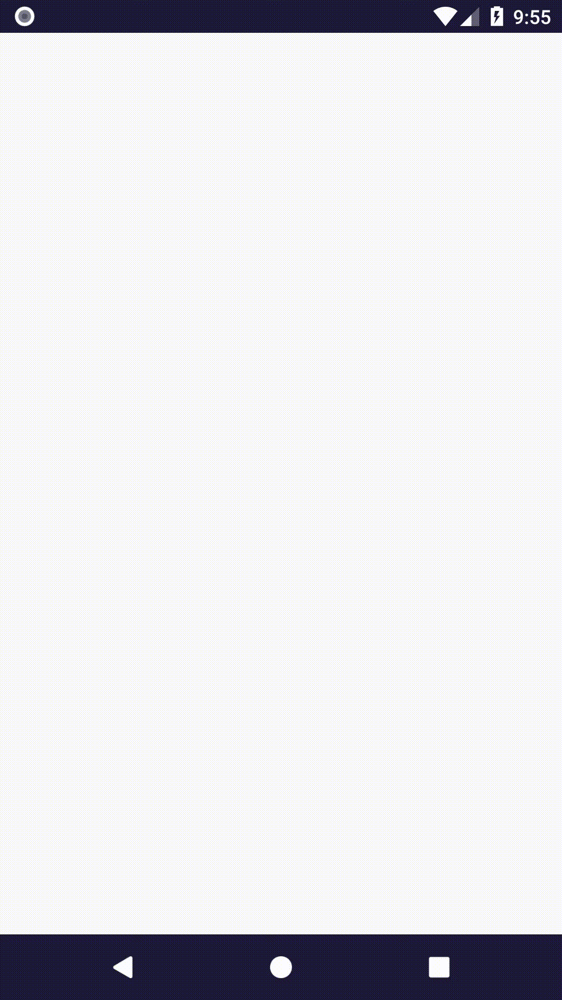
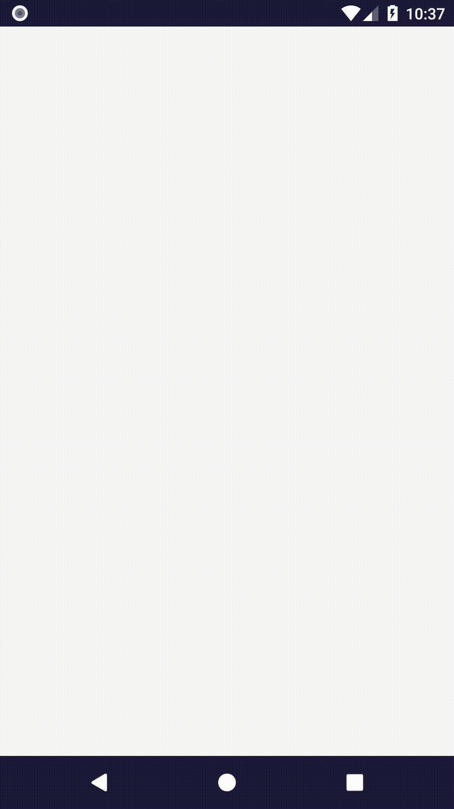
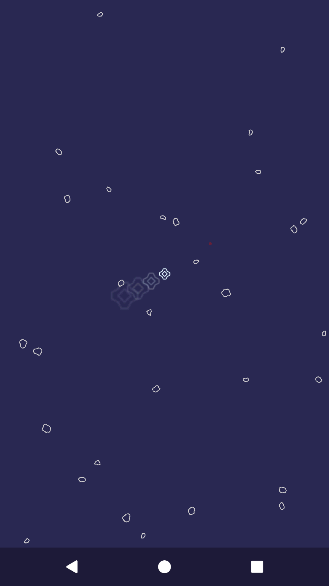

# Rozdział 10 - Orientacja urządzenia

Czas poruszyć, do tej pory nieruchomym, statkiem gracza.

## Odczyt orientacji w przestrzeni fizycznej

Naszym obecnym celem jest sprawić, by statek gracza zaczął pokuszać się na podstawie danych o orientacji urządzenia użytkownika. Widok będzie śledził statek, w taki sposób, że zawsze będzie on na środku ekranu (ujmując inaczej: zablokujemy kamerę na statku gracza).

Zmianie będą musiały ulec różne elementy aplikacji, ponieważ wprowadzenie takiej funkcjonaliści będzie wymagało zmiany charakteru gry, a dodatkowo różne komponenty niejawnie zakładają, że kamera i statek gracza znajdują się zawsze w punkcie (0, 0).

Zaczniemy jednak od odczytania orientacji urządzenia. Dodajmy nowy komponent fasady o nazwie `Orientation`:

```java
package com.github.daishe.androidgametutorial;

import android.content.Context;
import android.hardware.Sensor;
import android.hardware.SensorManager;
import android.support.annotation.NonNull;

public final class Orientation implements GameFacadeComponent {

    private SensorManager sensorManager;
    private Sensor sensor;
    private OrientationState orientationState;

    public Orientation(@NonNull GameFacade gameFacade) {
        this.orientationState = new OrientationState(gameFacade);
    }

    public void create(@NonNull Context context) {
        this.sensorManager = (SensorManager)context.getSystemService(Context.SENSOR_SERVICE);
        this.sensor = this.sensorManager.getDefaultSensor(Sensor.TYPE_GAME_ROTATION_VECTOR);
    }

    public void resume() {
        this.sensorManager.registerListener(this.orientationState, this.sensor, SensorManager.SENSOR_DELAY_GAME);
    }

    public void pause() {
        this.sensorManager.unregisterListener(this.orientationState);
        this.orientationState.reset();
    }

    public void destroy() {
        this.sensorManager = null;
        this.sensor = null;
    }

}
```

Jest to prosta klasa ukrywająca w sobie menedżera czujników (`sensorManager`), czujnik (`sensor`) i nasłuchiwacz zdarzeń czujnika (`orientationState`). Dwa pierwsze atrybuty pochodzą ze świata androida. Za implementacje ostatniego jesteśmy odpowiedzialni my, dlatego utwórzmy teraz nawą klasę o nazwie `OrientationState` implementującą wymagany interfejs `SensorEventListener`:

```java
package com.github.daishe.androidgametutorial;

import android.hardware.Sensor;
import android.hardware.SensorEvent;
import android.hardware.SensorEventListener;
import android.support.annotation.NonNull;

import java.util.concurrent.atomic.AtomicBoolean;

public class OrientationState implements SensorEventListener {

    private GameFacade gameFacade;

    private AtomicBoolean initialized = new AtomicBoolean(false);

    private AtomicFloat initialYaw = new AtomicFloat();
    private AtomicFloat initialPitch = new AtomicFloat();
    private AtomicFloat initialRoll = new AtomicFloat();

    private AtomicFloat currentYaw = new AtomicFloat();
    private AtomicFloat currentPitch = new AtomicFloat();
    private AtomicFloat currentRoll = new AtomicFloat();

    public OrientationState(@NonNull GameFacade gameFacade) {
        this.gameFacade = gameFacade;
    }

    public OrientationSnapshot relativeSnapshot() {
        return this.makeSnapshot(
                this.currentYaw.get() - this.initialYaw.get(),
                this.currentPitch.get() - this.initialPitch.get(),
                this.currentRoll.get() - this.initialRoll.get()
            );
    }

    public OrientationSnapshot initialStateSnapshot() {
        return this.makeSnapshot(this.initialYaw.get(), this.initialPitch.get(), this.initialRoll.get());
    }

    public OrientationSnapshot currentStateSnapshot() {
        return this.makeSnapshot(this.currentYaw.get(), this.currentPitch.get(), this.currentRoll.get());
    }

    public boolean ready() {
        return this.initialized.get();
    }

    public void reset() {
        this.initialized.set(false);
    }

    @Override
    public void onAccuracyChanged(Sensor sensor, int accuracy) {
        // Nothing to do
    }

    @Override
    public void onSensorChanged(SensorEvent event) {
        // TODO: The world is changing and I'm doing nothing.
    }

    private void setSensorOutput(float yaw, float pitch, float roll) {
        // TODO: Setting, setting, setting...
    }

    private OrientationSnapshot makeSnapshot(float yaw, float pitch, float roll) {
        return new OrientationSnapshot(this.gameFacade, yaw, pitch, roll);
    }

}
```

Cóż, sporo brakujących części. Dodajmy klasę `AtomicFloat`:

```java
package com.github.daishe.androidgametutorial;

import java.util.concurrent.atomic.AtomicInteger;

public class AtomicFloat {

    private AtomicInteger data;

    public AtomicFloat() {
        this.data = new AtomicInteger(0);
    }

    public AtomicFloat(float value) {
        this.set(value);
    }

    public AtomicFloat(AtomicFloat value) {
        this.set(value);
    }

    public float get() {
        return Float.intBitsToFloat(this.data.get());
    }

    public void set(float value) {
        this.data.set(Float.floatToIntBits(value));
    }

    public void set(AtomicFloat value) {
        this.data.set(value.data.get());
    }

}
```

oraz klasę `OrientationSnapshot`:

```java
package com.github.daishe.androidgametutorial;

import android.support.annotation.NonNull;

public class OrientationSnapshot {

    private GameFacade gameFacade;

    private final float yaw;
    private final float pitch;
    private final float roll;

    public OrientationSnapshot(@NonNull GameFacade gameFacade, float yaw, float pitch, float roll) {
        this.gameFacade = gameFacade;

        this.yaw = yaw;
        this.pitch = pitch;
        this.roll = roll;
    }

    public float yaw() {
        return this.yaw;
    }

    public float pitch() {
        return this.pitch;
    }

    public float roll() {
        return this.roll;
    }

    @NonNull
    public Vector2D asInGameVector2D() {
        float deviceRotationLimit = this.gameFacade.configuration().deviceRotationLimit;
        return Vector2D.fromCartesian(this.roll, this.pitch)
            .limitInPlace(deviceRotationLimit)
            .divInPlace(deviceRotationLimit);
    }

}
```

i wróćmy do klasy `OrientationState`. Mamy do uzupełnienia dwie metody. Zaczniemy od `onSensorChanged`. To, co powinno się w niej znaleźć, można wynieść bezpośrednio z dokumentacji systemu Android. Dostosowując to do naszego przypadku, dostaniemy:

```java
@Override
public void onSensorChanged(SensorEvent event) {
    if(event.sensor.getType() == Sensor.TYPE_GAME_ROTATION_VECTOR) {
        float[] rotationMatrix = new float[9];
        SensorManager.getRotationMatrixFromVector(rotationMatrix, event.values);
        float[] orientation = new float[3];
        SensorManager.getOrientation(rotationMatrix, orientation);
        this.setSensorOutput(orientation[0], orientation[1], orientation[2]);
    }
}
```

Teraz czas na metodę `setSensorOutput`. Z pozoru sprawa wydaje się prosta - mamy już przecież wymagane wartości. Wystarczy je zapisać, tak? Cóż, w praktyce natrafimy na pewne problemy. Otóż okazuje się, że pierwsze odczyty sensora (z jakiegoś powodu) na platformie Android zawsze zwracają zerowe wartości. Dlatego ostatecznie uzupełnijmy metodę w następujący sposób:

```java
private void setSensorOutput(float yaw, float pitch, float roll) {
    yaw = (!Float.isNaN(yaw)) ? yaw : 0;
    pitch = (!Float.isNaN(pitch)) ? pitch : 0;
    roll = (!Float.isNaN(roll)) ? roll : 0;

    if (!this.initialized.get() && (yaw != 0 || pitch != 0 || roll != 0)) {
        this.initialYaw.set(yaw);
        this.initialPitch.set(pitch);
        this.initialRoll.set(roll);
        this.initialized.set(true);
    }
    this.currentYaw.set(yaw);
    this.currentPitch.set(pitch);
    this.currentRoll.set(roll);
}
```

Potrzebujemy jeszcze jakiegoś sposobu, by pobrać obecny stan obrotu urządzenia z fasady. Dodajmy publiczną metodę `snapshot` do klasy `Orientation`:

```java
public OrientationSnapshot snapshot() {
    return this.orientationState.relativeSnapshot();
}
```

Nie zapomnijmy o dodaniu brakującego atrybutu do konfiguracji (klasa `Configuration`):

```java
public float deviceRotationLimit = (float)Math.PI / 8;
```

i rejestracji nowego komponentu w fasadzie (klasa `GameFacade`):

```java
package com.github.daishe.androidgametutorial;

import android.content.Context;
import android.support.annotation.NonNull;

public final class GameFacade implements GameFacadeComponent {

    private Context context = null;
    private Configuration configuration = new Configuration();
    private Random random = new Random();
    private Screen screen = new Screen(this);
    private Touch touch = new Touch(this);
    private Orientation orientation = new Orientation(this);
    private SoundManager soundManager = new SoundManager(this);
    private ImageManager imageManager = new ImageManager(this);
    private Timer timer = new Timer();

    public GameFacade() {
    }

    public Context context() {
        return this.context;
    }

    @NonNull
    public Configuration configuration() {
        return this.configuration;
    }

    @NonNull
    public Random random() {
        return this.random;
    }

    @NonNull
    public Screen screen() {
        return this.screen;
    }

    @NonNull
    public Orientation orientation() {
        return this.orientation;
    }

    @NonNull
    public Touch touch() {
        return this.touch;
    }

    @NonNull
    public SoundManager soundManager() {
        return this.soundManager;
    }

    @NonNull
    public ImageManager imageManager() {
        return this.imageManager;
    }

    @NonNull
    public Timer timer() {
        return this.timer;
    }

    @Override
    public void create(@NonNull Context context) {
        this.context = context;

        this.configuration.create(context);
        this.random.create(context);
        this.screen.create(context);
        this.touch.create(context);
        this.orientation.create(context);
        this.soundManager.create(context);
        this.imageManager.create(context);
        this.timer.create(context);
    }

    @Override
    public void resume() {
        this.configuration.resume();
        this.random.resume();
        this.screen.resume();
        this.touch.resume();
        this.orientation.resume();
        this.soundManager.resume();
        this.imageManager.resume();
        this.timer.resume();
    }

    @Override
    public void pause() {
        this.timer.pause();
        this.imageManager.pause();
        this.soundManager.pause();
        this.orientation.pause();
        this.touch.pause();
        this.screen.pause();
        this.random.pause();
        this.configuration.pause();
    }

    @Override
    public void destroy() {
        this.timer.destroy();
        this.imageManager.destroy();
        this.soundManager.destroy();
        this.orientation.destroy();
        this.touch.destroy();
        this.screen.destroy();
        this.random.destroy();
        this.configuration.destroy();

        this.context = null;
    }

}
```

## Poruszanie statkiem gracza

Wprawienie statku w ruch będzie wymagało kilku zmian. Zaczniemy od klasy `PlayerShip`:

```java
package com.github.daishe.androidgametutorial;

public class PlayerShip {

    private GameWorld world;

    private MutableVector2D position = Vector2D.fromNothing();
    private MutableVector2D velocity = Vector2D.fromNothing();

    private Image shipImage;

    private boolean alive = false;

    public PlayerShip() {
    }

    public PlayerShip create(GameWorld world) {
        this.world = world;

        this.velocity.setToCartesian(0, 0);
        this.position.setToCartesian(0, 0);

        this.shipImage = world.facade().imageManager().ship();

        this.alive = true;

        return this;
    }

    public GameWorld world() {
        return this.world;
    }

    public GameWorld world(GameWorld world) {
        return this.world = world;
    }

    public boolean alive() {
        return this.alive;
    }

    public boolean alive(boolean alive) {
        return this.alive = alive;
    }

    public Vector2D position() {
        return this.position;
    }

    public Vector2D position(Vector2D position) {
        return this.position.setTo(position);
    }

    public Vector2D velocity() {
        return this.velocity;
    }

    public Vector2D velocity(Vector2D velocity) {
        return this.velocity.setTo(velocity);
    }

    public float collisionRadius() {
        return this.shipImage.radius();
    }

    public void update(float timeShift) {
        Configuration configuration = this.world.facade().configuration();

        Vector2D velocityIncrement = this.world.orientationVector()
            .mul(timeShift * configuration.playerShipMaxAcceleration);
        this.velocity
            .addInPlace(velocityIncrement)
            .limitInPlace(configuration.playerShipMaxVelocity);

        this.position.addInPlace(this.velocity.mul(timeShift));
    }

    public void draw(GameCanvas gameCanvas) {
        if (!this.alive)
            return;

        if (this.world.facade().configuration().drawPhysicsDebugInfo) {
            gameCanvas.drawDebugVelocity(this.position, this.velocity);
            gameCanvas.drawDebugAcceleration(this.position, this.world.orientationVector().mul(this.world.facade().configuration().playerShipMaxAcceleration));
            gameCanvas.drawDebugCollisionBox(this.position, this.shipImage.radius());
        }

        this.shipImage.draw(gameCanvas, this.position);
    }

}
```

Następnie dodajmy brakujące atrybuty do konfiguracji (klasa `Configuration`):

```java
public float playerShipMaxVelocity = 100f;
public float playerShipMaxAcceleration = 75f;
```

oraz metodę `orientationVector` do klasy `GameWorld`:

```java
public Vector2D orientationVector() {
    return this.gameFacade.orientation().snapshot().asInGameVector2D();
}
```



Statek się porusza, ale chyba nie do końca nam o to chodziło.

Jeszcze drobna uwaga w odniesieniu do testowania orientacji urządzenia na emulatorze - w chili pisania tego kursu odczyt orientacji nie jest poprawny. Można zaobserwować dziwne skoki odczytu, a wartości zdają się mieć nijak do ustawionej orientacji w przestrzeni fizycznej. Tak więc, jeśli chcemy w pełni użyć aplikacji, potrzebujemy prawdziwego telefonu z Androidem.

## Śledząca gracza kamera

Teraz zajmiemy się odblokowaniem kamery. Zacznijmy od zmodyfikowania klasy `GameCanvas`. Dodajmy nowy prywatny atrybut `position`:

```java
private MutableVector2D position = Vector2D.fromNothing();
```

i dwie publiczne metody:

```java
public Vector2D position() {
    return this.position;
}

public Vector2D position(Vector2D position) {
    return this.position.setTo(position);
}
```

Następnie zaktualizujmy metody `isVisible`:

```java
public boolean isVisible(Vector2D point, float toleration) {
    float width = this.canvas.getWidth() / 2;
    float height = this.canvas.getHeight() / 2;
    float x = point.x() - this.position.x();
    float y = point.y() - this.position.y();

    boolean xVisible = !(x + toleration < -width || x - toleration > width);
    boolean yVisible = !(y + toleration < -height || y - toleration > height);
    return xVisible && yVisible;
}
```

i `lockCanvas`:

```java
public void lockCanvas(Canvas canvas) {
    this.canvas = canvas;
    this.canvas.save();

    this.canvas.translate(this.canvas.getWidth() / 2, this.canvas.getHeight() / 2);
    float scale = this.gameFacade.screen().scale();
    this.canvas.scale(scale, scale);
    this.canvas.translate(-this.position.x(), -this.position.y());

    this.canvas.drawColor(0xFF2E2957);

    Configuration configuration = this.gameFacade.configuration();
    if (configuration.drawPhysicsDebugInfo) {

        // Dimensional vectors
        this.drawVector2D(Vector2D.fromCartesian(100, 0), this.position, Color.RED);
        this.drawVector2D(Vector2D.fromCartesian(0, 100), this.position, Color.RED);

        // Dimensional vectors sum
        this.drawVector2D(Vector2D.fromCartesian(100, 100), this.position, Color.RED);

        // Minimum visible range
        this.paint.setStyle(Paint.Style.STROKE);
        this.paint.setColor(Color.RED);
        this.canvas.drawCircle(this.position.x(), this.position.y(), configuration.minVisibleRange, this.paint);
        this.paint.setStyle(Paint.Style.FILL);

        // Hearing range
        this.paint.setStyle(Paint.Style.STROKE);
        this.paint.setColor(Color.CYAN);
        this.canvas.drawCircle(this.position.x(), this.position.y(), configuration.clearHearingRange, this.paint);
        this.canvas.drawCircle(this.position.x(), this.position.y(), configuration.clearHearingRange + configuration.decayingHearingSpaceRange, this.paint);
        this.paint.setColor(0xFF000000);
        this.paint.setStyle(Paint.Style.FILL);
    }
}
```

Następnie zmodyfikujmy metodę `onDraw` klasy `GameView`:

```java
@Override
protected void onDraw(@NonNull Canvas canvas) {
    this.gameCanvas.position(this.world.cameraPosition());

    this.gameCanvas.lockCanvas(canvas);
    this.world.draw(this.gameCanvas);
    this.gameCanvas.releaseCanvas();
}
```

i dodajmy brakującą metodę do klasy `GameWorld`:

```java
public Vector2D cameraPosition() {
    return this.playerShip.position();
}
```



Kamera śledzi gracza, problem w tym, że świat gry wciąż zachowuje się niestosowanie.

## Dostosowanie świata

Zaczniemy od modyfikacji klasy `TouchEvent` i aktualizacji metody `gamePosition`:

```java
@NonNull
public Vector2D gamePosition(@NonNull Vector2D cameraPosition) {
    return this.gameFacade.screen().physicalToGame(this.position).add(cameraPosition);
}
```

Kontynuując, w klasie `GameWorld` naprawmy metody `update`:

```java
public void update(float timeShift) {
    Configuration configuration = this.gameFacade.configuration();

    TouchEvent touchEvent = this.facade().touch().get();
    if (touchEvent != null && !this.rocket.alive() && this.playerShip.alive())
        this.rocket.create(this, touchEvent.gamePosition(this.cameraPosition()));

    this.playerShip.update(timeShift);
    for (Asteroid asteroid : this.asteroids)
        asteroid.update(timeShift);
    this.rocket.update(timeShift);

    this.resolveCollisions();

    for (Asteroid asteroid : this.asteroids) {
        if (!asteroid.alive()) {
            this.createAsteroid(asteroid);
            if (this.asteroids.size() < configuration.asteroidsLimit)
                this.asteroids.add(this.createAsteroid(new Asteroid()));
        }
    }
}
```

i `draw`:

```java
public void draw(GameCanvas gameCanvas) {
    this.playerShip.draw(gameCanvas);
    for (Asteroid asteroid : this.asteroids)
        asteroid.draw(gameCanvas);
    this.rocket.draw(gameCanvas);

    if (this.gameFacade.configuration().drawPhysicsDebugInfo) {
        TouchEvent touchEvent = this.gameFacade.touch().get();
        if (touchEvent != null)
            gameCanvas.drawDebugTouch(touchEvent.gamePosition(this.cameraPosition()));
    }
}
```

Następnie zmodyfikujmy metody `createAsteroid`:

```java
private Asteroid createAsteroid(Asteroid asteroid) {
    Configuration configuration = this.gameFacade.configuration();
    Random random = this.gameFacade.random();

    float radius = random.linear() * configuration.spawnSpaceRange + configuration.minSpawnRange;
    float theta = random.angle();
    asteroid.create(this, Vector2D.fromPolar(radius, theta).addInPlace(this.cameraPosition()));
    return asteroid;
}
```

oraz `resolveCollisionsBetweenPlayerShipAndAsteroid`, `resolveCollisionsBetweenAsteroidAndAsteroid` i `resolveCollisionsBetweenAsteroidAndRocket`:

```java
private void resolveCollisionsBetweenPlayerShipAndAsteroid() {
    if (!this.playerShip.alive())
        return;

    for (int i = 0; i < this.asteroids.size(); ++i) {
        Asteroid asteroid = this.asteroids.get(i);

        if (!asteroid.alive())
            continue;

        Vector2D collisionPoint = Collision.at(
                this.playerShip.position(),
                this.playerShip.collisionRadius(),
                asteroid.position(),
                asteroid.collisionRadius()
            );

        if (collisionPoint != null) {
            this.playerShip.alive(false);
            asteroid.alive(false);
            this.facade().soundManager().largeCollisionSound().play(collisionPoint.sub(this.cameraPosition()));
        }
    }
}

private void resolveCollisionsBetweenAsteroidAndAsteroid() {
    for (int i = 0; i < this.asteroids.size(); ++i) {
        Asteroid first = this.asteroids.get(i);

        if (!first.alive())
            continue;

        for (int j = i + 1; j < this.asteroids.size(); ++j) {
            Asteroid second = this.asteroids.get(j);

            if (!second.alive())
                continue;

            Vector2D collisionPoint = Collision.at(
                    first.position(),
                    first.collisionRadius(),
                    second.position(),
                    second.collisionRadius()
                );

            if (collisionPoint != null) {
                first.alive(false);
                second.alive(false);
                this.facade().soundManager().smallCollisionSound().play(collisionPoint.sub(this.cameraPosition()));
            }
        }
    }
}

private void resolveCollisionsBetweenAsteroidAndRocket() {
    if (!this.rocket.alive())
        return;

    for (int i = 0; i < this.asteroids.size(); ++i) {
        Asteroid asteroid = this.asteroids.get(i);

        if (!asteroid.alive())
            continue;

        Vector2D collisionPoint = Collision.at(
                asteroid.position(),
                asteroid.collisionRadius(),
                this.rocket.position(),
                this.rocket.collisionRadius()
            );

        if (collisionPoint != null) {
            asteroid.alive(false);
            this.rocket.alive(false);
            this.facade().soundManager().smallCollisionSound().play(collisionPoint.sub(this.cameraPosition()));
        }
    }
}
```

Pozostaje jeszcze zmodyfikować klasy `Asteroid` i `Rocket`. Zaktualizujmy metodę `update` pierwszej z nich:

```java
public void update(float timeShift) {
    if (!this.alive)
        return;

    Configuration configuration = this.world.facade().configuration();

    Vector2D relativePosition = Vector2D.from(this.position).subInPlace(this.world.cameraPosition());
    if (Math.abs(relativePosition.x()) > configuration.killingRange || Math.abs(relativePosition.y()) > configuration.killingRange)
        this.alive = false;

    this.position.addInPlace(this.velocity.mul(timeShift));

    this.angularPosition += this.angularVelocity * timeShift;
    this.angularPosition -= ((int)(this.angularPosition / (float)(Math.PI * 2))) * (float)(Math.PI * 2);
}
```

a modyfikacje klasy `Rocket` zacznijmy od metody `create`:

```java
public Rocket create(GameWorld world, Vector2D initialPosition, Vector2D targetPosition) {
    GameFacade gameFacade = world.facade();

    this.world = world;

    this.position.setTo(initialPosition);
    this.velocity.setTo(targetPosition)
        .subInPlace(initialPosition)
        .normalizeInPlace()
        .mulInPlace(gameFacade.configuration().rocketMaxVelocity);

    this.alive = true;

    return this;
}
```

Następnie zaktualizujmy metodę `update`:

```java
public void update(float timeShift) {
    if (!this.alive)
        return;

    Configuration configuration = this.world.facade().configuration();

    Vector2D relativePosition = Vector2D.from(this.position).subInPlace(this.world.cameraPosition());
    if (Math.abs(relativePosition.x()) > configuration.killingRange || Math.abs(relativePosition.y()) > configuration.killingRange)
        this.alive = false;

    this.alpha.update(timeShift);

    this.position.addInPlace(this.velocity.mul(timeShift));
}
```

Pozostaje jeszcze naprawić metodę `update` klasy `GameWorld`:

```java
public void update(float timeShift) {
    Configuration configuration = this.gameFacade.configuration();

    TouchEvent touchEvent = this.facade().touch().get();
    if (touchEvent != null && !this.rocket.alive() && this.playerShip.alive())
        this.rocket.create(this, this.playerShip.position(), touchEvent.gamePosition(this.cameraPosition()));

    this.playerShip.update(timeShift);
    for (Asteroid asteroid : this.asteroids)
        asteroid.update(timeShift);
    this.rocket.update(timeShift);

    this.resolveCollisions();

    for (Asteroid asteroid : this.asteroids) {
        if (!asteroid.alive()) {
            this.createAsteroid(asteroid);
            if (this.asteroids.size() < configuration.asteroidsLimit)
                this.asteroids.add(this.createAsteroid(new Asteroid()));
        }
    }
}
```


I już wszystko działa. Tylko gra jest nie do końca zadowalająca - obecny charakter rozgrywki nie przystaje do statku, który może się poruszać.

## Deszcz asteroid

Zmianę logiki rozgrywki zaczniemy od klasy `Asteroid`. Zaktualizujmy metodę `create`:

```java
public Asteroid create(GameWorld world, Vector2D inWorldPosition) {
    GameFacade gameFacade = world.facade();
    Configuration configuration = gameFacade.configuration();

    this.world = world;

    this.velocity.setToPolar(
            configuration.asteroidMaxVelocity - Math.abs(gameFacade.random().gaussian(3) * configuration.asteroidMaxVelocity / 3),
            world.cameraPosition().sub(inWorldPosition).theta() + gameFacade.random().gaussian() * (float)Math.PI / 3
        );
    this.position.setTo(inWorldPosition);
    this.angularVelocity = gameFacade.random().gaussian(8) * (float)Math.PI / 2;
    this.angularPosition = gameFacade.random().angle();

    this.asteroidImage = gameFacade.imageManager().randomAsteroid();

    this.alive = true;

    return this;
}
```

Przechodząc dalej, zmodyfikujmy metodę `update` klasy `GameWorld`:

```java
public void update(float timeShift) {
    TouchEvent touchEvent = this.facade().touch().get();
    if (touchEvent != null && !this.rocket.alive() && this.playerShip.alive())
        this.rocket.create(this, this.playerShip.position(), touchEvent.gamePosition(this.cameraPosition()));

    this.playerShip.update(timeShift);
    for (Asteroid asteroid : this.asteroids)
        asteroid.update(timeShift);
    this.rocket.update(timeShift);

    this.resolveCollisions();

    for (Asteroid asteroid : this.asteroids)
        if (!asteroid.alive())
            this.createAsteroid(asteroid);
}
```

Ostatecznie zwiększmy ilość asteroid, modyfikując atrybuty `asteroidsLimit` i `asteroidMaxVelocity` w konfiguracji (klasa `Configuration`):

```java
public float playerShipMaxVelocity = 100f;
public float playerShipMaxAcceleration = 75f;
```

Zmieńmy także kilka innych ustawień:

```java
public float minSpawnRange = 1100f;
public float spawnSpaceRange = 400f;
public float killingRange = 1500f;
```


O coś takiego chodziło. Tylko jakoś tak łatwo się strzela. No i mamy tylko jedną rakietę na raz.

## Samonaprowadzające rakiety

Zmienimy teraz logikę rakiet. Zmodyfikuj klasę `Rocket`:

```java
package com.github.daishe.androidgametutorial;

public class Rocket {

    private static final float radius = 5f;

    private GameWorld world;

    private MutableVector2D position = Vector2D.fromNothing();
    private MutableVector2D velocity = Vector2D.fromNothing();
    private MutableVector2D acceleration = Vector2D.fromNothing();

    private MutableVector2D initialPosition = Vector2D.fromNothing();
    private MutableVector2D targetPosition = Vector2D.fromNothing();
    private float initialTargetDistanceSquare = 0;

    private boolean homing = false;

    private DynamicAlpha alpha = new DynamicAlpha(0.9f, 0.25f, 0.3f);

    private boolean alive = false;

    public Rocket() {
    }

    public Rocket create(GameWorld world, Vector2D targetPosition) {
        GameFacade gameFacade = world.facade();

        this.world = world;

        this.position.setTo(this.world.player().position());
        this.velocity.setTo(this.world.player().velocity())
            .normalizeInPlace()
            .mulInPlace(gameFacade.configuration().rocketMaxVelocity);
        this.acceleration.setToCartesian(0, 0);

        this.initialPosition.setTo(this.position);
        this.targetPosition.setTo(targetPosition);
        this.initialTargetDistanceSquare = Vector2D.from(this.targetPosition)
            .subInPlace(this.initialPosition)
            .radiusSquare();

        this.homing = true;

        this.alive = true;

        return this;
    }

    public GameWorld world() {
        return this.world;
    }

    public GameWorld world(GameWorld world) {
        return this.world = world;
    }

    public boolean alive() { return this.alive; }

    public boolean alive(boolean alive) { return this.alive = alive; }

    public Vector2D position() {
        return this.position;
    }

    public Vector2D position(Vector2D position) {
        return this.position.setTo(position);
    }

    public Vector2D velocity() {
        return this.velocity;
    }

    public Vector2D velocity(Vector2D velocity) {
        return this.velocity.setTo(velocity);
    }

    public float collisionRadius() {
        return Rocket.radius;
    }

    public void update(float timeShift) {
        if (!this.alive)
            return;

        Configuration configuration = this.world.facade().configuration();

        Vector2D relativePosition = Vector2D.from(this.position).subInPlace(this.world.cameraPosition());
        if (Math.abs(relativePosition.x()) > configuration.killingRange || Math.abs(relativePosition.y()) > configuration.killingRange)
            this.alive = false;

        this.alpha.update(timeShift);

        if (this.homing) {
            Vector2D homingVector = Vector2D.from(this.targetPosition)
                    .subInPlace(this.position);
            this.acceleration.setTo(homingVector)
                .normalizeInPlace()
                .mulInPlace(configuration.rocketMaxAcceleration);

            if (Vector2D.from(this.position).subInPlace(this.initialPosition).radiusSquare() > this.initialTargetDistanceSquare)
                this.homing = false;
        }
        else {
            this.acceleration.setTo(this.velocity)
                .normalizeInPlace()
                .mulInPlace(configuration.rocketMaxAcceleration);
        }

        Vector2D velocityIncrement = Vector2D.from(this.acceleration).mul(timeShift);
        this.velocity
                .addInPlace(velocityIncrement)
                .limitInPlace(configuration.rocketMaxVelocity);

        this.position.addInPlace(this.velocity.mul(timeShift));
    }

    public void draw(GameCanvas gameCanvas) {
        if (!this.alive || !gameCanvas.isVisible(this.position, Rocket.radius))
            return;

        if (this.world.facade().configuration().drawPhysicsDebugInfo) {
            gameCanvas.drawDebugHomingInfo(this.initialPosition, this.position, this.targetPosition);
            gameCanvas.drawDebugVelocity(this.position, this.velocity);
            gameCanvas.drawDebugAcceleration(this.position, this.acceleration);
            gameCanvas.drawDebugCollisionBox(this.position, Rocket.radius);
        }

        gameCanvas.drawCircle(Rocket.radius, this.position, this.alpha.get(), 0xFFFF0800);
    }

}
```

i zaktualizujmy klasę `GameWorld`:

```java
package com.github.daishe.androidgametutorial;

import java.util.ArrayList;

public class GameWorld {

    private GameFacade gameFacade;

    private PlayerShip playerShip;
    private ArrayList<Asteroid> asteroids;
    private ArrayList<Rocket> rockets;

    private float rocketFireTimeout = 0;

    public GameWorld(GameFacade gameFacade) {
        this.gameFacade = gameFacade;

        this.playerShip = new PlayerShip().create(this);

        this.asteroids = new ArrayList<Asteroid>();
        while (this.asteroids.size() < this.gameFacade.configuration().asteroidsLimit)
            this.asteroids.add(createAsteroid(new Asteroid()));

        this.rockets = new ArrayList<Rocket>();
    }

    public GameFacade facade() {
        return this.gameFacade;
    }

    public Vector2D cameraPosition() {
        return this.playerShip.position();
    }

    public PlayerShip player() {
        return this.playerShip;
    }

    public Vector2D orientationVector() {
        return this.gameFacade.orientation().snapshot().asInGameVector2D();
    }

    public void update(float timeShift) {

        if (this.rocketFireTimeout <= 0) {
            TouchEvent touchEvent = this.facade().touch().get();
            if (touchEvent != null && this.playerShip.alive()) {
                this.rockets.add(new Rocket().create(this, touchEvent.gamePosition(this.cameraPosition())));
                this.rocketFireTimeout = this.gameFacade.configuration().rocketFireTimeout;
            }
        }
        else {
            this.rocketFireTimeout -= timeShift;
        }

        this.playerShip.update(timeShift);
        for (Asteroid asteroid : this.asteroids)
            asteroid.update(timeShift);
        for (Rocket rocket : this.rockets)
            rocket.update(timeShift);

        this.resolveCollisions();

        for (Asteroid asteroid : this.asteroids)
            if (!asteroid.alive())
                this.createAsteroid(asteroid);
        for (int i = 0; i < this.rockets.size(); ++i)
            if (!this.rockets.get(i).alive())
                this.rockets.remove(i);
    }

    public void draw(GameCanvas gameCanvas) {
        this.playerShip.draw(gameCanvas);
        for (Asteroid asteroid : this.asteroids)
            asteroid.draw(gameCanvas);
        for (Rocket rocket : this.rockets)
            rocket.draw(gameCanvas);

        if (this.gameFacade.configuration().drawPhysicsDebugInfo) {
            TouchEvent touchEvent = this.gameFacade.touch().get();
            if (touchEvent != null)
                gameCanvas.drawDebugTouch(touchEvent.gamePosition(this.cameraPosition()));
        }
    }

    private Asteroid createAsteroid(Asteroid asteroid) {
        Configuration configuration = this.gameFacade.configuration();
        Random random = this.gameFacade.random();

        float radius = random.linear() * configuration.spawnSpaceRange + configuration.minSpawnRange;
        float theta = random.angle();
        asteroid.create(this, Vector2D.fromPolar(radius, theta).addInPlace(this.cameraPosition()));
        return asteroid;
    }

    private void resolveCollisions() {
        this.resolveCollisionsBetweenPlayerShipAndAsteroid();
        this.resolveCollisionsBetweenAsteroidAndAsteroid();
        this.resolveCollisionsBetweenAsteroidAndRocket();
    }

    private void resolveCollisionsBetweenPlayerShipAndAsteroid() {
        if (!this.playerShip.alive())
            return;

        for (int i = 0; i < this.asteroids.size(); ++i) {
            Asteroid asteroid = this.asteroids.get(i);

            if (!asteroid.alive())
                continue;

            Vector2D collisionPoint = Collision.at(
                    this.playerShip.position(),
                    this.playerShip.collisionRadius(),
                    asteroid.position(),
                    asteroid.collisionRadius()
                );

            if (collisionPoint != null) {
                this.playerShip.alive(false);
                asteroid.alive(false);
                this.facade().soundManager().largeCollisionSound().play(collisionPoint.sub(this.cameraPosition()));
            }
        }
    }

    private void resolveCollisionsBetweenAsteroidAndAsteroid() {
        for (int i = 0; i < this.asteroids.size(); ++i) {
            Asteroid first = this.asteroids.get(i);

            if (!first.alive())
                continue;

            for (int j = i + 1; j < this.asteroids.size(); ++j) {
                Asteroid second = this.asteroids.get(j);

                if (!second.alive())
                    continue;

                Vector2D collisionPoint = Collision.at(
                        first.position(),
                        first.collisionRadius(),
                        second.position(),
                        second.collisionRadius()
                    );

                if (collisionPoint != null) {
                    first.alive(false);
                    second.alive(false);
                    this.facade().soundManager().smallCollisionSound().play(collisionPoint.sub(this.cameraPosition()));
                }
            }
        }
    }

    private void resolveCollisionsBetweenAsteroidAndRocket() {
        for (int i = 0; i < this.asteroids.size(); ++i) {
            Asteroid asteroid = this.asteroids.get(i);

            if (!asteroid.alive())
                continue;

            for (int j = 0; j < this.rockets.size(); ++j) {
                Rocket rocket = this.rockets.get(j);

                if (!rocket.alive())
                    continue;

                Vector2D collisionPoint = Collision.at(
                        asteroid.position(),
                        asteroid.collisionRadius(),
                        rocket.position(),
                        rocket.collisionRadius()
                );

                if (collisionPoint != null) {
                    asteroid.alive(false);
                    rocket.alive(false);
                    this.facade().soundManager().smallCollisionSound().play(collisionPoint.sub(this.cameraPosition()));
                }
            }
        }
    }

}
```

a następnie dodajmy brakujące atrybuty w konfiguracji (klasa `Configuration`):

```java
public float rocketMaxAcceleration = 500f;
public float rocketFireTimeout = 2f;
```

Brakuje jeszcze publicznej metody `drawDebugHomingInfo` w klasie `GameCanvas`. Dodajmy ją:

```java
public void drawDebugHomingInfo(Vector2D initialPosition, Vector2D currentPosition, Vector2D targetPosition) {
    Vector2D relativePosition = targetPosition.sub(initialPosition);
    this.drawVector2D(targetPosition.sub(initialPosition), initialPosition, Color.GRAY);
    this.drawCircle(relativePosition.radius(), initialPosition, 1f, Color.GRAY);
}
```


Teraz korzystanie z rakiet jest dużo ciekawsze.

## Indykatory prędkości

Gracz może mieć pewien problem z określeniem, w którą stronę i z jaką prędkością się porusza (z uwagi na brak nieruchomych punktów odniesienia). By rozwiązać tę niedogodność, dodajmy indykatory prędkości. Zmodyfikujmy metodę `draw` klasy `PlayerShip`:

```java
public void draw(GameCanvas gameCanvas) {
    if (!this.alive)
        return;

    Configuration configuration = this.world.facade().configuration();

    if (configuration.drawPhysicsDebugInfo) {
        gameCanvas.drawDebugVelocity(this.position, this.velocity);
        gameCanvas.drawDebugAcceleration(this.position, this.world.orientationVector().mul(this.world.facade().configuration().playerShipMaxAcceleration));
        gameCanvas.drawDebugCollisionBox(this.position, this.shipImage.radius());
    }

    for (int i = configuration.numberOfPlayerShipTrails - 1; i > -1; --i) {
        Vector2D pos = Vector2D.from(this.position)
                .subInPlace(this.velocity.mul(configuration.playerShipTrailOffset / configuration.playerShipMaxVelocity * i));

        float scale = 1f + configuration.playerShipTrailScaleFactor * i;
        float alpha = (i != 0) ? (configuration.playerShipTrailAlphaFactor / i) : 1f;
        this.shipImage.draw(gameCanvas, pos, scale, 0f, alpha);
    }
}
```

i dodajmy brakujące atrybuty do konfiguracji (klasa `Configuration`):

```java
public int numberOfPlayerShipTrails = 4;
public float playerShipTrailOffset = 50f;
public float playerShipTrailScaleFactor = 0.5f;
public float playerShipTrailAlphaFactor = 0.25f;
```



Trzeba przyznać, że gra całkiem się rozwinęła.

## Podsumowanie

Tym razem dowiedzieliśmy się jak odczytywać orientacje urządzenia użytkownika na platformie Android. Poza tym znacznie rozbudowaliśmy naszą grę, zmieniając jej charakter.

## Zmodyfikowane pliki

Tak, jak we wcześniejszych rozdziałach, tak i w tym na końcu znajduje się lista zmodyfikowanych plików.

### Plik `Asteroid.java`

```java
package com.github.daishe.androidgametutorial;

public class Asteroid {

    private GameWorld world;

    private MutableVector2D position = Vector2D.fromNothing();
    private MutableVector2D velocity = Vector2D.fromNothing();
    private float angularVelocity;
    private float angularPosition;

    private Image asteroidImage;

    private boolean alive = false;

    public Asteroid() {
    }

    public Asteroid create(GameWorld world, Vector2D inWorldPosition) {
        GameFacade gameFacade = world.facade();
        Configuration configuration = gameFacade.configuration();

        this.world = world;

        this.velocity.setToPolar(
                configuration.asteroidMaxVelocity - Math.abs(gameFacade.random().gaussian(3) * configuration.asteroidMaxVelocity / 3),
                world.cameraPosition().sub(inWorldPosition).theta() + gameFacade.random().gaussian() * (float)Math.PI / 3
            );
        this.position.setTo(inWorldPosition);
        this.angularVelocity = gameFacade.random().gaussian(8) * (float)Math.PI / 2;
        this.angularPosition = gameFacade.random().angle();

        this.asteroidImage = gameFacade.imageManager().randomAsteroid();

        this.alive = true;

        return this;
    }

    public GameWorld world() {
        return this.world;
    }

    public GameWorld world(GameWorld world) {
        return this.world = world;
    }

    public boolean alive() { return this.alive; }

    public boolean alive(boolean alive) { return this.alive = alive; }

    public Vector2D position() {
        return this.position;
    }

    public Vector2D position(Vector2D position) {
        return this.position.setTo(position);
    }

    public Vector2D velocity() {
        return this.velocity;
    }

    public Vector2D velocity(Vector2D velocity) {
        return this.velocity.setTo(velocity);
    }

    public float collisionRadius() {
        return this.asteroidImage.radius();
    }

    public void update(float timeShift) {
        if (!this.alive)
            return;

        Configuration configuration = this.world.facade().configuration();

        Vector2D relativePosition = Vector2D.from(this.position).subInPlace(this.world.cameraPosition());
        if (Math.abs(relativePosition.x()) > configuration.killingRange || Math.abs(relativePosition.y()) > configuration.killingRange)
            this.alive = false;

        this.position.addInPlace(this.velocity.mul(timeShift));

        this.angularPosition += this.angularVelocity * timeShift;
        this.angularPosition -= ((int)(this.angularPosition / (float)(Math.PI * 2))) * (float)(Math.PI * 2);
    }

    public void draw(GameCanvas gameCanvas) {
        if (!this.alive || !gameCanvas.isVisible(this.position, this.asteroidImage.diagonal() / 2))
            return;

        if (this.world.facade().configuration().drawPhysicsDebugInfo) {
            gameCanvas.drawDebugVelocity(this.position, this.velocity);
            gameCanvas.drawDebugCollisionBox(this.position, this.asteroidImage.radius());
        }

        this.asteroidImage.draw(gameCanvas, this.position, 1f, this.angularPosition, 1f);
    }

}
```

### Plik `Configuration.java`

```java
package com.github.daishe.androidgametutorial;

import android.content.Context;
import android.support.annotation.NonNull;

public final class Configuration implements GameFacadeComponent {

    public long framesPerSecond = 30;
    public boolean unboundFrameRate = false;

    public float deviceRotationLimit = (float)Math.PI / 8;

    public float minVisibleRange = 540f;
    public float minSpawnRange = 1100f;
    public float spawnSpaceRange = 400f;
    public float killingRange = 1500f;

    public float clearHearingRange = 300f;
    public float decayingHearingSpaceRange = 400f;
    public int maxSimultaneousSoundStreams = 20;

    public float playerShipMaxVelocity = 100f;
    public float playerShipMaxAcceleration = 75f;
    public int numberOfPlayerShipTrails = 4;
    public float playerShipTrailOffset = 50f;
    public float playerShipTrailScaleFactor = 0.5f;
    public float playerShipTrailAlphaFactor = 0.25f;

    public float rocketMaxVelocity = 300f;
    public float rocketMaxAcceleration = 500f;
    public float rocketFireTimeout = 2f;

    public long asteroidsLimit = 100;
    public float asteroidMaxVelocity = 80f;

    public boolean drawFramesPerSecond = true;
    public float framesPerSecondCalcInterval = 0.1f;
    public boolean drawPhysicsDebugInfo = true;

    public Configuration() {
    }

    @Override
    public void create(@NonNull Context context) {
    }

    @Override
    public void pause() {
    }

    @Override
    public void resume() {
    }

    @Override
    public void destroy() {
    }

}
```

### Plik `GameCanvas.java`

```java
package com.github.daishe.androidgametutorial;

import android.graphics.Bitmap;
import android.graphics.Canvas;
import android.graphics.Color;
import android.graphics.Matrix;
import android.graphics.Paint;

public class GameCanvas {

    private GameFacade gameFacade;

    private Canvas canvas = null;
    private MutableVector2D position = Vector2D.fromNothing();

    private Paint paint = new Paint();
    private Matrix matrix = new Matrix();

    private float lastScale = 1f;

    public GameCanvas(GameFacade gameFacade) {
        this.gameFacade = gameFacade;

        this.paint.setAntiAlias(true);
    }

    public Vector2D position() {
        return this.position;
    }

    public Vector2D position(Vector2D position) {
        return this.position.setTo(position);
    }

    public boolean isVisible(Vector2D point, float toleration) {
        float width = this.canvas.getWidth() / this.lastScale / 2;
        float height = this.canvas.getHeight() / this.lastScale / 2;
        float x = point.x() - this.position.x();
        float y = point.y() - this.position.y();

        boolean xVisible = !(x + toleration < -width || x - toleration > width);
        boolean yVisible = !(y + toleration < -height || y - toleration > height);
        return xVisible && yVisible;
    }

    public void drawVector2D(Vector2D vector, Vector2D at, int color) {
        this.paint.setColor(color);
        this.canvas.drawLine(
                at.x(),
                at.y(),
                at.x() + vector.x(),
                at.y() + vector.y(),
                this.paint
        );
        this.paint.setColor(0xFF000000);
    }

    public void drawCircle(float radius, Vector2D at, float alpha, int color) {
        this.paint.setColor(color);
        this.paint.setAlpha((int)(255 * alpha));
        this.canvas.drawCircle(at.x(), at.y(), radius, this.paint);
        this.paint.setAlpha(255);
        this.paint.setColor(0xFF000000);
    }

    public void drawBitmap(Bitmap bitmap, Vector2D at) {
        this.canvas.drawBitmap(
                bitmap,
                at.x() - bitmap.getWidth() / 2,
                at.y() - bitmap.getHeight() / 2,
                this.paint
        );
    }

    public void drawBitmap(Bitmap bitmap, Vector2D at, float scale, float rotation, float alpha) {
        this.matrix.setTranslate(-bitmap.getWidth() / 2, -bitmap.getHeight() / 2);
        this.matrix.postScale(scale, scale);
        this.matrix.postRotate((float)Math.toDegrees(rotation), 0, 0);
        this.matrix.postTranslate(at.x(), at.y());

        this.paint.setAlpha((int)(255 * alpha));
        canvas.drawBitmap(bitmap, this.matrix, this.paint);
        this.paint.setAlpha(255);

        this.matrix.reset();
    }

    public void drawDebugTouch(Vector2D at) {
        this.drawCircle(20f, at, 0.5f, Color.YELLOW);
    }

    public void drawDebugAcceleration(Vector2D at, Vector2D acceleration) {
        this.drawVector2D(acceleration, at, Color.YELLOW);
    }

    public void drawDebugVelocity(Vector2D at, Vector2D velocity) {
        this.drawVector2D(velocity, at, Color.GREEN);
    }

    public void drawDebugHomingInfo(Vector2D initialPosition, Vector2D currentPosition, Vector2D targetPosition) {
        this.drawVector2D(targetPosition.sub(currentPosition), currentPosition, Color.GRAY);

        this.paint.setColor(Color.GRAY);
        this.paint.setStyle(Paint.Style.STROKE);
        this.canvas.drawCircle(initialPosition.x(), initialPosition.y(), targetPosition.sub(initialPosition).radius(), this.paint);
        this.paint.setStyle(Paint.Style.FILL);
        this.paint.setColor(0xFF000000);
    }

    public void drawDebugCollisionBox(Vector2D at, float radius) {
        this.paint.setColor(Color.WHITE);
        this.paint.setStyle(Paint.Style.STROKE);

        // Collision circle
        this.canvas.drawCircle(at.x(), at.y(), radius, this.paint);

        // Collision box
        this.canvas.drawLine(at.x() - radius, at.y() - radius, at.x() + radius, at.y() - radius, this.paint);
        this.canvas.drawLine(at.x() - radius, at.y() - radius, at.x() - radius, at.y() + radius, this.paint);
        this.canvas.drawLine(at.x() + radius, at.y() + radius, at.x() - radius, at.y() + radius, this.paint);
        this.canvas.drawLine(at.x() + radius, at.y() + radius, at.x() + radius, at.y() - radius, this.paint);

        this.paint.setStyle(Paint.Style.FILL);
        this.paint.setColor(0xFF000000);
    }

    public void lockCanvas(Canvas canvas) {
        this.canvas = canvas;
        this.canvas.save();

        this.canvas.translate(this.canvas.getWidth() / 2, this.canvas.getHeight() / 2);
        this.lastScale = this.gameFacade.screen().scale();
        this.canvas.scale(this.lastScale, this.lastScale);
        this.canvas.translate(-this.position.x(), -this.position.y());

        this.canvas.drawColor(0xFF2E2957);

        Configuration configuration = this.gameFacade.configuration();
        if (configuration.drawPhysicsDebugInfo) {

            // Dimensional vectors
            this.drawVector2D(Vector2D.fromCartesian(100, 0), this.position, Color.RED);
            this.drawVector2D(Vector2D.fromCartesian(0, 100), this.position, Color.RED);

            // Dimensional vectors sum
            this.drawVector2D(Vector2D.fromCartesian(100, 100), this.position, Color.RED);

            // Minimum visible range
            this.paint.setStyle(Paint.Style.STROKE);
            this.paint.setColor(Color.RED);
            this.canvas.drawCircle(this.position.x(), this.position.y(), configuration.minVisibleRange, this.paint);
            this.paint.setStyle(Paint.Style.FILL);

            // Hearing range
            this.paint.setStyle(Paint.Style.STROKE);
            this.paint.setColor(Color.CYAN);
            this.canvas.drawCircle(this.position.x(), this.position.y(), configuration.clearHearingRange, this.paint);
            this.canvas.drawCircle(this.position.x(), this.position.y(), configuration.clearHearingRange + configuration.decayingHearingSpaceRange, this.paint);
            this.paint.setColor(0xFF000000);
            this.paint.setStyle(Paint.Style.FILL);
        }
    }

    public Canvas releaseCanvas() {
        this.canvas.restore();

        Canvas result = this.canvas;
        this.canvas = null;
        return result;
    }

}
```

### Plik `GameFacade.java`

```java
package com.github.daishe.androidgametutorial;

import android.content.Context;
import android.support.annotation.NonNull;

public final class GameFacade implements GameFacadeComponent {

    private Context context = null;
    private Configuration configuration = new Configuration();
    private Random random = new Random();
    private Screen screen = new Screen(this);
    private Touch touch = new Touch(this);
    private Orientation orientation = new Orientation(this);
    private SoundManager soundManager = new SoundManager(this);
    private ImageManager imageManager = new ImageManager(this);
    private Timer timer = new Timer();

    public GameFacade() {
    }

    public Context context() {
        return this.context;
    }

    @NonNull
    public Configuration configuration() {
        return this.configuration;
    }

    @NonNull
    public Random random() {
        return this.random;
    }

    @NonNull
    public Screen screen() {
        return this.screen;
    }

    @NonNull
    public Orientation orientation() {
        return this.orientation;
    }

    @NonNull
    public Touch touch() {
        return this.touch;
    }

    @NonNull
    public SoundManager soundManager() {
        return this.soundManager;
    }

    @NonNull
    public ImageManager imageManager() {
        return this.imageManager;
    }

    @NonNull
    public Timer timer() {
        return this.timer;
    }

    @Override
    public void create(@NonNull Context context) {
        this.context = context;

        this.configuration.create(context);
        this.random.create(context);
        this.screen.create(context);
        this.touch.create(context);
        this.orientation.create(context);
        this.soundManager.create(context);
        this.imageManager.create(context);
        this.timer.create(context);
    }

    @Override
    public void resume() {
        this.configuration.resume();
        this.random.resume();
        this.screen.resume();
        this.touch.resume();
        this.orientation.resume();
        this.soundManager.resume();
        this.imageManager.resume();
        this.timer.resume();
    }

    @Override
    public void pause() {
        this.timer.pause();
        this.imageManager.pause();
        this.soundManager.pause();
        this.orientation.pause();
        this.touch.pause();
        this.screen.pause();
        this.random.pause();
        this.configuration.pause();
    }

    @Override
    public void destroy() {
        this.timer.destroy();
        this.imageManager.destroy();
        this.soundManager.destroy();
        this.orientation.destroy();
        this.touch.destroy();
        this.screen.destroy();
        this.random.destroy();
        this.configuration.destroy();

        this.context = null;
    }

}
```

### Plik `GameView.java`

```java
package com.github.daishe.androidgametutorial;

import android.content.Context;
import android.graphics.Canvas;
import android.support.annotation.NonNull;
import android.view.SurfaceView;

public class GameView extends SurfaceView {

    private GameFacade gameFacade;
    private GameWorld world;
    private GameCanvas gameCanvas;

    private float lastUpdateTime;

    public GameView(Context context, @NonNull GameFacade gameFacade, @NonNull GameWorld world) {
        super(context);

        this.gameFacade = gameFacade;
        this.world = world;
        this.gameCanvas = new GameCanvas(gameFacade);

        this.lastUpdateTime = this.gameFacade.timer().timeAsFloat();
    }

    protected void update() {
        float updateTime = this.gameFacade.timer().timeAsFloat();
        float timeShift = updateTime - this.lastUpdateTime;
        timeShift = timeShift > 0 ? timeShift : 0;
        this.lastUpdateTime = updateTime;

        this.world.update(timeShift);
    }

    @Override
    protected void onDraw(@NonNull Canvas canvas) {
        this.gameCanvas.position(this.world.cameraPosition());

        this.gameCanvas.lockCanvas(canvas);
        this.world.draw(this.gameCanvas);
        this.gameCanvas.releaseCanvas();
    }

}
```

### Plik `GameWorld.java`

```java
package com.github.daishe.androidgametutorial;

import java.util.ArrayList;

public class GameWorld {

    private GameFacade gameFacade;

    private PlayerShip playerShip;
    private ArrayList<Asteroid> asteroids;
    private ArrayList<Rocket> rockets;

    private float rocketFireTimeout = 0;

    public GameWorld(GameFacade gameFacade) {
        this.gameFacade = gameFacade;

        this.playerShip = new PlayerShip().create(this);

        this.asteroids = new ArrayList<Asteroid>();
        while (this.asteroids.size() < this.gameFacade.configuration().asteroidsLimit)
            this.asteroids.add(createAsteroid(new Asteroid()));

        this.rockets = new ArrayList<Rocket>();
    }

    public GameFacade facade() {
        return this.gameFacade;
    }

    public Vector2D cameraPosition() {
        return this.playerShip.position();
    }

    public PlayerShip player() {
        return this.playerShip;
    }

    public Vector2D orientationVector() {
        return this.gameFacade.orientation().snapshot().asInGameVector2D();
    }

    public void update(float timeShift) {

        if (this.rocketFireTimeout <= 0) {
            TouchEvent touchEvent = this.facade().touch().get();
            if (touchEvent != null && this.playerShip.alive()) {
                this.rockets.add(new Rocket().create(this, touchEvent.gamePosition(this.cameraPosition())));
                this.rocketFireTimeout = this.gameFacade.configuration().rocketFireTimeout;
            }
        }
        else {
            this.rocketFireTimeout -= timeShift;
        }

        this.playerShip.update(timeShift);
        for (Asteroid asteroid : this.asteroids)
            asteroid.update(timeShift);
        for (Rocket rocket : this.rockets)
            rocket.update(timeShift);

        this.resolveCollisions();

        for (Asteroid asteroid : this.asteroids)
            if (!asteroid.alive())
                this.createAsteroid(asteroid);
        for (int i = 0; i < this.rockets.size(); ++i)
            if (!this.rockets.get(i).alive())
                this.rockets.remove(i);
    }

    public void draw(GameCanvas gameCanvas) {
        this.playerShip.draw(gameCanvas);
        for (Asteroid asteroid : this.asteroids)
            asteroid.draw(gameCanvas);
        for (Rocket rocket : this.rockets)
            rocket.draw(gameCanvas);

        if (this.gameFacade.configuration().drawPhysicsDebugInfo) {
            TouchEvent touchEvent = this.gameFacade.touch().get();
            if (touchEvent != null)
                gameCanvas.drawDebugTouch(touchEvent.gamePosition(this.cameraPosition()));
        }
    }

    private Asteroid createAsteroid(Asteroid asteroid) {
        Configuration configuration = this.gameFacade.configuration();
        Random random = this.gameFacade.random();

        float radius = random.linear() * configuration.spawnSpaceRange + configuration.minSpawnRange;
        float theta = random.angle();
        asteroid.create(this, Vector2D.fromPolar(radius, theta).addInPlace(this.cameraPosition()));
        return asteroid;
    }

    private void resolveCollisions() {
        this.resolveCollisionsBetweenPlayerShipAndAsteroid();
        this.resolveCollisionsBetweenAsteroidAndAsteroid();
        this.resolveCollisionsBetweenAsteroidAndRocket();
    }

    private void resolveCollisionsBetweenPlayerShipAndAsteroid() {
        if (!this.playerShip.alive())
            return;

        for (int i = 0; i < this.asteroids.size(); ++i) {
            Asteroid asteroid = this.asteroids.get(i);

            if (!asteroid.alive())
                continue;

            Vector2D collisionPoint = Collision.at(
                    this.playerShip.position(),
                    this.playerShip.collisionRadius(),
                    asteroid.position(),
                    asteroid.collisionRadius()
                );

            if (collisionPoint != null) {
                this.playerShip.alive(false);
                asteroid.alive(false);
                this.facade().soundManager().largeCollisionSound().play(collisionPoint.sub(this.cameraPosition()));
            }
        }
    }

    private void resolveCollisionsBetweenAsteroidAndAsteroid() {
        for (int i = 0; i < this.asteroids.size(); ++i) {
            Asteroid first = this.asteroids.get(i);

            if (!first.alive())
                continue;

            for (int j = i + 1; j < this.asteroids.size(); ++j) {
                Asteroid second = this.asteroids.get(j);

                if (!second.alive())
                    continue;

                Vector2D collisionPoint = Collision.at(
                        first.position(),
                        first.collisionRadius(),
                        second.position(),
                        second.collisionRadius()
                    );

                if (collisionPoint != null) {
                    first.alive(false);
                    second.alive(false);
                    this.facade().soundManager().smallCollisionSound().play(collisionPoint.sub(this.cameraPosition()));
                }
            }
        }
    }

    private void resolveCollisionsBetweenAsteroidAndRocket() {
        for (int i = 0; i < this.asteroids.size(); ++i) {
            Asteroid asteroid = this.asteroids.get(i);

            if (!asteroid.alive())
                continue;

            for (int j = 0; j < this.rockets.size(); ++j) {
                Rocket rocket = this.rockets.get(j);

                if (!rocket.alive())
                    continue;

                Vector2D collisionPoint = Collision.at(
                        asteroid.position(),
                        asteroid.collisionRadius(),
                        rocket.position(),
                        rocket.collisionRadius()
                );

                if (collisionPoint != null) {
                    asteroid.alive(false);
                    rocket.alive(false);
                    this.facade().soundManager().smallCollisionSound().play(collisionPoint.sub(this.cameraPosition()));
                }
            }
        }
    }

}
```

### Plik `Orientation.java`

```java
package com.github.daishe.androidgametutorial;

import android.content.Context;
import android.hardware.Sensor;
import android.hardware.SensorManager;
import android.support.annotation.NonNull;

public final class Orientation implements GameFacadeComponent {

    private SensorManager sensorManager;
    private Sensor sensor;
    private OrientationState orientationState;

    public Orientation(@NonNull GameFacade gameFacade) {
        this.orientationState = new OrientationState(gameFacade);
    }

    public OrientationSnapshot snapshot() {
        return this.orientationState.relativeSnapshot();
    }

    public void create(@NonNull Context context) {
        this.sensorManager = (SensorManager)context.getSystemService(Context.SENSOR_SERVICE);
        this.sensor = this.sensorManager.getDefaultSensor(Sensor.TYPE_GAME_ROTATION_VECTOR);
    }

    public void resume() {
        this.sensorManager.registerListener(this.orientationState, this.sensor, SensorManager.SENSOR_DELAY_GAME);
    }

    public void pause() {
        this.sensorManager.unregisterListener(this.orientationState);
        this.orientationState.reset();
    }

    public void destroy() {
        this.sensorManager = null;
        this.sensor = null;
    }

}
```

### Plik `OrientationSnapshot.java`

```java
package com.github.daishe.androidgametutorial;

import android.support.annotation.NonNull;

public class OrientationSnapshot {

    private GameFacade gameFacade;

    private final float yaw;
    private final float pitch;
    private final float roll;

    public OrientationSnapshot(@NonNull GameFacade gameFacade, float yaw, float pitch, float roll) {
        this.gameFacade = gameFacade;

        this.yaw = yaw;
        this.pitch = pitch;
        this.roll = roll;
    }

    public float yaw() {
        return this.yaw;
    }

    public float pitch() {
        return this.pitch;
    }

    public float roll() {
        return this.roll;
    }

    @NonNull
    public Vector2D asInGameVector2D() {
        float deviceRotationLimit = this.gameFacade.configuration().deviceRotationLimit;
        return Vector2D.fromCartesian(this.roll, -this.pitch)
            .limitInPlace(deviceRotationLimit)
            .divInPlace(deviceRotationLimit);
    }

}
```

### Plik `OrientationState.java`

```java
package com.github.daishe.androidgametutorial;

import android.hardware.Sensor;
import android.hardware.SensorEvent;
import android.hardware.SensorEventListener;
import android.hardware.SensorManager;
import android.support.annotation.NonNull;

import java.util.concurrent.atomic.AtomicBoolean;

public class OrientationState implements SensorEventListener {

    private GameFacade gameFacade;

    private AtomicBoolean initialized = new AtomicBoolean(false);

    private AtomicFloat initialYaw = new AtomicFloat();
    private AtomicFloat initialPitch = new AtomicFloat();
    private AtomicFloat initialRoll = new AtomicFloat();

    private AtomicFloat currentYaw = new AtomicFloat();
    private AtomicFloat currentPitch = new AtomicFloat();
    private AtomicFloat currentRoll = new AtomicFloat();

    public OrientationState(@NonNull GameFacade gameFacade) {
        this.gameFacade = gameFacade;
    }

    public OrientationSnapshot relativeSnapshot() {
        return this.makeSnapshot(
                this.currentYaw.get() - this.initialYaw.get(),
                this.currentPitch.get() - this.initialPitch.get(),
                this.currentRoll.get() - this.initialRoll.get()
            );
    }

    public OrientationSnapshot initialStateSnapshot() {
        return this.makeSnapshot(this.initialYaw.get(), this.initialPitch.get(), this.initialRoll.get());
    }

    public OrientationSnapshot currentStateSnapshot() {
        return this.makeSnapshot(this.currentYaw.get(), this.currentPitch.get(), this.currentRoll.get());
    }

    public boolean ready() {
        return this.initialized.get();
    }

    public void reset() {
        this.initialized.set(false);
    }

    @Override
    public void onAccuracyChanged(Sensor sensor, int accuracy) {
        // Nothing to do
    }

    @Override
    public void onSensorChanged(SensorEvent event) {
        if(event.sensor.getType() == Sensor.TYPE_GAME_ROTATION_VECTOR) {
            float[] rotationMatrix = new float[9];
            SensorManager.getRotationMatrixFromVector(rotationMatrix, event.values);
            float[] orientation = new float[3];
            SensorManager.getOrientation(rotationMatrix, orientation);
            this.setSensorOutput(orientation[0], orientation[1], orientation[2]);
        }
    }

    private void setSensorOutput(float yaw, float pitch, float roll) {
        yaw = (!Float.isNaN(yaw)) ? yaw : 0;
        pitch = (!Float.isNaN(pitch)) ? pitch : 0;
        roll = (!Float.isNaN(roll)) ? roll : 0;

        if (!this.initialized.get() && (yaw != 0 || pitch != 0 || roll != 0)) {
            this.initialYaw.set(yaw);
            this.initialPitch.set(pitch);
            this.initialRoll.set(roll);
            this.initialized.set(true);
        }
        this.currentYaw.set(yaw);
        this.currentPitch.set(pitch);
        this.currentRoll.set(roll);
    }

    private OrientationSnapshot makeSnapshot(float yaw, float pitch, float roll) {
        return new OrientationSnapshot(this.gameFacade, yaw, pitch, roll);
    }

}
```

### Plik `PlayerShip.java`

```java
package com.github.daishe.androidgametutorial;

public class PlayerShip {

    private GameWorld world;

    private MutableVector2D position = Vector2D.fromNothing();
    private MutableVector2D velocity = Vector2D.fromNothing();

    private Image shipImage;

    private boolean alive = false;

    public PlayerShip() {
    }

    public PlayerShip create(GameWorld world) {
        this.world = world;

        this.velocity.setToCartesian(0, 0);
        this.position.setToCartesian(0, 0);

        this.shipImage = world.facade().imageManager().ship();

        this.alive = true;

        return this;
    }

    public GameWorld world() {
        return this.world;
    }

    public GameWorld world(GameWorld world) {
        return this.world = world;
    }

    public boolean alive() {
        return this.alive;
    }

    public boolean alive(boolean alive) {
        return this.alive = alive;
    }

    public Vector2D position() {
        return this.position;
    }

    public Vector2D position(Vector2D position) {
        return this.position.setTo(position);
    }

    public Vector2D velocity() {
        return this.velocity;
    }

    public Vector2D velocity(Vector2D velocity) {
        return this.velocity.setTo(velocity);
    }

    public float collisionRadius() {
        return this.shipImage.radius();
    }

    public void update(float timeShift) {
        Configuration configuration = this.world.facade().configuration();

        Vector2D velocityIncrement = this.world.orientationVector()
            .mul(timeShift * configuration.playerShipMaxAcceleration);
        this.velocity
            .addInPlace(velocityIncrement)
            .limitInPlace(configuration.playerShipMaxVelocity);

        this.position.addInPlace(this.velocity.mul(timeShift));
    }

    public void draw(GameCanvas gameCanvas) {
        if (!this.alive)
            return;

        Configuration configuration = this.world.facade().configuration();

        if (configuration.drawPhysicsDebugInfo) {
            gameCanvas.drawDebugVelocity(this.position, this.velocity);
            gameCanvas.drawDebugAcceleration(this.position, this.world.orientationVector().mul(this.world.facade().configuration().playerShipMaxAcceleration));
            gameCanvas.drawDebugCollisionBox(this.position, this.shipImage.radius());
        }

        for (int i = configuration.numberOfPlayerShipTrails - 1; i > -1; --i) {
            Vector2D pos = Vector2D.from(this.position)
                    .subInPlace(this.velocity.mul(configuration.playerShipTrailOffset / configuration.playerShipMaxVelocity * i));

            float scale = 1f + configuration.playerShipTrailScaleFactor * i;
            float alpha = (i != 0) ? (configuration.playerShipTrailAlphaFactor / i) : 1f;
            this.shipImage.draw(gameCanvas, pos, scale, 0f, alpha);
        }
    }

}
```

### Plik `Rocket.java`

```java
package com.github.daishe.androidgametutorial;

public class Rocket {

    private static final float radius = 5f;

    private GameWorld world;

    private MutableVector2D position = Vector2D.fromNothing();
    private MutableVector2D velocity = Vector2D.fromNothing();
    private MutableVector2D acceleration = Vector2D.fromNothing();

    private MutableVector2D initialPosition = Vector2D.fromNothing();
    private MutableVector2D targetPosition = Vector2D.fromNothing();
    private float initialTargetDistanceSquare = 0;

    private boolean homing = false;

    private DynamicAlpha alpha = new DynamicAlpha(0.9f, 0.25f, 0.3f);

    private boolean alive = false;

    public Rocket() {
    }

    public Rocket create(GameWorld world, Vector2D targetPosition) {
        GameFacade gameFacade = world.facade();

        this.world = world;

        this.position.setTo(this.world.player().position());
        this.velocity.setTo(this.world.player().velocity())
            .normalizeInPlace()
            .mulInPlace(gameFacade.configuration().rocketMaxVelocity);
        this.acceleration.setToCartesian(0, 0);

        this.initialPosition.setTo(this.position);
        this.targetPosition.setTo(targetPosition);
        this.initialTargetDistanceSquare = Vector2D.from(this.targetPosition)
            .subInPlace(this.initialPosition)
            .radiusSquare();

        this.homing = true;

        this.alive = true;

        return this;
    }

    public GameWorld world() {
        return this.world;
    }

    public GameWorld world(GameWorld world) {
        return this.world = world;
    }

    public boolean alive() { return this.alive; }

    public boolean alive(boolean alive) { return this.alive = alive; }

    public Vector2D position() {
        return this.position;
    }

    public Vector2D position(Vector2D position) {
        return this.position.setTo(position);
    }

    public Vector2D velocity() {
        return this.velocity;
    }

    public Vector2D velocity(Vector2D velocity) {
        return this.velocity.setTo(velocity);
    }

    public float collisionRadius() {
        return Rocket.radius;
    }

    public void update(float timeShift) {
        if (!this.alive)
            return;

        Configuration configuration = this.world.facade().configuration();

        Vector2D relativePosition = Vector2D.from(this.position).subInPlace(this.world.cameraPosition());
        if (Math.abs(relativePosition.x()) > configuration.killingRange || Math.abs(relativePosition.y()) > configuration.killingRange)
            this.alive = false;

        this.alpha.update(timeShift);

        if (this.homing) {
            Vector2D homingVector = Vector2D.from(this.targetPosition)
                    .subInPlace(this.position);
            this.acceleration.setTo(homingVector)
                .normalizeInPlace()
                .mulInPlace(configuration.rocketMaxAcceleration);

            if (Vector2D.from(this.position).subInPlace(this.initialPosition).radiusSquare() > this.initialTargetDistanceSquare)
                this.homing = false;
        }
        else {
            this.acceleration.setTo(this.velocity)
                .normalizeInPlace()
                .mulInPlace(configuration.rocketMaxAcceleration);
        }

        Vector2D velocityIncrement = Vector2D.from(this.acceleration).mul(timeShift);
        this.velocity
                .addInPlace(velocityIncrement)
                .limitInPlace(configuration.rocketMaxVelocity);

        this.position.addInPlace(this.velocity.mul(timeShift));
    }

    public void draw(GameCanvas gameCanvas) {
        if (!this.alive || !gameCanvas.isVisible(this.position, Rocket.radius))
            return;

        if (this.world.facade().configuration().drawPhysicsDebugInfo) {
            gameCanvas.drawDebugHomingInfo(this.initialPosition, this.position, this.targetPosition);
            gameCanvas.drawDebugVelocity(this.position, this.velocity);
            gameCanvas.drawDebugAcceleration(this.position, this.acceleration);
            gameCanvas.drawDebugCollisionBox(this.position, Rocket.radius);
        }

        gameCanvas.drawCircle(Rocket.radius, this.position, this.alpha.get(), 0xFFFF0800);
    }

}
```

### Plik `TouchEvent.java`

```java
package com.github.daishe.androidgametutorial;

import android.support.annotation.NonNull;

public class TouchEvent {

    private GameFacade gameFacade;

    private final Vector2D position;
    private final float time;

    public TouchEvent(@NonNull GameFacade gameFacade, @NonNull Vector2D position, float time) {
        this.gameFacade = gameFacade;

        this.position = Vector2D.from(position);
        this.time = time;
    }

    @NonNull
    public Vector2D physicalPosition() {
        return this.position;
    }

    @NonNull
    public Vector2D gamePosition(@NonNull Vector2D cameraPosition) {
        return this.gameFacade.screen().physicalToGame(this.position).add(cameraPosition);
    }

    public float time() {
        return this.time;
    }

}
```
